## The `translate()` method

```
<!DOCTYPE html>
<html>
<head>
<style> 
div {
  width: 300px;
  height: 100px;
  background-color: rgb(190, 183, 56);
  border: 5px solid rgb(246, 97, 97);
  transform: translate(50px,100px);
}
</style>
</head>
<body>

<h1>The translate() method</h1>
<p>The translate() method moves an element from its current position:</p>

<div>
This div element is moved 50 pixels to the right, and 100 pixels down from its current position.
</div>

</body>
</html>
```

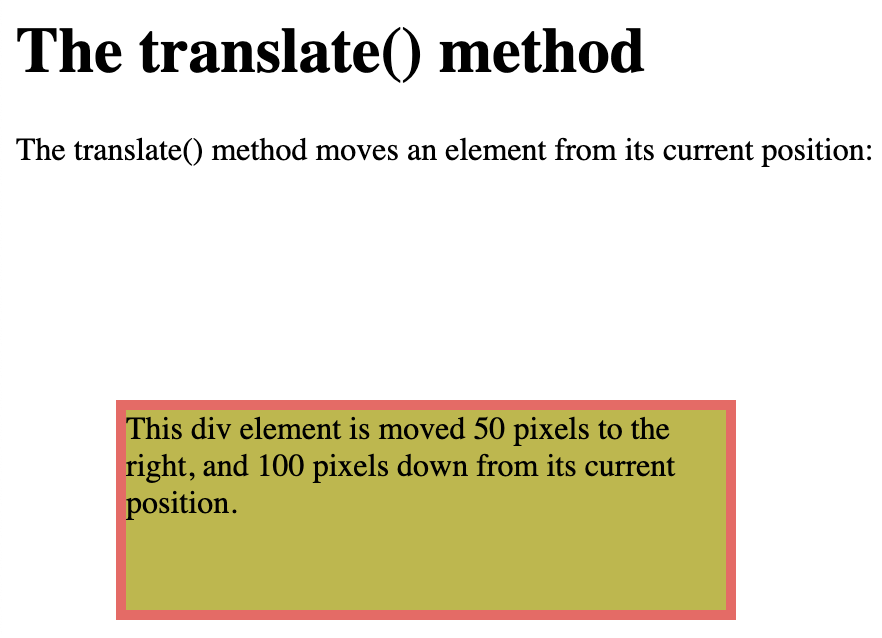

## The `rotate()` method

```
<!DOCTYPE html>
<html>
<head>
<style>
div {
  width: 300px;
  height: 100px;
  background-color: gold;
  border: 1px solid red;
}

div#myDiv {
  transform: rotate(20deg);
}
</style>
</head>
<body>

<h1>The rotate() method</h1>

<p>The rotate() method rotates an element clockwise or counter-clockwise.</p>

<div>
This a normal div element.
</div>

<div id="myDiv">
This div element is rotated clockwise 20 degrees.
</div>

</body>
</html>
```
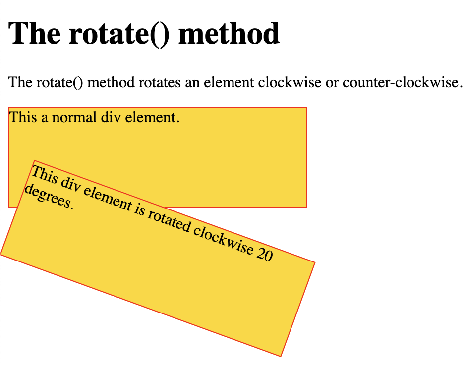

## The `scale()` method

```
<!DOCTYPE html>
<html>
<head>
<style>
div {
  margin: 150px;
  width: 150px;
  height: 100px;
  background-color: gold;
  border: 1px solid red;
  transform: scale(2,3);
}
</style>
</head>
<body>

<h1>The scale() method</h1>

<p>The scale() method increases or decreases the size of an element.</p>

<div>
This div element is two times of its original width, and three times of its original height.
</div>

</body>
</html>
```
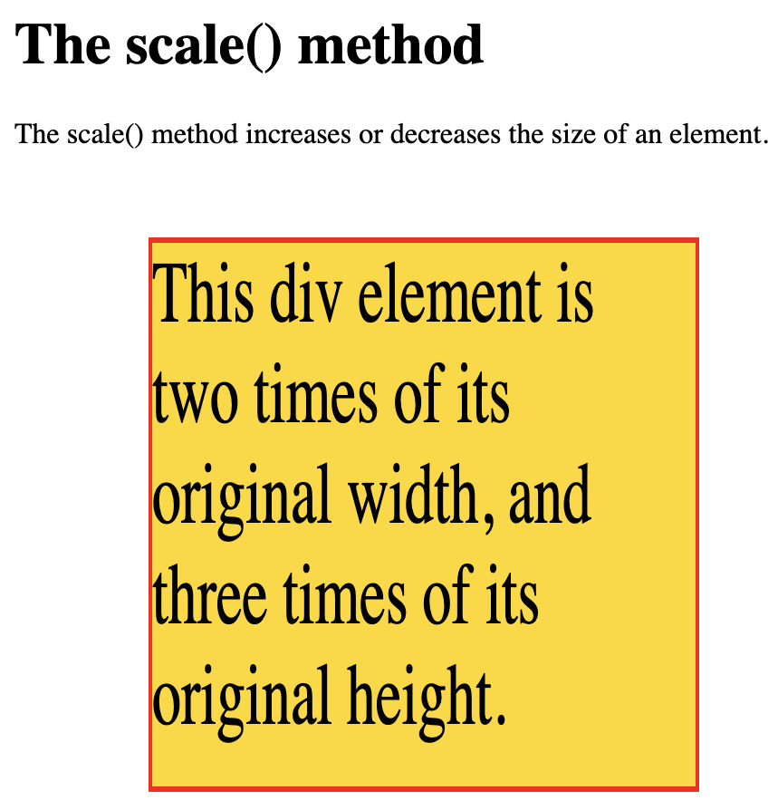

## The `scale()` method

```
<!DOCTYPE html>
<html>
<head>
<style>
div {
  margin: 150px;
  width: 200px;
  height: 100px;
  background-color: gold;
  border: 1px solid red;
  transform: scale(0.5,0.5);
}
</style>
</head>
<body>

<h1>The scale() method</h1>

<p>The scale() method increases or decreases the size of an element.</p>

<div>
This div element is decreased to be half of its original width and height.
</div>

</body>
</html>
```

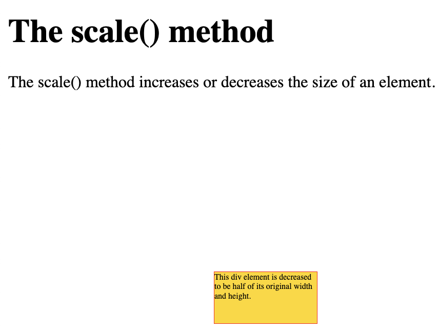

## The `scaleX()` method
 
```
<!DOCTYPE html>
<html>
<head>
<style>
div {
  margin: 150px;
  width: 150px;
  height: 100px;
  background-color: gold;
  border: 1px solid red;
  transform: scaleX(2);
}
</style>
</head>
<body>

<h1>The scaleX() Method</h1>

<p>The scaleX() method increases or decreases the width of an element.</p>

<div>
This div element is two times of its original width.
</div>

</body>
</html>
```

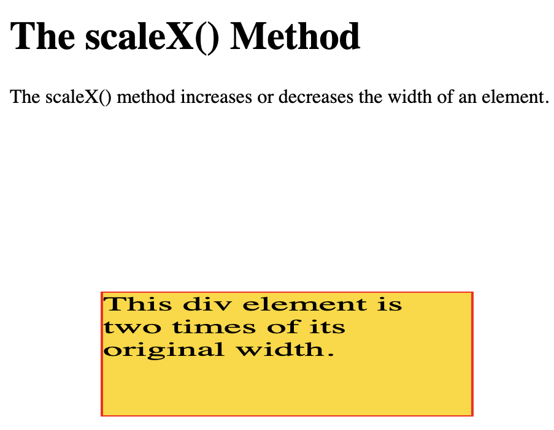

## The `scaleX()` method

```
<!DOCTYPE html>
<html>
<head>
<style>
div {
  margin: 150px;
  width: 200px;
  height: 100px;
  background-color: gold;
  border: 1px solid red;
  transform: scaleX(0.5);
}
</style>
</head>
<body>

<h1>The scaleX() method</h1>

<p>The scaleX() method increases or decreases the width of an element.</p>

<div>
This div element is half of its original width.
</div>

</body>
</html>
```
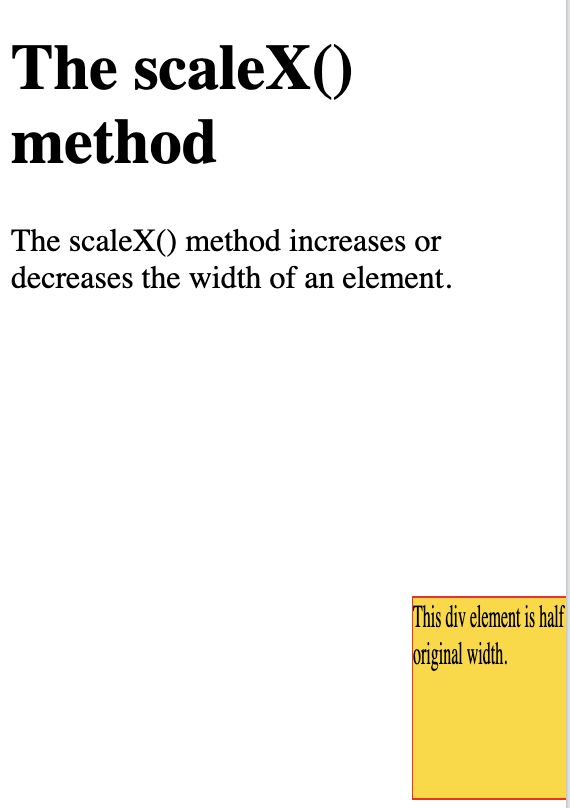

## The `scaleY()` method

```
<!DOCTYPE html>
<html>
<head>
<style>
div {
  margin: 150px;
  width: 200px;
  height: 100px;
  background-color: gold;
  border: 1px solid red;
  transform: scaleY(3);
}
</style>
</head>
<body>

<h1>The scaleY() method</h1>

<p>The scaleY() method increases or decreases the height of an element.</p>

<div>
This div element is three times of its original height.
</div>

</body>
</html>
```
## The `skewX()` method

```
<!DOCTYPE html>
<html>
<head>
<style>
div {
  width: 300px;
  height: 100px;
  background-color: gold;
  border: 1px solid red;
}

div#myDiv {
  transform: skewX(20deg);
}
</style>
</head>
<body>

<h1>The skewX() method</h1>

<p>The skewX() method skews an element along the X-axis by the given angle.</p>

<div>
This a normal div element.
</div>

<div id="myDiv">
This div element is skewed 20 degrees along the X-axis.
</div>

</body>
</html>
```
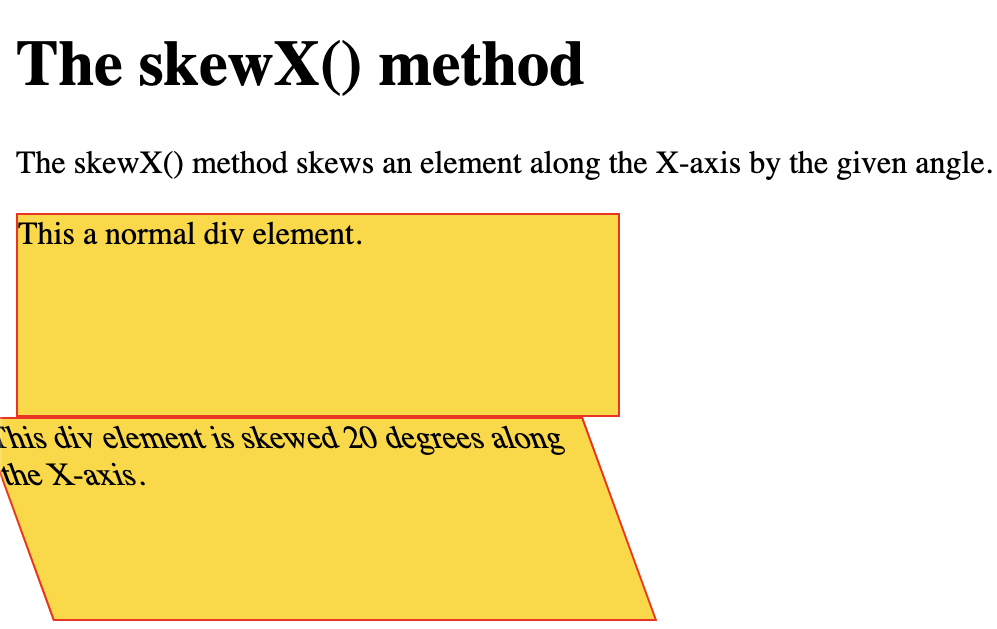

##

```
<!DOCTYPE html>
<html>
<head>
<style>
div {
  width: 300px;
  height: 100px;
  background-color: gold;
  border: 1px solid red;
}

div#myDiv {
  transform: skewY(20deg);
}
</style>
</head>
<body>

<h1>The skewY() method</h1>

<p>The skewY() method skews an element along the Y-axis by the given angle.</p>

<div>
This a normal div element.
</div>

<div id="myDiv">
This div element is skewed 20 degrees along the Y-axis.
</div>

</body>
</html>
```
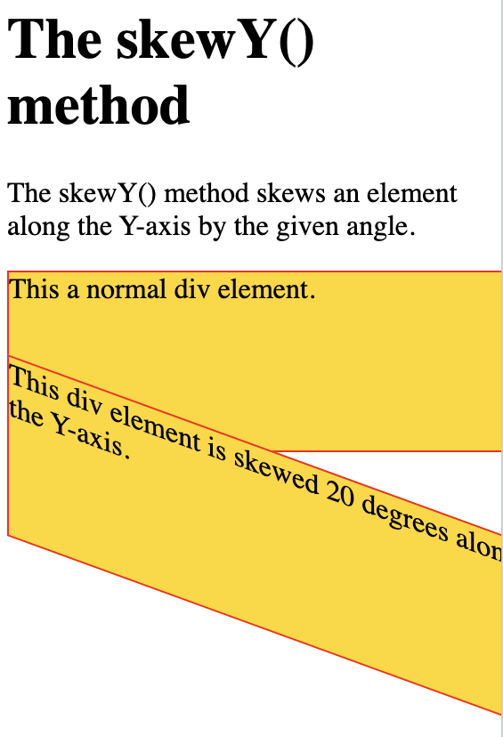

## The `skew()` method

```
<!DOCTYPE html>
<html>
<head>
<style>
div {
  width: 300px;
  height: 100px;
  background-color: gold;
  border: 1px solid red;
}

div#myDiv {
  transform: skew(20deg,10deg);
}
</style>
</head>
<body>

<h1>The skew() Method</h1>
<p>The skew() method skews an element into a given angle.</p>

<div>
This a normal div element.
</div>

<div id="myDiv">
This div element is skewed 20 degrees along the X-axis, and 10 degrees along the Y-axis.
</div>

</body>
</html>
```
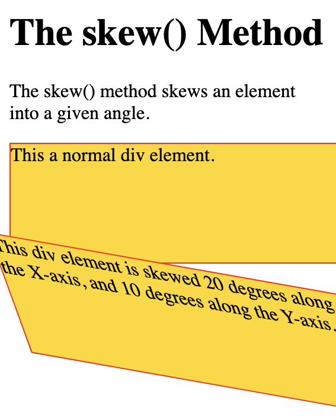

##

```
<!DOCTYPE html>
<html>
<head>
<style>
div {
  width: 300px;
  height: 100px;
  background-color: gold;
  border: 1px solid red;
}

div#myDiv1 {
  transform: matrix(1, -0.3, 0, 1, 0, 0);
}

div#myDiv2 {
  transform: matrix(1, 0, 0.5, 1, 150, 0);
}
</style>
</head>
<body>

<h1>The matrix() method</h1>

<p>The matrix() method combines all the 2D transform methods into one.</p>

<div>
This a normal div element.
</div>

<div id="myDiv1">
Using the matrix() method.
</div>

<div id="myDiv2">
Another use of the matrix() method.
</div>

</body>
</html>
```
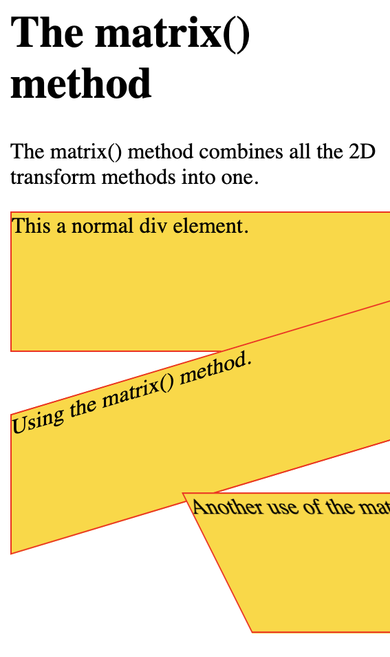

# 3D 

## The `rotateX()` method

```
<!DOCTYPE html>
<html>
<head>
<style>
div {
  width: 300px;
  height: 100px;
  background-color: gold;
  border: 1px solid red;
}

#myDiv {
  transform: rotateX(150deg);
}
</style>
</head>
<body>

<h1>The rotateX() Method</h1>

<p>The rotateX() method rotates an element around its X-axis at a given degree.</p>

<div>
This a normal div element.
</div>

<div id="myDiv">
This div element is rotated 150 degrees.
</div>

</body>
</html>
```


## The `rotateY()` method

```
<!DOCTYPE html>
<html>
<head>
<style>
div {
  width: 300px;
  height: 100px;
  background-color: gold;
  border: 1px solid red;
}

#myDiv {
  transform: rotateY(150deg);
}
</style>
</head>
<body>

<h1>The rotateY() method</h1>

<p>The rotateY() method rotates an element around its Y-axis at a given degree.</p>

<div>
This a normal div element.
</div>

<div id="myDiv">
This div element is rotated 150 degrees.
</div>

</body>
</html>
```
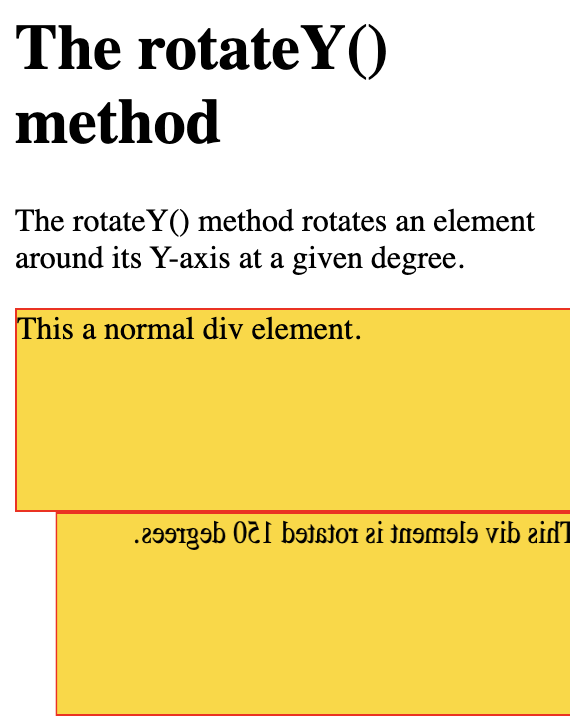

##

```
<!DOCTYPE html>
<html>
<head>
<style>
div {
  width: 300px;
  height: 100px;
  background-color: gold;
  border: 1px solid red;
}

#myDiv {
  transform: rotateZ(90deg);
}
</style>
</head>
<body>

<h1>The rotateZ() method</h1>

<p>The rotateZ() method rotates an element around its Z-axis at a given degree.</p>

<div>
This a normal div element.
</div>

<div id="myDiv">
This div element is rotated 90 degrees.
</div>

</body>
</html>
```
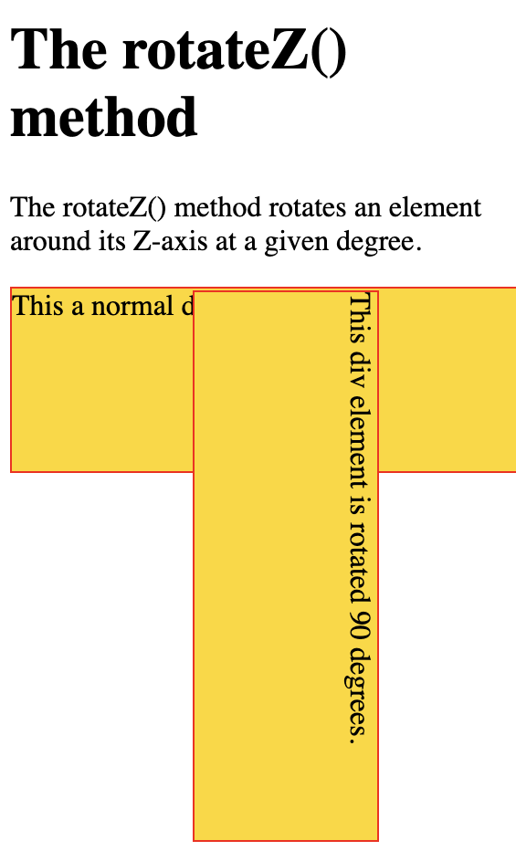
