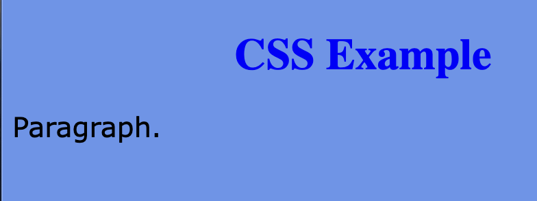
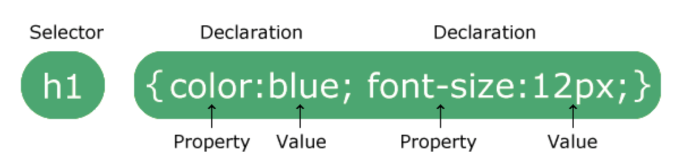
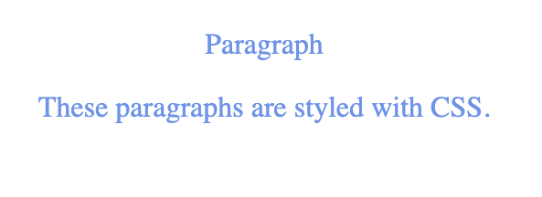

# CSS

CSS stands for Cascading Style Sheets

CSS is the language we use to style an HTML document.

CSS describes how HTML elements should be displayed.

```
<!DOCTYPE html>
<html>
<head>
<style>
body {
  background-color: lightblue;
}

h1 {
  color: white;
  text-align: center;
}

p {
  font-family: verdana;
  font-size: 20px;
}
</style>
</head>
<body>

<h1>CSS Example</h1>
<p>Paragraph.</p>

</body>
</html>

```





The selector points to the HTML element you want to style.

The declaration block contains one or more declarations separated by semicolons.

Each declaration includes a CSS property name and a value, separated by a colon.

Multiple CSS declarations are separated with semicolons, and declaration blocks are surrounded by curly braces.

```
<!DOCTYPE html>
<html>
<head>
<style>
p {
  color: cornflowerblue;
  text-align: center;
} 
</style>
</head>
<body>

<p>Paragraph</p>
<p>These paragraphs are styled with CSS.</p>

</body>
</html>
```


`p` is a selector in CSS (it points to the HTML element you want to style: `<p>`).

`color` is a property, and `cornflowerblue` is the property value

`text-align` is a property, and `center` is the property value


