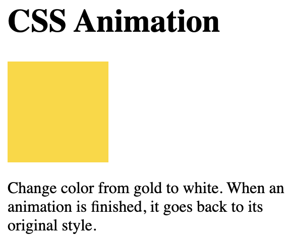

## Animation

```
<!DOCTYPE html>
<html>
<head>
<style> 
div {
  width: 100px;
  height: 100px;
  background-color: gold;
  animation-name: example;
  animation-duration: 4s;
}

@keyframes example {
  from {background-color: gold;}
  to {background-color: white;}
}
</style>
</head>
<body>

<h1>CSS Animation</h1>

<div></div>

<p>Change color from gold to white. When an animation is finished, it goes back to its original style.</p>

</body>
</html>
```


## Change both the background-color and the position

```
<!DOCTYPE html>
<html>
<head>
<style> 
div {
  width: 100px;
  height: 100px;
  background-color: red;
  position: relative;
  animation-name: example;
  animation-duration: 4s;
}

@keyframes example {
  0%   {background-color:red; left:0px; top:0px;}
  25%  {background-color:yellow; left:200px; top:0px;}
  50%  {background-color:blue; left:200px; top:200px;}
  75%  {background-color:green; left:0px; top:200px;}
  100% {background-color:red; left:0px; top:0px;}
}
</style>
</head>
<body>

<h1>CSS Animation</h1>

<div></div>


</body>
</html>
```
## Animation 3 times 

```
<!DOCTYPE html>
<html>
<head>
<style> 
div {
  width: 100px;
  height: 100px;
  background-color: red;
  position: relative;
  animation-name: example;
  animation-duration: 4s;
  animation-iteration-count: 3;
}

@keyframes example {
  0%   {background-color:red; left:0px; top:0px;}
  25%  {background-color:yellow; left:200px; top:0px;}
  50%  {background-color:blue; left:200px; top:200px;}
  75%  {background-color:green; left:0px; top:200px;}
  100% {background-color:red; left:0px; top:0px;}
}
</style>
</head>
<body>

<h1>CSS Animation</h1>

<div></div>

</body>
</html>
```
## or run forever

```
<!DOCTYPE html>
<html>
<head>
<style> 
div {
  width: 100px;
  height: 100px;
  background-color: red;
  position: relative;
  animation-name: example;
  animation-duration: 4s;
  animation-iteration-count: infinite;
}

@keyframes example {
  0%   {background-color:red; left:0px; top:0px;}
  25%  {background-color:yellow; left:200px; top:0px;}
  50%  {background-color:blue; left:200px; top:200px;}
  75%  {background-color:green; left:0px; top:200px;}
  100% {background-color:red; left:0px; top:0px;}
}
</style>
</head>
<body>

<h1>CSS Animation</h1>

<div></div>

</body>
</html>
```

## Reverse Direction or Alternate Cycles

- normal - The animation is played as normal (forwards). This is default

- reverse - The animation is played in reverse direction (backwards)

- alternate - The animation is played forwards first, then backwards

- alternate-reverse - The animation is played backwards first, then forwards

```
div {
  width: 100px;
  height: 100px;
  position: relative;
  background-color: red;
  animation-name: example;
  animation-duration: 4s;
  animation-direction: reverse;
}
```

## `animation-timing-function`

- ease - Specifies an animation with a slow start, then fast, then end slowly (this is default)

- linear - Specifies an animation with the same speed from start to end

- ease-in - Specifies an animation with a slow start

- ease-out - Specifies an animation with a slow end

- ease-in-out - Specifies an animation with a slow start and end

- cubic-bezier(n,n,n,n) - Lets you define your own values in a cubic-bezier function

```
<!DOCTYPE html>
<html>
<head>
<style> 
div {
  width: 100px;
  height: 50px;
  background-color: red;
  font-weight: bold;
  position: relative;
  animation: mymove 5s;
  animation-fill-mode: forwards;
}

#div1 {animation-timing-function: linear;}
#div2 {animation-timing-function: ease;}
#div3 {animation-timing-function: ease-in;}
#div4 {animation-timing-function: ease-out;}
#div5 {animation-timing-function: ease-in-out;}

@keyframes mymove {
  from {left: 0px;}
  to {left: 300px;}
}
</style>
</head>
<body>

<h1>CSS Animation</h1>

<div id="div1">linear</div>
<div id="div2">ease</div>
<div id="div3">ease-in</div>
<div id="div4">ease-out</div>
<div id="div5">ease-in-out</div>

</body>
</html>
```

##  `animation-fill-mode`

- none - Default value. Animation will not apply any styles to the element before or after it is executing

- forwards - The element will retain the style values that is set by the last keyframe (depends on animation-direction and animation-iteration-count)

- backwards - The element will get the style values that is set by the first keyframe (depends on animation-direction), and retain this during the animation-delay period

- both - The animation will follow the rules for both forwards and backwards, extending the animation properties in both directions

```
div {
  width: 100px;
  height: 100px;
  background: red;
  position: relative;
  animation-name: example;
  animation-duration: 3s;
  animation-fill-mode: forwards;
}
```

## shorthand animation property:

```
div {
  animation-name: example;
  animation-duration: 5s;
  animation-timing-function: linear;
  animation-delay: 2s;
  animation-iteration-count: infinite;
  animation-direction: alternate;
}
```

```
div {
  animation: example 5s linear 2s infinite alternate;
}
```


