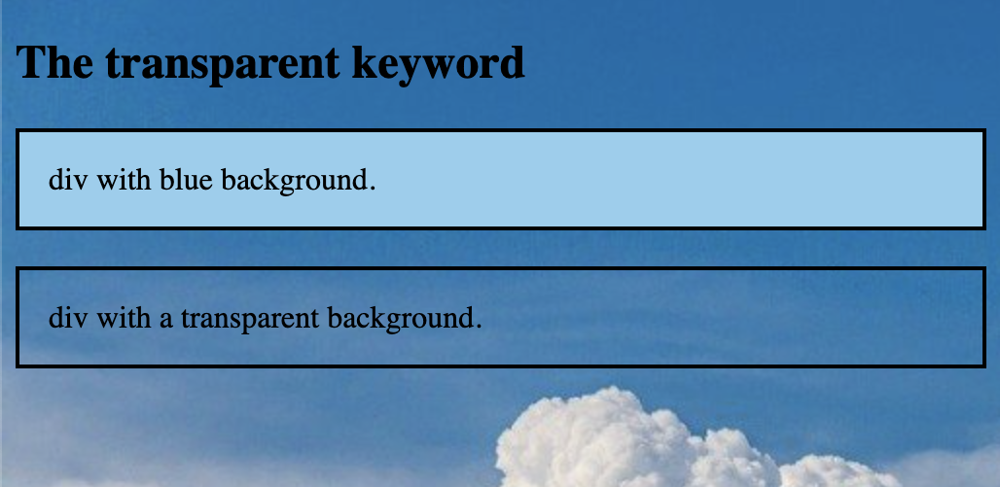
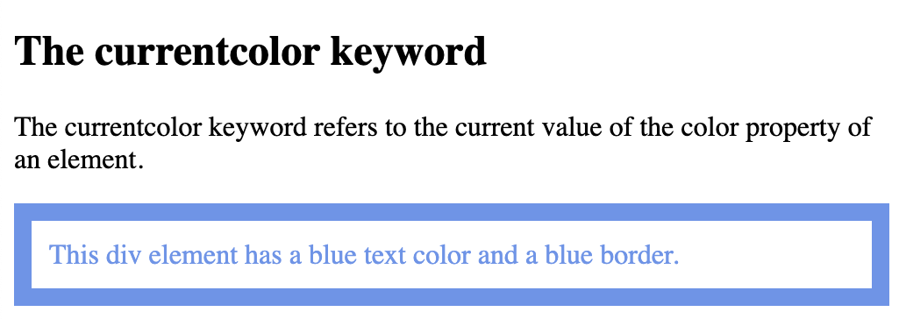
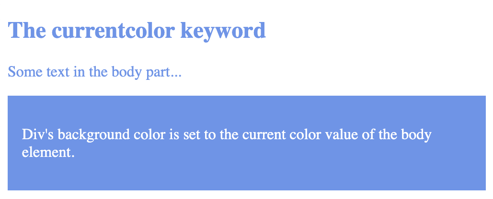
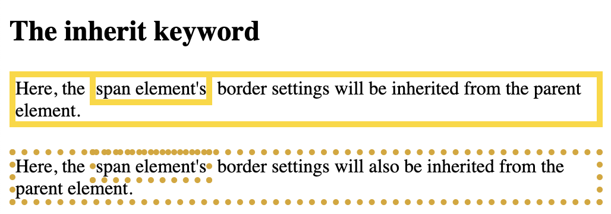

# CSS color use is the same as HTML

https://github.com/SunnyAris/HTML/blob/main/HTML_colors.md


```
<!DOCTYPE html>
<html>
<body>

<h1 style="background-color:Tomato;">Tomato</h1>
<h1 style="background-color:Orange;">Orange</h1>
<h1 style="background-color:DodgerBlue;">DodgerBlue</h1>
<h1 style="background-color:MediumSeaGreen;">MediumSeaGreen</h1>
<h1 style="background-color:Gray;">Gray</h1>
<h1 style="background-color:SlateBlue;">SlateBlue</h1>
<h1 style="background-color:Violet;">Violet</h1>
<h1 style="background-color:LightGray;">LightGray</h1>

</body>
</html>
```

## CSS Background Color (the same as HTML)

```
<!DOCTYPE html>
<html>
<body>

<h1 style="background-color:royalblue;">Hello World</h1>

<p style="background-color:cornflowerblue;">
Lorem ipsum dolor sit amet, consectetuer adipiscing elit, sed diam nonummy nibh euismod tincidunt ut laoreet dolore magna aliquam erat volutpat.
Ut wisi enim ad minim veniam, quis nostrud exerci tation ullamcorper suscipit lobortis nisl ut aliquip ex ea commodo consequat.
</p>

</body>
</html>
```


https://github.com/SunnyAris/HTML/blob/main/HTML_colors.md

# CSS Backgrounds

The CSS background properties are used to add background effects for elements.

- background-color
- background-image
- background-repeat
- background-attachment
- background-position
- background (shorthand property)

## CSS background-color

```
<!DOCTYPE html>
<html>
<head>
<style>
body {
  background-color: rgb(114, 134, 236);
}
</style>
</head>
<body>

<h1>Hello World!</h1>

<p>This page has background color</p>

</body>
</html>
```


## Here, the `<h1>`, `<p>`, and `<div>` elements will have different background colors: 

```
<!DOCTYPE html>
<html>
<head>
<style>
h1 {
  background-color: cornflowerblue;
}

div {
  background-color: lightblue;
}

p {
  background-color: lightskyblue;
}
</style>
</head>
<body>

<h1>CSS background-color example</h1>
<div>
This is a text inside a div element.
<p>This paragraph has its own background color.</p>
Still in the div element.
</div>

</body>
</html>
```


## Opacity / Transparency

```
<!DOCTYPE html>
<html>
<head>
<style>
div {
  background-color: cornflowerblue;
}

div.first {
  opacity: 0.1;
}

div.second {
  opacity: 0.3;
}

div.third {
  opacity: 0.6;
}
</style>
</head>
<body>

<h1>Transparent Boxes</h1>

<p>When using the opacity property to add transparency to the background of an element, all of its child elements become transparent as well. This can make the text inside a fully transparent element hard to read:</p>

<div class="first">
  <h1>opacity 0.1</h1>
</div>

<div class="second">
  <h1>opacity 0.3</h1>
</div>

<div class="third">
  <h1>opacity 0.6</h1>
</div>

<div>
  <h1>opacity 1 (default)</h1>
</div>

</body>
</html>
```


```
<!DOCTYPE html>
<html>
<head>
<style>
div {
  background: rgb(100, 149, 237);
}

div.first {
  background: rgb(100, 149, 237, 0.1);
}

div.second {
  background: rgb(100, 149, 237, 0.3);
}

div.third {
  background: rgb(100, 149, 237, 0.6);
}
</style>
</head>
<body>

<h1>Transparent Boxes 2</h1>

<p>Result with opacity:</p>

<div style="opacity:0.1;">
  <h1>10% opacity</h1>
</div>

<div style="opacity:0.3;">
  <h1>30% opacity</h1>
</div>

<div style="opacity:0.6;">
  <h1>60% opacity</h1>
</div>

<div>
  <h1>opacity 1</h1>
</div>

<p>Result with rgba():</p>

<div class="first">
  <h1>10% opacity</h1>
</div>

<div class="second">
  <h1>30% opacity</h1>
</div>

<div class="third">
  <h1>60% opacity</h1>
</div>

<div>
  <h1>default</h1>
</div>

<p>Notice how the text gets transparent as well as the background color when using the opacity property.</p>

</body>
</html>
```
## Use RGBA color values to sets the opacity for the background color and not the text:

```
<style>
div {
  background: rgb(100, 149, 237);
}

div.first {
  background: rgb(100, 149, 237, 0.1);
}

div.second {
  background: rgb(100, 149, 237, 0.3);
}

div.third {
  background: rgb(100, 149, 237, 0.6);
}
</style>
```


## `background image`

```
<!DOCTYPE html>
<html>
<head>
<style>
body {
  background-image: url("doc-files/cloudb.jpg");
}
</style>
</head>
<body>

<h1>Hello World!</h1>

<p>This page has an image as the background!</p>

</body>
</html>
```


```
<!DOCTYPE html>
<html>
<head>
<style>
p {
  background-image: url("doc-files/cloudb.jpg");
}
</style>
</head>
<body>

<h1>Hello World!</h1>

<p>This page has an image as the background!</p>

</body>
</html>
```


## `background-repeat`

```
<!DOCTYPE html>
<html>
<head>
<style>
body {
  background-image: url("doc-files/chibi2.jpg");
}

* {
  text-align: left;
  color: orange;
}
</style>
</head>
<body>

<h1>Hello World!</h1>
<p>Strange background image...</p>

</body>
</html>
```


```
<!DOCTYPE html>
<html>
<head>
<style>
body {
  background-image: url("doc-files/chibi2.jpg");
  background-repeat: repeat-x;
}

* {
  text-align: left;
  color: orange;
}
</style>
</head>
<body>

<h1>Hello World!</h1>
<p>Here, a background image is repeated only horizontally</p>

</body>
</html>
```


## `background-repeat: no-repeat`

```
<!DOCTYPE html>
<html>
<head>
<style>
body {
  background-image: url("doc-files/chibi2.jpg");
  background-repeat: no-repeat;
}

* {
  text-align: left;
  color: orange;
}

</style>
</head>
<body>

<h1>Hello World!</h1>
<p>The background image only shows once, but it is disturbing the reader!</p>

</body>
</html>
```


## `background-position`

```
<!DOCTYPE html>
<html>
<head>
<style>
body {
  background-image: url("doc-files/chibi2.jpg");
  background-repeat: no-repeat;
  background-position: center top ;
  margin-right: 500px;
}

* {
  text-align: left;
  color: orange;
}

</style>
</head>
<body>

<h1>Hello World!</h1>
<p>Here, the background image is only shown once. In addition it is positioned away from the text.</p>
<p>In this example we have also added a margin on the center, so that the background image will not disturb the text.</p>

</body>
</html>
```


## `background-attachment`

Fixed will not scroll with the rest of the page:

```
<!DOCTYPE html>
<html>
<head>
<style>
body {
  background-image: url("doc-files/chibi2.jpg");
  background-repeat: no-repeat;
  background-position: center top;
  margin-right: 550px;
  background-attachment: fixed;
}
</style>
</head>
<body>

<h1>The background-attachment Property</h1>

<p>The background-attachment property specifies whether the background image should scroll or be fixed (will not scroll with the rest of the page).</p>

<p><strong>Tip:</strong> If you do not see any scrollbars, try to resize the browser window.</p>

<p>The background-image is fixed. Try to scroll down the page.</p>
<p>The background-image is fixed. Try to scroll down the page.</p>
<p>The background-image is fixed. Try to scroll down the page.</p>
<p>The background-image is fixed. Try to scroll down the page.</p>
<p>The background-image is fixed. Try to scroll down the page.</p>
<p>The background-image is fixed. Try to scroll down the page.</p>
<p>The background-image is fixed. Try to scroll down the page.</p>
<p>The background-image is fixed. Try to scroll down the page.</p>
<p>The background-image is fixed. Try to scroll down the page.</p>
<p>The background-image is fixed. Try to scroll down the page.</p>
<p>The background-image is fixed. Try to scroll down the page.</p>
<p>The background-image is fixed. Try to scroll down the page.</p>
<p>The background-image is fixed. Try to scroll down the page.</p>
<p>The background-image is fixed. Try to scroll down the page.</p>
<p>The background-image is fixed. Try to scroll down the page.</p>
<p>The background-image is fixed. Try to scroll down the page.</p>
<p>The background-image is fixed. Try to scroll down the page.</p>
<p>The background-image is fixed. Try to scroll down the page.</p>
<p>The background-image is fixed. Try to scroll down the page.</p>
<p>The background-image is fixed. Try to scroll down the page.</p>
<p>The background-image is fixed. Try to scroll down the page.</p>
<p>The background-image is fixed. Try to scroll down the page.</p>

</body>
</html>
```


## Background image scroll with the rest of the page:

```
body {
  background-image: url("doc-files/chibi2.jpg");
  background-repeat: no-repeat;
  background-position: center top;
  margin-right: 550px;
  background-attachment: scroll;
}
```
## CSS background - Shorthand property 

Instead of writing:

```
body {
  background-color: #ffffff;
  background-image: url("img_tree.png");
  background-repeat: no-repeat;
  background-position: right top;
}
```
Use the shorthand property background:

```
body {
  background: #ffffff url("img_tree.png") no-repeat right top;
  margin-right: 200px;
}
```

##


```
<!DOCTYPE html>
<html>
<head>
<style>
body {
  background-image: url("doc-files/cloudb.jpg");
}

div.ex1 { 
  background-color: rgb(144, 207, 238);
  border: 2px solid black;
  padding: 15px;
}

div.ex2 { 
  background-color: transparent;
  border: 2px solid black;
  padding: 15px;
} 
</style>
</head>
<body>

<h2>The transparent keyword</h2>

<div class="ex1">div with blue background.</div>
<br>
<div class="ex2">div with a transparent background.</div>

</body>
</html>
```



# `currentcolor` keyword

```
<!DOCTYPE html>
<html>
<head>
<style>
div {
  color: cornflowerblue;
  border: 10px solid currentcolor;
  padding: 10px;  
}
</style>
</head>
<body>

<h2>The currentcolor keyword</h2>

<p>The currentcolor keyword refers to the current value of the color property of an element.</p>

<div>
This div element has a blue text color and a blue border.
</div>

</body>
</html>
```


```
<!DOCTYPE html>
<html>
<head>
<style>
body {
  color: cornflowerblue;
}

div {
  background-color: currentcolor;
  padding: 15px;
}

div p {
  color: white;
}
</style>
</head>
<body>

<h2>The currentcolor keyword</h2>

<p>Some text in the body part...</p>

<div>
<p>Div's background color is set to the current color value of the body element.</p>
</div>

</body>
</html>
```


```
<!DOCTYPE html>
<html>
<head>
<style>
body {
  color: cornflowerblue;
}

div { 
  box-shadow: 0px 0px 15px currentcolor;
  border: 5px solid currentcolor;
  padding: 15px;
}
</style>
</head>
<body>

<h2>The currentcolor keyword</h2>

<p>Some text in the body part...</p>

<div>
<p>Div's border color and shadow color is set to the current color value of the body element.</p>
</div>

</body>
</html>
```

```
<!DOCTYPE html>
<html>
<head>
<style>
div {
  border: 5px solid gold;
}

span {
  border: inherit;
}
</style>
</head>
<body>

<h2>The inherit keyword</h2>

<div>Here, the <span>span element's</span> border settings will be inherited from the parent element.</div>
<br>

<div style="border:5px dotted goldenrod;">Here, the <span>span element's</span> border settings will also be inherited from the parent element.</div>

</body>
</html>
```


