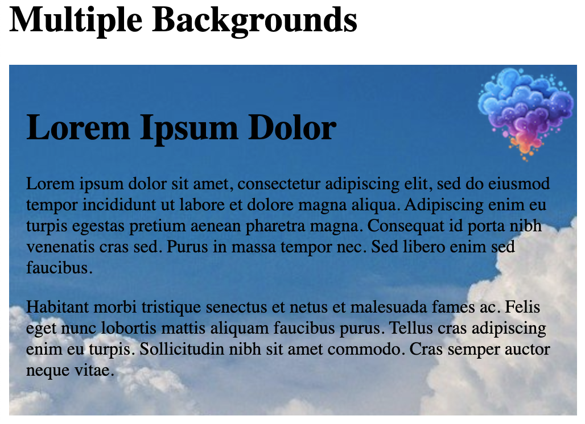
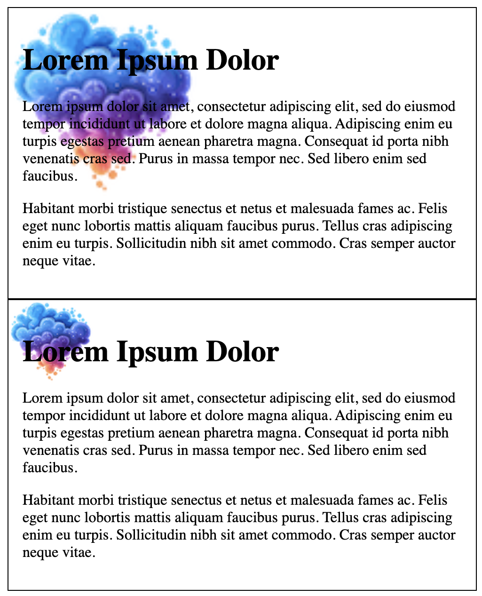
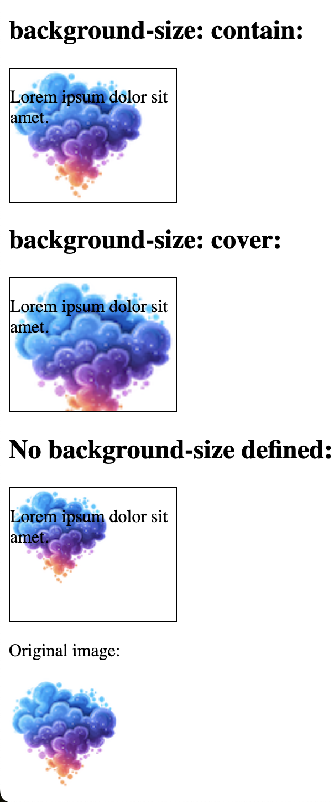
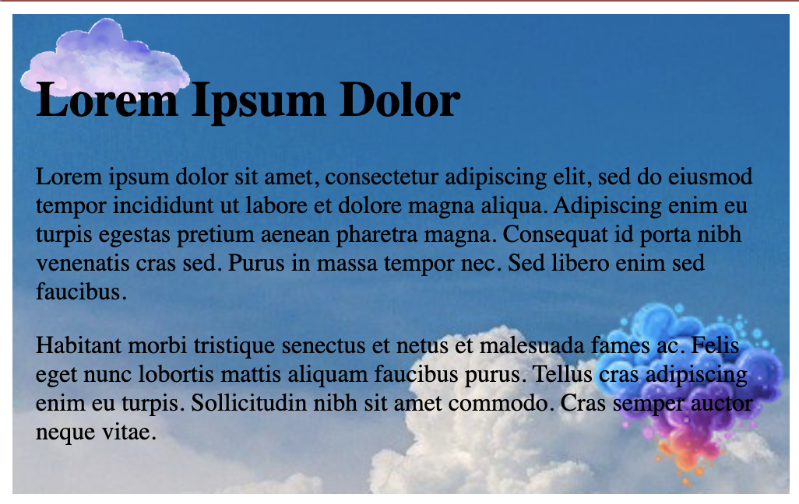
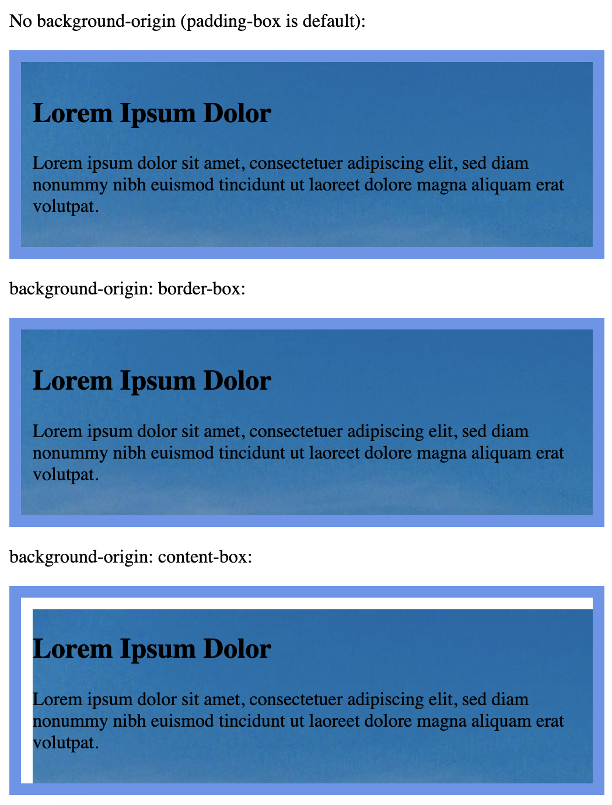
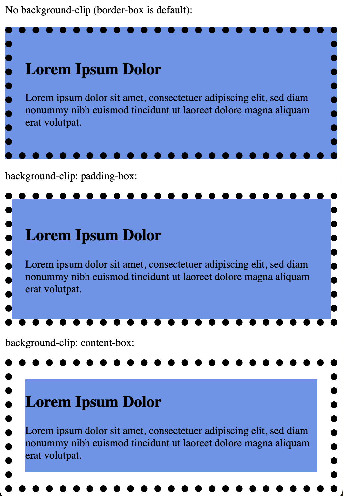

## Multiple Backgrounds

```<!DOCTYPE html>
<html>
<head>
<style> 
#example1 {
   background-image: url(doc-files/cloudcolor1.png), url(doc-files/cloudb.jpg);
    background-position: right top, center top;
    background-repeat: no-repeat, repeat;
    padding: 15px;
}
</style>
</head>
<body>

<h1>Multiple Backgrounds</h1>

<div id="example1">
  <h1>Lorem Ipsum Dolor</h1>
  <p>Lorem ipsum dolor sit amet, consectetur adipiscing elit, sed do eiusmod tempor incididunt ut labore et dolore magna aliqua. Adipiscing enim eu turpis egestas pretium aenean pharetra magna. Consequat id porta nibh venenatis cras sed. Purus in massa tempor nec. Sed libero enim sed faucibus.</p>
  <p>Habitant morbi tristique senectus et netus et malesuada fames ac. Felis eget nunc lobortis mattis aliquam faucibus purus. Tellus cras adipiscing enim eu turpis. Sollicitudin nibh sit amet commodo. Cras semper auctor neque vitae.</p>
</div>

</body>
</html>
```


```
<!DOCTYPE html>
<html>
<head>
<style> 
#example1 {
  background: url(doc-files/cloudcolor1.png) right bottom no-repeat, url(paper.gif) left top repeat;
  padding: 15px;
}
</style>
</head>
<body>
```

## `background-size`



## `contain` and `cover`

```
<!DOCTYPE html>
<html>
<head>
<style>
.div1 {
  border: 1px solid black;
  height: 120px;
  width: 150px;
  background: url(doc-files/cloudcolor1.png);
  background-repeat: no-repeat;
  background-size: contain;
}

.div2 {
  border: 1px solid black;
  height: 120px;
  width: 150px;
  background: url(doc-files/cloudcolor1.png);
  background-repeat: no-repeat;
  background-size: cover;
}

.div3 {
  border: 1px solid black;
  height: 120px;
  width: 150px;
  background: url(doc-files/cloudcolor1.png);
  background-repeat: no-repeat;
}
</style>
</head>
<body>

<h1>The background-size Property</h1>

<h2>background-size: contain:</h2>
<div class="div1">
<p>Lorem ipsum dolor sit amet.</p>
</div>

<h2>background-size: cover:</h2>
<div class="div2">
<p>Lorem ipsum dolor sit amet.</p>
</div>

<h2>No background-size defined:</h2>
<div class="div3">
<p>Lorem ipsum dolor sit amet.</p>
</div>

<p>Original image:</p>


</body>
</html>
```


## Define Sizes of Multiple Background Images

```
<!DOCTYPE html>
<html>
<head>
<style> 
#example1 {
  background: url(doc-files/pink-purple.png) left top no-repeat, url(doc-files/cloudcolor1.png) right bottom no-repeat, url(doc-files/cloudb.jpg) left top repeat;
  padding: 15px;
  background-size: 120px, 130px, auto;
}
</style>
</head>
<body>

<div id="example1">
  <h1>Lorem Ipsum Dolor</h1>
  <p>Lorem ipsum dolor sit amet, consectetur adipiscing elit, sed do eiusmod tempor incididunt ut labore et dolore magna aliqua. Adipiscing enim eu turpis egestas pretium aenean pharetra magna. Consequat id porta nibh venenatis cras sed. Purus in massa tempor nec. Sed libero enim sed faucibus.</p>
  <p>Habitant morbi tristique senectus et netus et malesuada fames ac. Felis eget nunc lobortis mattis aliquam faucibus purus. Tellus cras adipiscing enim eu turpis. Sollicitudin nibh sit amet commodo. Cras semper auctor neque vitae.</p>

</body>
</html>
```




## Full Size Background Image

```
<!DOCTYPE html>
<html>
<head>
<style> 
html { 
  background: url(doc-files/cloudb.jpg) no-repeat center fixed; 
  background-size: cover;
}

body { 
  color: white; 
}
</style>
</head>
<body>

<h1>Full Page Background Image</h1>
<p>Lorem ipsum dolor sit amet, consectetuer adipiscing elit, sed diam nonummy nibh euismod tincidunt ut laoreet dolore magna aliquam erat volutpat. Ut wisi enim ad minim veniam, quis nostrud exerci tation ullamcorper suscipit lobortis nisl ut aliquip ex ea commodo consequat.</p>

</body>
</html>
```

## Hero Image

```
<!DOCTYPE html>
<html>
<head>
<meta name="viewport" content="width=device-width, initial-scale=1">
<style>
body {
  margin: 0;
  font-family: Arial, Helvetica, sans-serif;
}

.hero-image {
  background: url(doc-files/cloudb.jpg) no-repeat center; 
  background-size: cover;
  height: 500px;
  position: relative;
}

.hero-text {
  text-align: center;
  position: absolute;
  top: 50%;
  left: 50%;
  transform: translate(-50%, -50%);
  color: rgb(74, 165, 239);
}
</style>
</head>
<body>

<div class="hero-image">
  <div class="hero-text">
    <h1 style="font-size:50px">Hello</h1>
    <h3>Welcome to Sunny Aris page!</h3>
    <button>Click me</button>
  </div>
</div>

<p>Test page..</p>
<p>Image is responsive.</p>

</body>
</html>
```


## `background-origin`

- border-box - the background image starts from the upper left corner of the border

- padding-box - (default) the background image starts from the upper left corner of the padding edge

- content-box - the background image starts from the upper left corner of the content

```
<!DOCTYPE html>
<html>
<head>
<style>
#example1 {
  border: 10px solid cornflowerblue;
  padding: 10px;
  background: url(doc-files/cloudb.jpg);
  background-repeat: no-repeat;
}

#example2 {
  border: 10px solid cornflowerblue;
  padding: 10px;
  background: url(doc-files/cloudb.jpg);
  background-repeat: no-repeat;
  background-origin: border-box;
}

#example3 {
  border: 10px solid cornflowerblue;
  padding: 10px;
  background: url(doc-files/cloudb.jpg);
  background-repeat: no-repeat;
  background-origin: content-box;
}
</style>
</head>
<body>

<h1>The background-origin Property</h1>

<p>No background-origin (padding-box is default):</p>
<div id="example1">
  <h2>Lorem Ipsum Dolor</h2>
  <p>Lorem ipsum dolor sit amet, consectetuer adipiscing elit, sed diam nonummy nibh euismod tincidunt ut laoreet dolore magna aliquam erat volutpat.</p>
</div>

<p>background-origin: border-box:</p>
<div id="example2">
  <h2>Lorem Ipsum Dolor</h2>
  <p>Lorem ipsum dolor sit amet, consectetuer adipiscing elit, sed diam nonummy nibh euismod tincidunt ut laoreet dolore magna aliquam erat volutpat.</p>
</div>

<p>background-origin: content-box:</p>
<div id="example3">
  <h2>Lorem Ipsum Dolor</h2>
  <p>Lorem ipsum dolor sit amet, consectetuer adipiscing elit, sed diam nonummy nibh euismod tincidunt ut laoreet dolore magna aliquam erat volutpat.</p>
</div>

</body>
</html>
```




```
<!DOCTYPE html>
<html>
<head>
<style>
#example1 {
  border: 10px dotted black;
  padding: 20px;
  background: cornflowerblue;
}

#example2 {
  border: 10px dotted black;
  padding: 20px;
  background: cornflowerblue;
  background-clip: padding-box;
}

#example3 {
  border: 10px dotted black;
  padding: 20px;
  background: cornflowerblue;
  background-clip: content-box;
}
</style>
</head>
<body>

<h1>The background-clip Property</h1>

<p>No background-clip (border-box is default):</p>
<div id="example1">
  <h2>Lorem Ipsum Dolor</h2>
  <p>Lorem ipsum dolor sit amet, consectetuer adipiscing elit, sed diam nonummy nibh euismod tincidunt ut laoreet dolore magna aliquam erat volutpat.</p>
</div>

<p>background-clip: padding-box:</p>
<div id="example2">
  <h2>Lorem Ipsum Dolor</h2>
  <p>Lorem ipsum dolor sit amet, consectetuer adipiscing elit, sed diam nonummy nibh euismod tincidunt ut laoreet dolore magna aliquam erat volutpat.</p>
</div>

<p>background-clip: content-box:</p>
<div id="example3">
  <h2>Lorem Ipsum Dolor</h2>
  <p>Lorem ipsum dolor sit amet, consectetuer adipiscing elit, sed diam nonummy nibh euismod tincidunt ut laoreet dolore magna aliquam erat volutpat.</p>
</div>

</body>
</html>
```



Multicolored Paints Cloud  PNG Designed By Odome from https://www.cleanpng.com/png-multicolored-paints-cloud-colorful-abstract-clouds-7947895/


