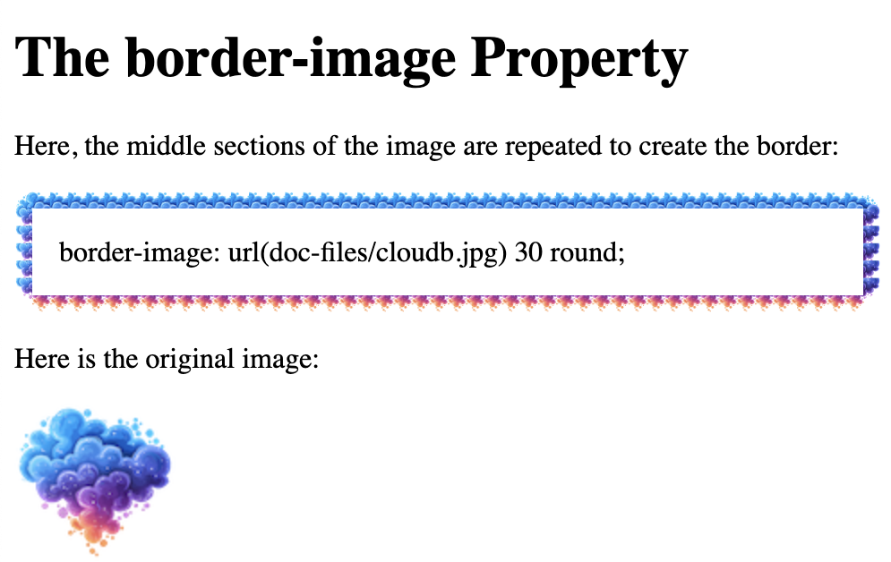
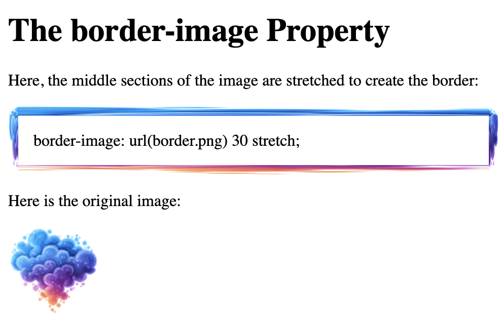

## Border Images

```
<!DOCTYPE html>
<html>
<head>
<style> 
#borderimg { 
  border: 10px solid transparent;
  padding: 15px;
  border-image: url(doc-files/cloudcolor1.png) 30 round;
}
</style>
</head>
<body>
  
  <h1>The border-image Property</h1>

  <p>Here, the middle sections of the image are repeated to create the border:</p>
  <p id="borderimg">border-image: url(doc-files/cloudb.jpg) 30 round;</p>
  
  <p>Here is the original image:</p>
 
  </body>
</html>
```



```
<!DOCTYPE html>
<html>
<head>
<style> 
#borderimg { 
  border: 10px solid transparent;
  padding: 15px;
  border-image: url(doc-files/cloudcolor1.png) 30 stretch;
}
</style>
</head>
<body>

<h1>The border-image Property</h1>

<p>Here, the middle sections of the image are stretched to create the border:</p>
<p id="borderimg">border-image: url(doc-files/cloudcolor1.png) 30 stretch;</p>

<p>Here is the original image:</p>

</body>
</html>
```


