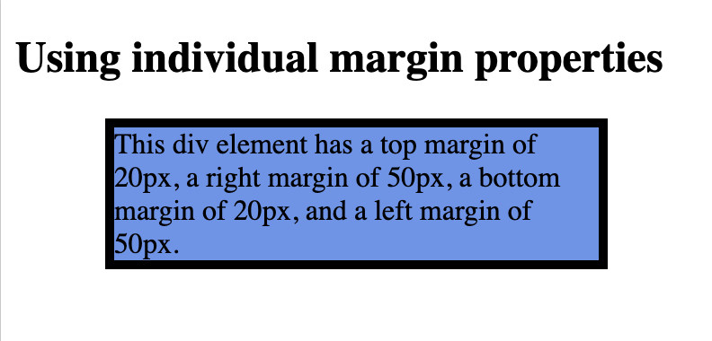

# Borders


## `border-style`

The border-style property specifies what kind of border to display.

- `dotted` - Defines a dotted border
- `dashed` - Defines a dashed border
- `solid` - Defines a solid border
- `double` - Defines a double border
- `groove` - Defines a 3D grooved border. The effect depends on the border-color value
- `ridge` - Defines a 3D ridged border. The effect depends on the border-color value
- `inset` - Defines a 3D inset border. The effect depends on the border-color value
- `outset` - Defines a 3D outset border. The effect depends on the border-color value
- `none`- Defines no border
- `hidden` - Defines a hidden border

`border-style` property can have from one to four values (for the top border, right border, bottom border, and the left border).

```
<!DOCTYPE html>
<html>
<head>
<style>
p.dotted {border-style: dotted;}
p.dashed {border-style: dashed;}
p.solid {border-style: solid;}
p.double {border-style: double;}
p.groove {border-style: groove;}
p.ridge {border-style: ridge;}
p.inset {border-style: inset;}
p.outset {border-style: outset;}
p.none {border-style: none;}
p.hidden {border-style: hidden;}
p.mix {border-style: dotted dashed solid double;}
</style>
</head>
<body>

<h2>The border-style property</h2>
<p>This property specifies what kind of border to display:</p>

<p class="dotted">A dotted border.</p>
<p class="dashed">A dashed border.</p>
<p class="solid">A solid border.</p>
<p class="double">A double border.</p>
<p class="groove">A groove border.</p>
<p class="ridge">A ridge border.</p>
<p class="inset">An inset border.</p>
<p class="outset">An outset border.</p>
<p class="none">No border.</p>
<p class="hidden">A hidden border.</p>
<p class="mix">A mixed border.</p>

</body>
</html>
```


## `border-width`

The width can be set as a specific size (in px, pt, cm, em, etc) or by using one of the three pre-defined values: thin, medium, or thick

```
<!DOCTYPE html>
<html>
<head>
<style>
p.a {
  border-style: solid;
  border-width: 8px;
}

p.b {
  border-style: solid;
  border-width: medium;
}

p.c {
  border-style: dotted;
  border-width: 3px;
}

p.d {
  border-style: dotted;
  border-width: thick;
}

p.e {
  border-style: double;
  border-width: 15px;
}

p.f {
  border-style: double;
  border-width: thick;
}
</style>
</head>
<body>

<h2>The border-width property</h2>
<p>This property specifies the width of the borders:</p>

<p class="a">Some text.</p>
<p class="b">Some text.</p>
<p class="c">Some text.</p>
<p class="d">Some text.</p>
<p class="e">Some text.</p>
<p class="f">Some text.</p>


</body>
</html>
```


```
<!DOCTYPE html>
<html>
<head>
<style>
p.a {
  border-style: solid;
  border-width: 10px 30px; /* 10px top and bottom, 30px on the sides */
}

p.b {
  border-style: double;
  border-width: 20px 10px; /* 20px top and bottom, 10px on the sides */
}

p.c {
  border-style: solid;
  border-width: 20px 10px; /* 20px top and bottom, 10px on the sides */
}

p.d {
  border-style: double;
  border-width: 25px 10px 4px 35px; /* 25px top, 10px right, 4px bottom and 35px left */
}

p.e {
  border-style: solid;
  border-width: 25px 10px 4px 35px; /* 25px top, 10px right, 4px bottom and 35px left */
}
</style>
</head>
<body>

<h2>The border-width property</h2>
<p>The border-width property can have from one to four values (for the top border, right border, bottom border, and the left border):</p>

<p class="a">Some text.</p>
<p class="b">Some text.</p>
<p class="c">Some text.</p>
<p class="d">Some text.</p>
<p class="e">Some text.</p>

</body>
</html>
```


## `border-color`

```
<!DOCTYPE html>
<html>
<head>
<style>
p.one {
  border-style: double;
  border-color: cornflowerblue;
}

p.two {
  border-style: solid;
  border-color: darkblue;
} 

p.three {
  border-style: dotted;
  border-color: blue;
} 
</style>
</head>
<body>

<h2>The border-color Property</h2>
<p>This property specifies the color of the four borders:</p>

<p class="one">A solid red border</p>
<p class="two">A solid green border</p>
<p class="three">A dotted blue border</p>

<p><b>Note:</b> The "border-color" property does not work if it is used alone. Use the "border-style" property to set the borders first.</p>

</body>
</html>
```


## Multicolor border

```
<!DOCTYPE html>
<html>
<head>
<style>
p.one {
  border-style: double;
  border-width: 10px;
  border-color: dodgerblue darkslateblue blue black; /* dodgerblue top, darkslateblue right, blue bottom and black left */
}
</style>
</head>
<body>

<h2>The border-color Property</h2>
<p>The border-color property can have from one to four values (for the top border, right border, bottom border, and the left border):</p>

<p class="one">A double multicolor border</p>

</body>
</html>
```


## Individual Sides

```
<!DOCTYPE html>
<html>
<head>
<style>
p {
  border-top-style: dotted;
  border-right-style: solid;
  border-bottom-style: dotted;
  border-left-style: solid;
  border-width: 5px;
}
</style>
</head>
<body>

<h2>Individual Border Sides</h2>
<p>2 different border styles.</p>

</body>
</html>
```

## OR

```
<style>
p {
  border-style: dotted solid;
}
</style>
```

The same result


```
<!DOCTYPE html>
<html>
<head>
<style>
body {
  text-align: center;
}
/* Four values */
p.four {
  border-style: dotted solid double dashed;
  border-width: 3px;
}

/* Three values */
p.three {
  border-style: dotted solid double;
  border-width: 3px;
}

/* Two values */
p.two {
  border-style: dotted solid;
  border-width: 3px;
}

/* One value */
p.one {
  border-style: dotted;
  border-width: 3px;
  
}
</style>
</head>
<body>

<h2>Individual Border Sides</h2>
<p class="four">4 different border styles.</p>
<p class="three">3 different border styles.</p>
<p class="two">2 different border styles.</p>
<p class="one">1 border style.</p>

</body>
</html>
```


```
<!DOCTYPE html>
<html>
<head>
<style>
p.a {
  border: 5px solid cornflowerblue;
}

p.b {
  border-left: 6px solid cornflowerblue;
  background-color: lightcyan;
}

p.c {
  border-bottom: 6px solid cornflowerblue;
  background-color: lightcyan;
}

</style>
</head>
<body>

<h2>The border property</h2>

<p class="a">This property is a shorthand property for border-width, border-style, and border-color.</p>

<p class="b">This property is a shorthand property for border-left-width, border-left-style, and border-left-color.</p>

<p class="c">This property is a shorthand property for border-bottom-width, border-bottom-style, and border-bottom-color.</p>

</body>
</html>
```


## Rounded Borders

```
<!DOCTYPE html>
<html>
<head>
<style>
p.normal {
  border: 2px solid cornflowerblue;
  padding: 5px;
}

p.round1 {
  border: 2px solid cornflowerblue;
  border-radius: 5px;
  padding: 5px;
}

p.round2 {
  border: 2px solid cornflowerblue;
  border-radius: 8px;
  padding: 5px;
}

p.round3 {
  border: 2px solid cornflowerblue;
  border-radius: 12px;
  padding: 5px;
}
</style>
</head>
<body>

<h2>The border-radius property</h2>
<p>This property is used to add rounded borders to an element:</p>

<p class="normal">Normal border</p>
<p class="round1">Round border</p>
<p class="round2">Rounder border</p>
<p class="round3">Roundest border</p>

</body>
</html>
```


# Margins

CSS has properties for specifying the margin for each side of an element:

- margin-top
- margin-right
- margin-bottom
- margin-left

All the margin properties can have the following values:

- auto - the browser calculates the margin
- length - specifies a margin in px, pt, cm, etc.
- % - specifies a margin in % of the width of the containing element
- inherit - specifies that the margin should be inherited from the parent element


```
<!DOCTYPE html>
<html>
<head>
<style>
div {
  margin: 50px;
  border: 5px solid #4c61af;
}
</style>
</head>
<body>

<h2>CSS Margins</h2>

<div>This element has a margin of 50px.</div>

</body>
</html>
```


```
<!DOCTYPE html>
<html>
<head>
<style>
div {
  border: 5px solid black;
  margin-top: 20px;
  margin-bottom: 20px;
  margin-right: 50px;
  margin-left: 50px;
  background-color: cornflowerblue;
}
</style>
</head>
<body>

<h2>Using individual margin properties</h2>

<div>This div element has a top margin of 20px, a right margin of 50px, a bottom margin of 20px, and a left margin of 50px.</div>

</body>
</html>
```



## Shorthand Property

The margin property is a shorthand property for the following individual margin properties:

- margin-top
- margin-right
- margin-bottom
- margin-left

So, here is how it works:

If the margin property has four values:

### margin: 25px 50px 75px 100px;
- top margin is 25px
- right margin is 50px
- bottom margin is 75px
- left margin is 100px

```
<!DOCTYPE html>
<html>
<head>
<style>
div {
  border: 1px solid black;
  margin: 25px 50px 75px 100px;
  background-color: cornflowerblue;
}
</style>
</head>
<body>

<h2>The margin shorthand property - 4 values</h2>

<div>This div element has a top margin of 25px, a right margin of 50px, a bottom margin of 75px, and a left margin of 100px.</div>

<hr>

</body>
</html>

```


### margin: 25px 50px 75px;
- top margin is 25px
- right and left margins are 50px
- bottom margin is 75px

```
p {
  margin: 25px 50px 75px;
}
```

### margin: 25px 50px;
- top and bottom margins are 25px
- right and left margins are 50px

```
p {
  margin: 25px 50px;
}
```

### margin: 25px;
- all four margins are 25px

```
p {
  margin: 25px;
}
```

## `margin: auto`

```
<!DOCTYPE html>
<html>
<head>
<style>
div {
  width: 350px;
  margin: auto;
  border: 5px solid cornflowerblue;
}
</style>
</head>
<body>

<h2>Use of margin: auto</h2>
<p>Set the margin property to auto to horizontally center the element within its container. The element will then take up the specified width, and the remaining space will be split equally between the left and right margins:</p>

<div>
This div will be horizontally centered because it has margin: auto;
</div>

</body>
</html>
```


## `inherit` value

```
<!DOCTYPE html>
<html>
<head>
<style>
div {
  border: 5px solid cornflowerblue;
  margin-left: 50px;
}

p.ex1 {
  margin-left: inherit;
}
</style>
</head>
<body>

<h2>Use of the inherit value</h2>
<p>Let the left margin be inherited from the parent element:</p>

<div>
<p class="ex1">This paragraph has an inherited left margin (from the div element).</p>
</div>

</body>
</html>
```


## Margin Collapse

Top and bottom margins of elements are sometimes collapsed into a single margin that is equal to the largest of the two margins.

This does not happen on left and right margins. Only top and bottom margins.

```
<!DOCTYPE html>
<html>
<head>
<style>
h1 {
  margin: 0 0 50px 0;
}

h2 {
  margin: 20px 0 0 0;
}
</style>
</head>
<body>

<p>In this example the h1 element has a bottom margin of 50px and the h2 element has a top margin of 20px. So, the vertical margin between h1 and h2 should have been 70px (50px + 20px). However, due to margin collapse, the actual margin ends up being 50px.</p>

<h1>Heading 1</h1>
<h2>Heading 2</h2>

</body>
</html>
```

