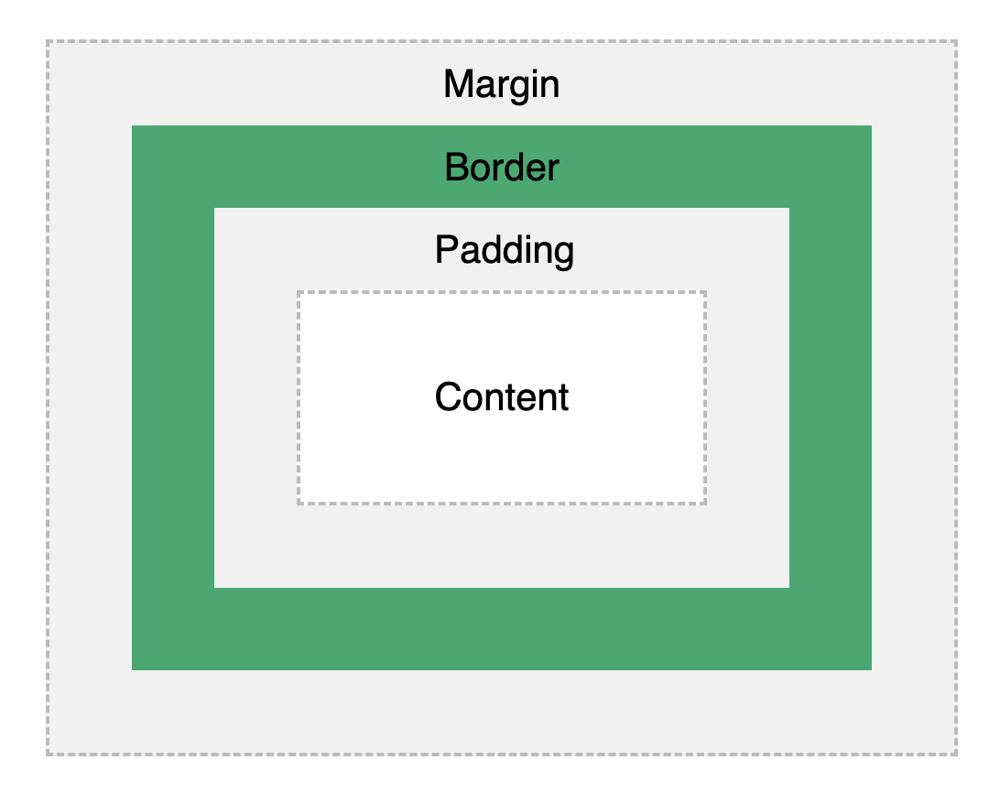
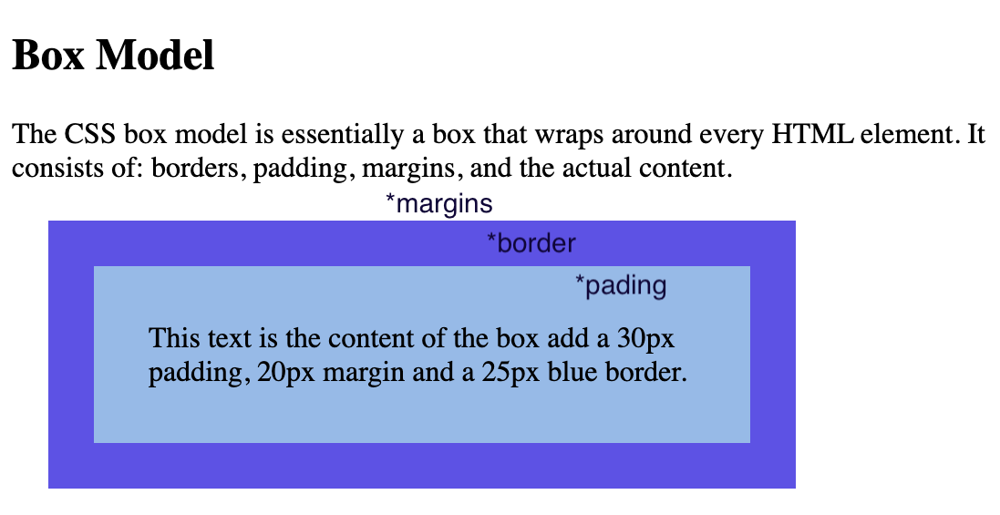
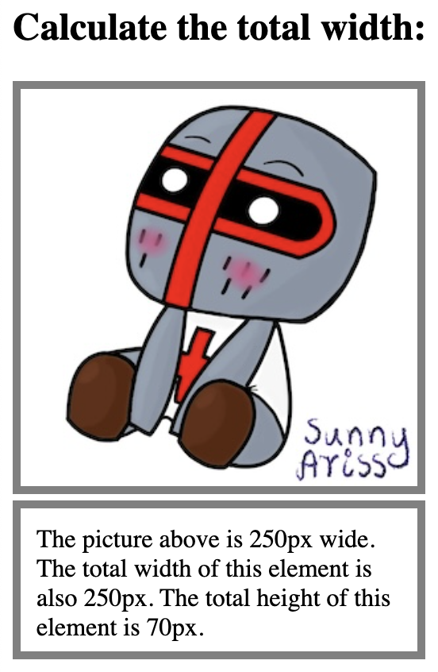

# Box model

CSS box model is essentially a box that wraps around every HTML element. It consists of: content, padding, borders and margins



- Content - The content of the box, where text and images appear

- Padding - Clears an area around the content. The padding is transparent

- Border - A border that goes around the padding and content

- Margin - Clears an area outside the border. The margin is transparent


```
<!DOCTYPE html>
<html>
<head>
<style>
div {
  background-color: rgb(142, 187, 235);
  width: 300px;
  border: 25px solid rgb(95, 82, 237);
  padding: 30px;
  margin: 20px;
}
</style>
</head>
<body>

<h2>Box Model</h2>

<p>The CSS box model is essentially a box that wraps around every HTML element. It consists of: borders, padding, margins, and the actual content.</p>

<div>This text is the content of the box add a 30px padding, 20px margin and a 25px blue border.</div>

</body>
</html>
```



```
<!DOCTYPE html>
<html>
<head>
<style>
div {
  width: 230px;
  height: 70px;
  padding: 10px;
  border: 5px solid gray;
  margin: 0px;
}
img {
  border: 5px solid gray;
}
</style>
</head>
<body>

<h2>Calculate the total width:</h2>


<div>The picture above is 250px wide. The total width of this element is also 250px. The total height of this element is 70px.</div>

</body>
</html>
```

```
230px (width of content area)
+ 20px (left padding + right padding)
+ 10px (left border + right border)
= 250px (total width)

  70px (height of content area)
+ 20px (top padding + bottom padding)
+ 10px (top border + bottom border)
= 100px (total height)
```


