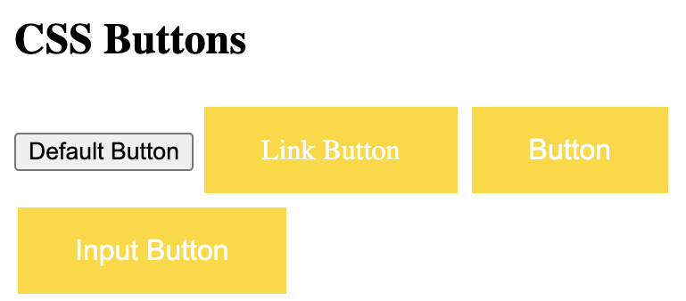
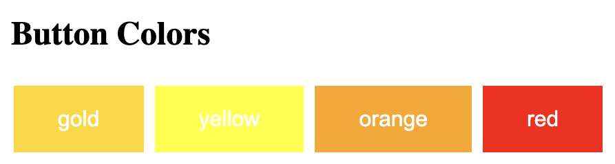
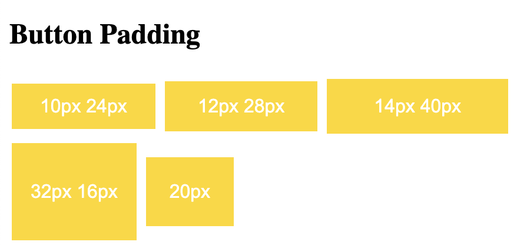
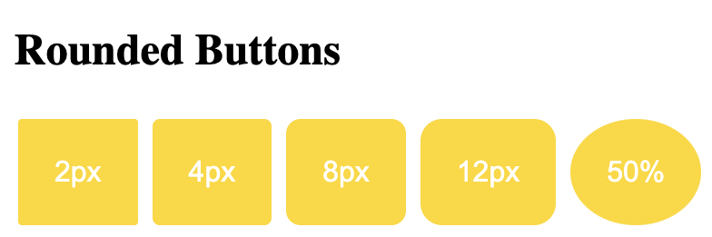
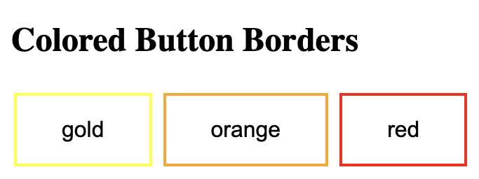
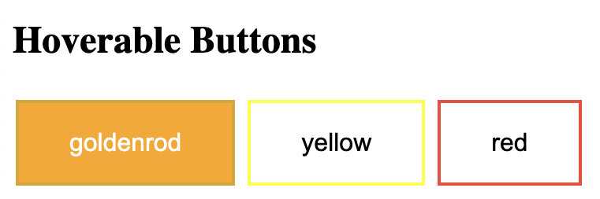
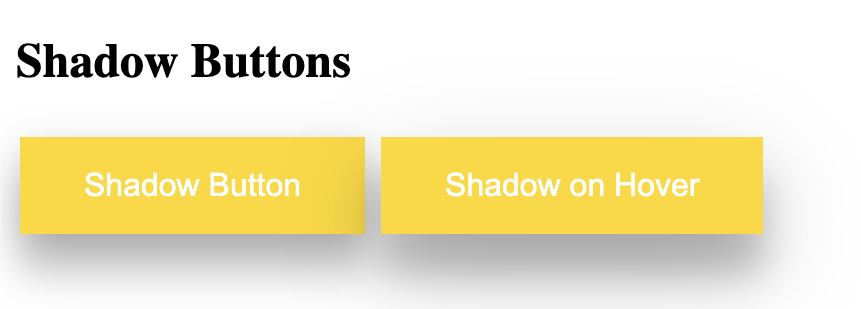
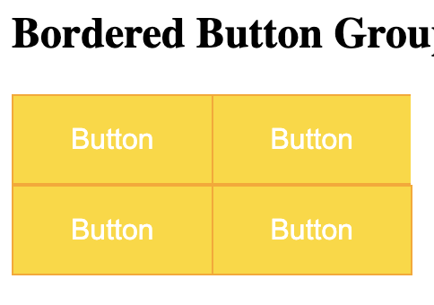
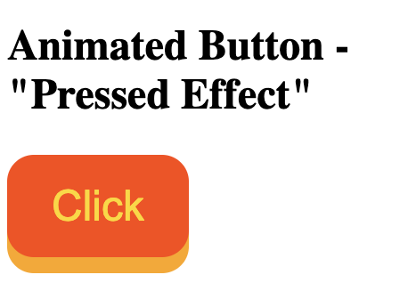

# Buttons

```
<!DOCTYPE html>
<html>
<head>
<style>
.button {
  background-color: gold;
  border: none;
  color: white;
  padding: 15px 32px;
  text-align: center;
  text-decoration: none;
  display: inline-block;
  font-size: 16px;
  margin: 4px 2px;
  cursor: pointer;
}
</style>
</head>
<body>

<h2>CSS Buttons</h2>

<button>Default Button</button>
<a href="#" class="button">Link Button</a>
<button class="button">Button</button>
<input type="button" class="button" value="Input Button">

</body>
</html>
```


## Color
```
<!DOCTYPE html>
<html>
<head>
<style>
.button {
  background-color: gold; 
  border: none;
  color: white;
  padding: 15px 32px;
  text-align: center;
  text-decoration: none;
  display: inline-block;
  font-size: 16px;
  margin: 4px 2px;
  cursor: pointer;
}

.button2 {background-color: yellow;} 
.button3 {background-color: orange;} 
.button4 {background-color: red;} 
</style>
</head>
<body>

<h2>Button Colors</h2>

<button class="button">gold</button>
<button class="button button2">yellow</button>
<button class="button button3">orange</button>
<button class="button button4">red</button>

</body>
</html>
```



## Padding

```
<!DOCTYPE html>
<html>
<head>
<style>
.button {
  background-color: gold; 
  border: none;
  color: white;
  text-align: center;
  text-decoration: none;
  display: inline-block;
  font-size: 16px;
  margin: 4px 2px;
  cursor: pointer;
}

.button1 {padding: 10px 24px;}
.button2 {padding: 12px 28px;}
.button3 {padding: 14px 40px;}
.button4 {padding: 32px 16px;}
.button5 {padding: 20px;}
</style>
</head>
<body>

<h2>Button Padding</h2>

<button class="button button1">10px 24px</button>
<button class="button button2">12px 28px</button>
<button class="button button3">14px 40px</button>
<button class="button button4">32px 16px</button>
<button class="button button5">20px</button>

</body>
</html>
```



## Rounded

```
<!DOCTYPE html>
<html>
<head>
<style>
.button {
  background-color: gold; 
  border: none;
  color: white;
  padding: 20px;
  text-align: center;
  text-decoration: none;
  display: inline-block;
  font-size: 16px;
  margin: 4px 2px;
  cursor: pointer;
}

.button1 {border-radius: 2px;}
.button2 {border-radius: 4px;}
.button3 {border-radius: 8px;}
.button4 {border-radius: 12px;}
.button5 {border-radius: 50%;}
</style>
</head>
<body>

<h2>Rounded Buttons</h2>

<button class="button button1">2px</button>
<button class="button button2">4px</button>
<button class="button button3">8px</button>
<button class="button button4">12px</button>
<button class="button button5">50%</button>

</body>
</html>
```


## Borders 

```
<!DOCTYPE html>
<html>
<head>
<style>
.button {
  background-color: gold; 
  border: none;
  color: white;
  padding: 15px 32px;
  text-align: center;
  text-decoration: none;
  display: inline-block;
  font-size: 16px;
  margin: 4px 2px;
  cursor: pointer;
}

.button1 {
  background-color: white; 
  color: black; 
  border: 2px solid yellow;
}

.button2 {
  background-color: white; 
  color: black; 
  border: 2px solid orange;
}

.button3 {
  background-color: white; 
  color: black; 
  border: 2px solid red;
}

</style>
</head>
<body>

<h2>Colored Button Borders</h2>

<button class="button button1">gold</button>
<button class="button button2">orange</button>
<button class="button button3">red</button>

</body>
</html>
```


Hover

```
<!DOCTYPE html>
<html>
<head>
<style>
.button {
  background-color: gold; 
  border: none;
  color: white;
  padding: 16px 32px;
  text-align: center;
  text-decoration: none;
  display: inline-block;
  font-size: 16px;
  margin: 4px 2px;
  transition-duration: 0.4s;
  cursor: pointer;
}

.button1 {
  background-color: white; 
  color: black; 
  border: 2px solid goldenrod;
}

.button1:hover {
  background-color: orange;
  color: white;
}

.button2 {
  background-color: white; 
  color: black; 
  border: 2px solid yellow;
}

.button2:hover {
  background-color: yellow;
  color: white;
}

.button3 {
  background-color: white; 
  color: black; 
  border: 2px solid #f44336;
}

.button3:hover {
  background-color: #f44336;
  color: white;
}

</style>
</head>
<body>

<h2>Hoverable Buttons</h2>

<button class="button button1">goldenrod</button>
<button class="button button2">yellow</button>
<button class="button button3">red</button>

</body>
</html>
```



## Shadow

```
<!DOCTYPE html>
<html>
<head>
<style>
.button {
  background-color: gold; 
  border: none;
  color: white;
  padding: 15px 32px;
  text-align: center;
  text-decoration: none;
  display: inline-block;
  font-size: 16px;
  margin: 4px 2px;
  cursor: pointer;
  -webkit-transition-duration: 0.4s; /* Safari */
  transition-duration: 0.4s;
}

.button1 {
  box-shadow: 0 20px 20px 0 rgba(0,0,0,0.2), 0 6px 20px 0 rgba(0,0,0,0.19);
}

.button2:hover {
  box-shadow: 0 20px 20px 0 rgba(0,0,0,0.24),0 17px 50px 0 rgba(0,0,0,0.19);
}
</style>
</head>
<body>

<h2>Shadow Buttons</h2>

<button class="button button1">Shadow Button</button>
<button class="button button2">Shadow on Hover</button>

</body>
</html>
```


## Disabled button

```
<!DOCTYPE html>
<html>
<head>
<style>
.button {
  background-color: gold; 
  border: none;
  color: white;
  padding: 15px 32px;
  text-align: center;
  text-decoration: none;
  display: inline-block;
  font-size: 16px;
  margin: 4px 2px;
  cursor: pointer;
}

.disabled {
  opacity: 0.6;
  cursor: not-allowed;
}
</style>
</head>
<body>

<h2>Disabled Button</h2>

<button class="button">Normal Button</button>
<button class="button disabled">Disabled Button</button>

</body>
</html>
```

## Button Groups

```
<!DOCTYPE html>
<html>
<head>
<style>
.btn-group .button {
  background-color: gold;
  color: white;
  padding: 15px 32px;
  text-align: center;
  text-decoration: none;
  display: inline-block;
  font-size: 16px;
  cursor: pointer;
  float: left;
}

.btn-group .button:hover {
  background-color: #3e8e41;
}
</style>
</head>
<body>

<h2>Button Groups</h2>

<div class="btn-group">
  <button class="button">Button</button>
  <button class="button">Button</button>
  <button class="button">Button</button>
  <button class="button">Button</button>
</div>

<p style="clear:both">

</body>
</html>
```

## Bordered button group

```
<!DOCTYPE html>
<html>
<head>
<style>
.btn-group .button {
  background-color: gold;
  border: 1px solid orange;
  color: white;
  padding: 15px 32px;
  text-align: center;
  text-decoration: none;
  display: inline-block;
  font-size: 16px;
  cursor: pointer;
  float: left;
}

.btn-group .button:not(:last-child) {
  border-right: none; /* Prevent double borders */
}

.btn-group .button:hover {
  background-color: white;
}
</style>
</head>
<body>

<h2>Bordered Button Group</h2>

<div class="btn-group">
  <button class="button">Button</button>
  <button class="button">Button</button>
  <button class="button">Button</button>
  <button class="button">Button</button>
</div>

<p style="clear:both">
</body>
</html>
```


## Vertical Button Group

```
.button {
  display: block;
}
```
## Button on Image

```
<!DOCTYPE html>
<html>
<head>
<style>
.container {
  position: relative;
  width: 100%;
  max-width: 400px;
}

.container img {
  width: 100%;
  height: auto;
}

.container .btn {
  position: absolute;
  top: 50%;
  left: 50%;
  transform: translate(-50%, -50%);
  -ms-transform: translate(-50%, -50%);
  background-color: #f1f1f1;
  color: black;
  font-size: 16px;
  padding: 16px 30px;
  border: none;
  cursor: pointer;
  border-radius: 5px;
  text-align: center;
}

.container .btn:hover {
  background-color: black;
  color: white;
}
</style>
</head>
<body>

<h2>Button on Image</h2>

<p>Add a button on an image:</p>

<div class="container">
  
  <button class="btn">Button</button>
</div>

</body>
</html>
```

## Animated Button
 

### arrow
```
<!DOCTYPE html>
<html>
<head>
<style>
.button {
  display: inline-block;
  border-radius: 4px;
  background-color: gold;
  border: none;
  color: #FFFFFF;
  text-align: center;
  font-size: 28px;
  padding: 20px;
  width: 200px;
  transition: all 0.5s;
  cursor: pointer;
  margin: 5px;
}

.button span {
  cursor: pointer;
  display: inline-block;
  position: relative;
  transition: 0.5s;
}

.button span:after {
  content: '\00bb';
  position: absolute;
  opacity: 0;
  top: 0;
  right: -20px;
  transition: 0.5s;
}

.button:hover span {
  padding-right: 25px;
}

.button:hover span:after {
  opacity: 1;
  right: 0;
}
</style>
</head>
<body>

<h2>Animated Button</h2>

<button class="button" style="vertical-align:middle"><span>Hover </span></button>

</body>
</html>
```

### pressed

```
<!DOCTYPE html>
<html>
<head>
<style>
.button {
  display: inline-block;
  padding: 15px 25px;
  font-size: 24px;
  cursor: pointer;
  text-align: center;
  text-decoration: none;
  outline: none;
  color: gold;
  background-color: orangered;
  border: none;
  border-radius: 15px;
  box-shadow: 0 9px orange;
}

.button:hover {background-color: red}

.button:active {
  background-color: #3e8e41;
  box-shadow: 0 5px #666;
  transform: translateY(4px);
}
</style>
</head>
<body>

<h2>Animated Button - "Pressed Effect"</h2>

<button class="button">Click</button>

</body>
</html>
```


