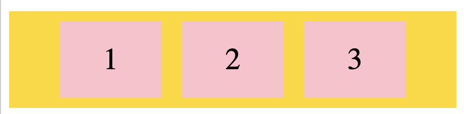
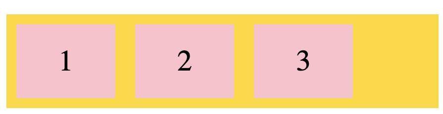
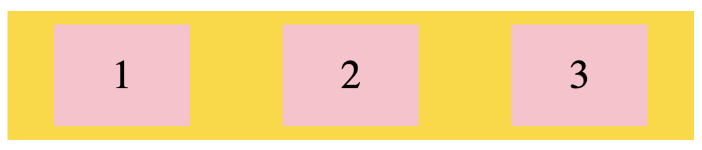
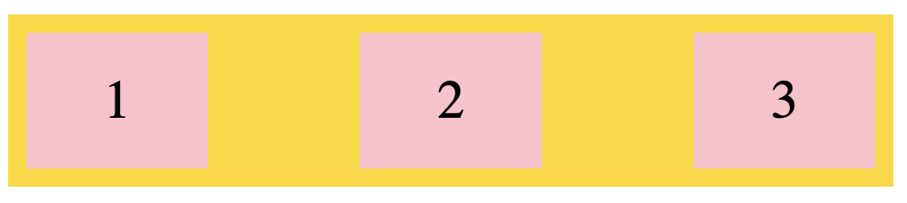
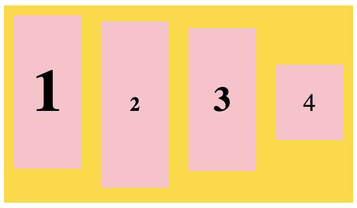

# Flex container

## flex-direction - property defines in which direction the container wants to stack the flex items.

### column value stacks the flex items vertically (from top to bottom):

```
.flex-container {
  display: flex;
  flex-direction: column;
}
```

### column-reverse value stacks the flex items vertically (but from bottom to top):

```
.flex-container {
  display: flex;
  flex-direction: column-reverse;
}
```
### row value stacks the flex items horizontally (from left to right):

```
.flex-container {
  display: flex;
  flex-direction: row;
}
```
### row-reverse value stacks the flex items horizontally (but from right to left):

```
.flex-container {
  display: flex;
  flex-direction: row-reverse;
}
```


## flex-wrap - property specifies whether the flex items should wrap or not.

### wrap value specifies that the flex items will wrap if necessary:

```
.flex-container {
  display: flex;
  flex-wrap: wrap;
}
```

### nowrap value specifies that the flex items will not wrap (this is default):

```
.flex-container {
  display: flex;
  flex-wrap: nowrap;
}
```
### wrap-reverse value specifies that the flexible items will wrap if necessary, in reverse order:

```
.flex-container {
  display: flex;
  flex-wrap: wrap-reverse;
}
```

## flex-flow - flex-flow property is a shorthand property for setting both the flex-direction and flex-wrap properties.

```
.flex-container {
  display: flex;
  flex-flow: row wrap;
}
```

## justify-content - justify-content property is used to align the flex items:

## center value aligns the flex items at the center of the container:

```
.flex-container {
  display: flex;
  justify-content: center;
}
```


### flex-end value aligns the flex items at the end of the container:

```
.flex-container {
  display: flex;
  justify-content: flex-end;
}
```



### space-around value displays the flex items with space before, between, and after the lines:

```
.flex-container {
  display: flex;
  justify-content: space-around;
}
```


### space-between value displays the flex items with space between the lines:

```
.flex-container {
  display: flex;
  justify-content: space-between;
}
```


## align-items - align-items property is used to align the flex items.

### center value aligns the flex items in the middle of the container:

```
.flex-container {
  display: flex;
  height: 200px;
  align-items: center;
}
```
### flex-start value aligns the flex items at the top of the container:
```
.flex-container {
  display: flex;
  height: 200px;
  align-items: flex-start;
}
```

### flex-end value aligns the flex items at the bottom of the container:
```
.flex-container {
  display: flex;
  height: 200px;
  align-items: flex-end;
}
```

### stretch value stretches the flex items to fill the container (this is default):

```
.flex-container {
  display: flex;
  height: 200px;
  align-items: stretch;
}
```

### baseline value aligns the flex items such as their baselines aligns:


```
.flex-container {
  display: flex;
  height: 200px;
  align-items: baseline;
}
```



## align-content - property is used to align the flex lines.

### space-between value displays the flex lines with equal space between them:

```
.flex-container {
  display: flex;
  height: 600px;
  flex-wrap: wrap;
  align-content: space-between;
}
```
### space-around value displays the flex lines with space before, between, and after them:

```
.flex-container {
  display: flex;
  height: 600px;
  flex-wrap: wrap;
  align-content: space-around;
}
```

### stretch value stretches the flex lines to take up the remaining space (this is default):

```
.flex-container {
  display: flex;
  height: 600px;
  flex-wrap: wrap;
  align-content: stretch;
}
```

### center value displays the flex lines in the middle of the container:

```
.flex-container {
  display: flex;
  height: 600px;
  flex-wrap: wrap;
  align-content: center;
}
```
### flex-start value displays the flex lines at the start of the container:

```
.flex-container {
  display: flex;
  height: 600px;
  flex-wrap: wrap;
  align-content: flex-start;
}
```

### flex-end value displays the flex lines at the end of the container: 

```
.flex-container {
  display: flex;
  height: 600px;
  flex-wrap: wrap;
  align-content: flex-end;
}
```

# Perfect Centering

justify-content and align-items properties to center, and the flex item will be perfectly centered:

```
.flex-container {
  display: flex;
  height: 300px;
  justify-content: center;
  align-items: center;
}
```
