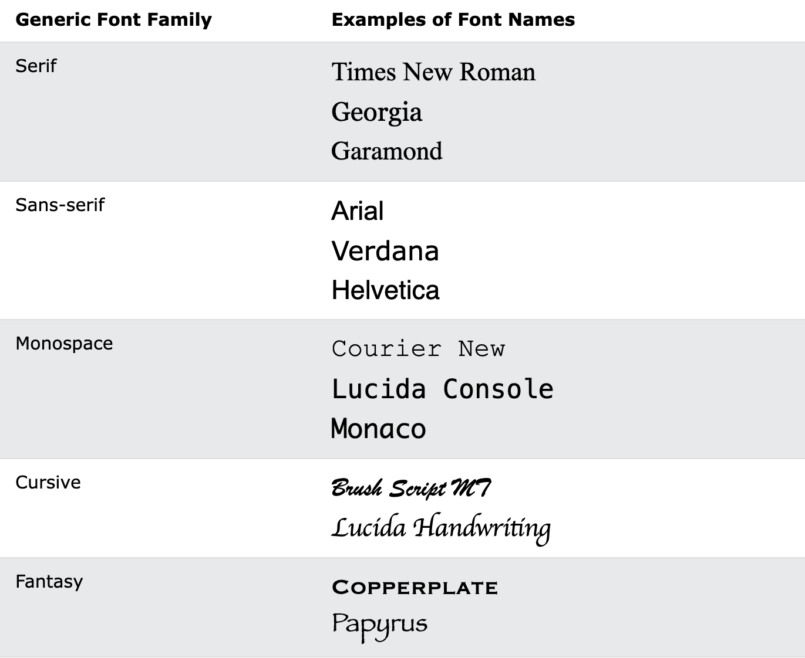
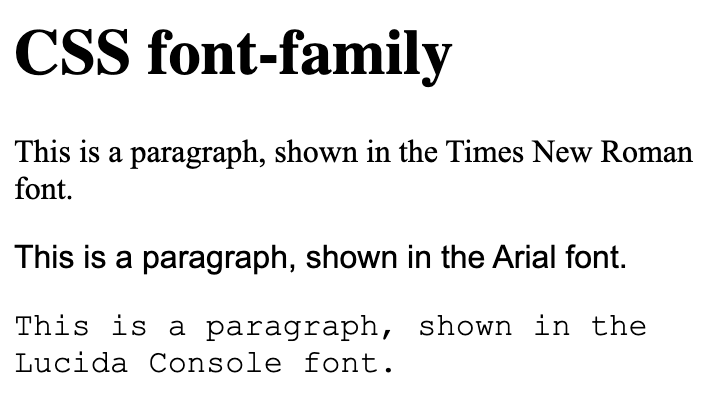
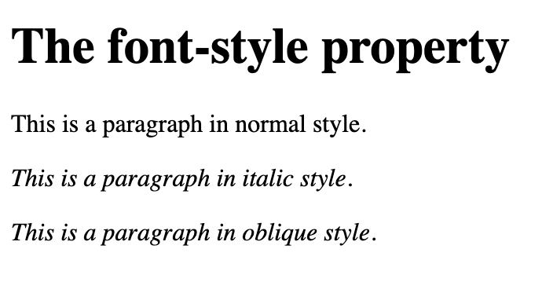
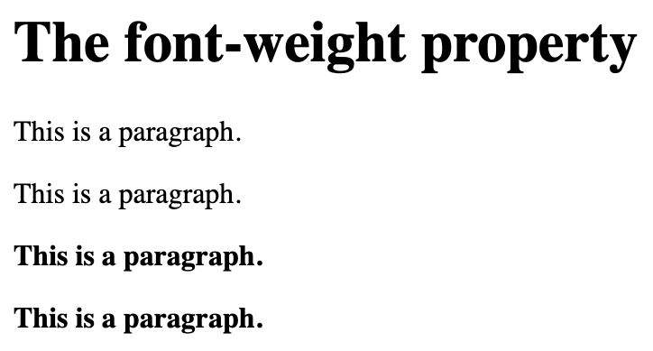
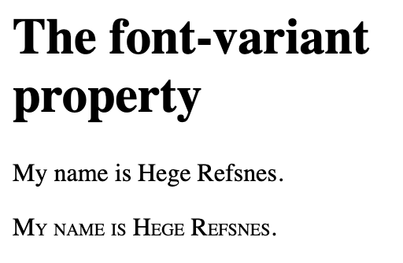

# Fronts

Font families:

1. Serif fonts have a small stroke at the edges of each letter. They create a sense of formality and elegance.

2. Sans-serif fonts have clean lines (no small strokes attached). They create a modern and minimalistic look.

3. Monospace fonts - here all the letters have the same fixed width. They create a mechanical look. 

4. Cursive fonts imitate human handwriting.

5. Fantasy fonts are decorative/playful fonts.



```
<!DOCTYPE html>
<html>
<head>
<style>
.p1 {
  font-family: "Times New Roman", Times, serif;
}

.p2 {
  font-family: Arial, Helvetica, sans-serif;
}

.p3 {
  font-family: "Lucida Console", "Courier New", monospace;
}
</style>
</head>
<body>

<h1>CSS font-family</h1>
<p class="p1">This is a paragraph, shown in the Times New Roman font.</p>
<p class="p2">This is a paragraph, shown in the Arial font.</p>
<p class="p3">This is a paragraph, shown in the Lucida Console font.</p>

</body>
</html>
```


There are three font types. The second and third fonts are backups, in case the first one is not found.

List of the best web safe fonts for HTML and CSS:

- Arial (sans-serif)
- Verdana (sans-serif)
- Tahoma (sans-serif)
- Trebuchet MS (sans-serif)
- Times New Roman (serif)
- Georgia (serif)
- Garamond (serif)
- Courier New (monospace)
- Brush Script MT (cursive)

## `font-style`

Used to specify italic text.

- normal - The text is shown normally
- italic - The text is shown in italics
- oblique - The text is "leaning" (oblique is very similar to italic, but less supported)

```
<!DOCTYPE html>
<html>
<head>
<style>
p.normal {
  font-style: normal;
}

p.italic {
  font-style: italic;
}

p.oblique {
  font-style: oblique;
}
</style>
</head>
<body>

<h1>The font-style property</h1>

<p class="normal">This is a paragraph in normal style.</p>
<p class="italic">This is a paragraph in italic style.</p>
<p class="oblique">This is a paragraph in oblique style.</p>

</body>
</html>
```


## `font-weight`

```
<!DOCTYPE html>
<html>
<head>
<style>
p.normal {
  font-weight: normal;
}

p.light {
  font-weight: lighter;
}

p.thick {
  font-weight: bold;
}

p.thicker {
  font-weight: 900;
}
</style>
</head>
<body>

<h1>The font-weight property</h1>

<p class="normal">This is a paragraph.</p>
<p class="light">This is a paragraph.</p>
<p class="thick">This is a paragraph.</p>
<p class="thicker">This is a paragraph.</p>

</body>
</html>
```



## `font-variant`

`font-variant` property specifies whether or not a text should be displayed in a small-caps font.

```
<!DOCTYPE html>
<html>
<head>
<style>
p.normal {
  font-variant: normal;
}

p.small {
  font-variant: small-caps;
}
</style>
</head>
<body>

<h1>The font-variant property</h1>

<p class="normal">My name is Hege Refsnes.</p>
<p class="small">My name is Hege Refsnes.</p>

</body>
</html>
```


