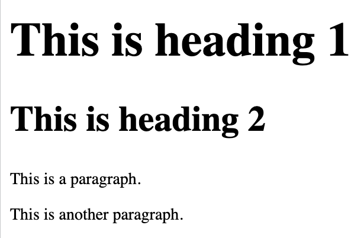
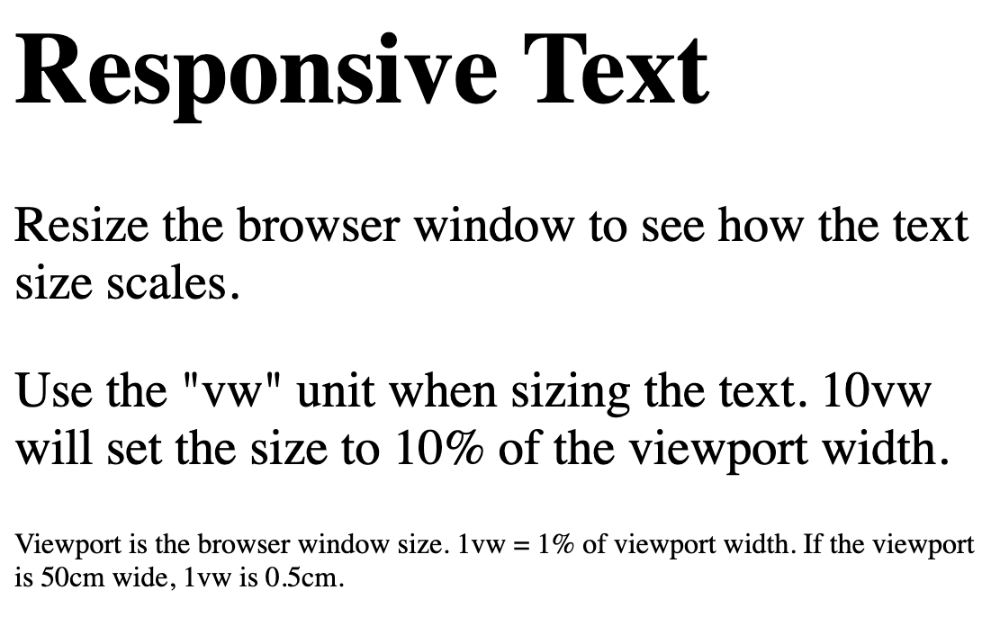
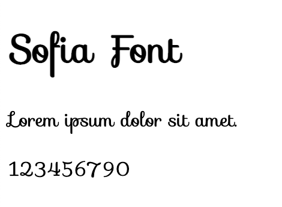
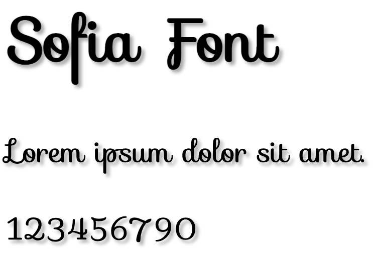
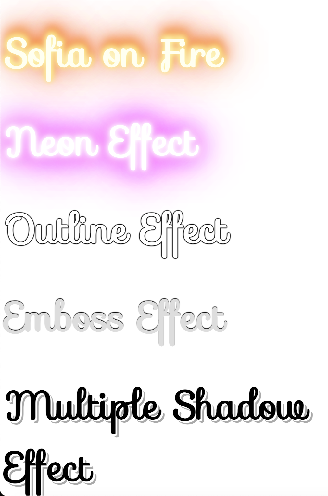
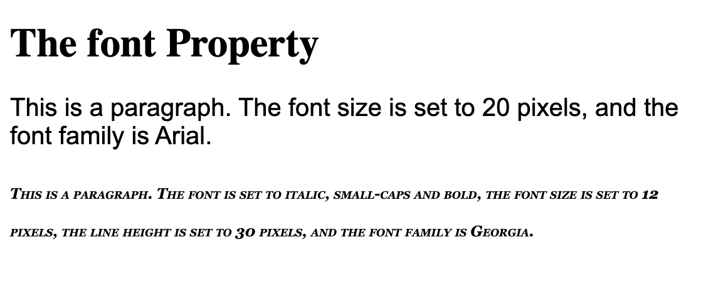

# Fronts

Font families:

1. Serif fonts have a small stroke at the edges of each letter. They create a sense of formality and elegance.

2. Sans-serif fonts have clean lines (no small strokes attached). They create a modern and minimalistic look.

3. Monospace fonts - here all the letters have the same fixed width. They create a mechanical look. 

4. Cursive fonts imitate human handwriting.

5. Fantasy fonts are decorative/playful fonts.


```
<!DOCTYPE html>
<html>
<head>
<style>
.p1 {
  font-family: "Times New Roman", Times, serif;
}

.p2 {
  font-family: Arial, Helvetica, sans-serif;
}

.p3 {
  font-family: "Lucida Console", "Courier New", monospace;
}
</style>
</head>
<body>

<h1>CSS font-family</h1>
<p class="p1">This is a paragraph, shown in the Times New Roman font.</p>
<p class="p2">This is a paragraph, shown in the Arial font.</p>
<p class="p3">This is a paragraph, shown in the Lucida Console font.</p>

</body>
</html>
```


There are three font types. The second and third fonts are backups, in case the first one is not found.

List of the best web safe fonts for HTML and CSS:

- Arial (sans-serif)
- Verdana (sans-serif)
- Tahoma (sans-serif)
- Trebuchet MS (sans-serif)
- Times New Roman (serif)
- Georgia (serif)
- Garamond (serif)
- Courier New (monospace)
- Brush Script MT (cursive)

## `font-style`

Used to specify italic text.

- normal - The text is shown normally
- italic - The text is shown in italics
- oblique - The text is "leaning" (oblique is very similar to italic, but less supported)

```
<!DOCTYPE html>
<html>
<head>
<style>
p.normal {
  font-style: normal;
}

p.italic {
  font-style: italic;
}

p.oblique {
  font-style: oblique;
}
</style>
</head>
<body>

<h1>The font-style property</h1>

<p class="normal">This is a paragraph in normal style.</p>
<p class="italic">This is a paragraph in italic style.</p>
<p class="oblique">This is a paragraph in oblique style.</p>

</body>
</html>
```


## `font-weight`

```
<!DOCTYPE html>
<html>
<head>
<style>
p.normal {
  font-weight: normal;
}

p.light {
  font-weight: lighter;
}

p.thick {
  font-weight: bold;
}

p.thicker {
  font-weight: 900;
}
</style>
</head>
<body>

<h1>The font-weight property</h1>

<p class="normal">This is a paragraph.</p>
<p class="light">This is a paragraph.</p>
<p class="thick">This is a paragraph.</p>
<p class="thicker">This is a paragraph.</p>

</body>
</html>
```


## `font-variant`

`font-variant` property specifies whether or not a text should be displayed in a small-caps font.

```
<!DOCTYPE html>
<html>
<head>
<style>
p.normal {
  font-variant: normal;
}

p.small {
  font-variant: small-caps;
}
</style>
</head>
<body>

<h1>The font-variant property</h1>

<p class="normal">My name is Hege Refsnes.</p>
<p class="small">My name is Hege Refsnes.</p>

</body>
</html>
```


## `font-size`

```
<!DOCTYPE html>
<html>
<head>
<style>
h1 {
  font-size: 40px;
}

h2 {
  font-size: 30px;
}

p {
  font-size: 14px;
}
</style>
</head>
<body>

<h1>This is heading 1</h1>
<h2>This is heading 2</h2>
<p>This is a paragraph.</p>
<p>This is another paragraph.</p>

</body>
</html>
```


### Font Size With Em

```
h1 {
  font-size: 2.5em; /* 40px/16=2.5em */
}

h2 {
  font-size: 1.875em; /* 30px/16=1.875em */
}

p {
  font-size: 0.875em; /* 14px/16=0.875em */
}
```
## Responsive Font Size

```
<!DOCTYPE html>
<html>
<meta name="viewport" content="width=device-width, initial-scale=1.0">
<body>

<h1 style="font-size:10vw;">Responsive Text</h1>

<p style="font-size:5vw;">Resize the browser window to see how the text size scales.</p>

<p style="font-size:5vw;">Use the "vw" unit when sizing the text. 10vw will set the size to 10% of the viewport width.</p>

<p>Viewport is the browser window size. 1vw = 1% of viewport width. If the viewport is 50cm wide, 1vw is 0.5cm.</p>

</body>
</html>
```


## CSS Google Fonts

Google Fonts are free to use, and have more than 1000 fonts to choose from.
https://www.w3schools.com/howto/howto_google_fonts.asp

```
<!DOCTYPE html>
<html>
<head>
<link rel="stylesheet" href="https://fonts.googleapis.com/css?family=Sofia">
<style>
body {
  font-family: "Sofia", sans-serif;
}
</style>
</head>
<body>

<h1>Sofia Font</h1>
<p>Lorem ipsum dolor sit amet.</p>
<p>123456790</p>

</body>
</html>
```



## Styling Google Fonts

```
<!DOCTYPE html>
<html>
<head>
<link rel="stylesheet" href="https://fonts.googleapis.com/css?family=Sofia">
<style>
body {
  font-family: "Sofia", sans-serif;
  font-size: 30px;
  text-shadow: 3px 3px 3px #ababab;
}
</style>
</head>
<body>

<h1>Sofia Font</h1>
<p>Lorem ipsum dolor sit amet.</p>
<p>123456790</p>

</body>
</html>
```


## `effect=effectname`

```
<!DOCTYPE html>
<html>
<head>
<link rel="stylesheet" href="https://fonts.googleapis.com/css?family=Sofia&effect=neon|outline|emboss|shadow-multiple|fire">
<style>
body {
  font-family: "Sofia", sans-serif;
  font-size: 30px;
}
</style>
</head>
<body>

<h1 class="font-effect-fire">Sofia on Fire</h1>
<h1 class="font-effect-neon">Neon Effect</h1>
<h1 class="font-effect-outline">Outline Effect</h1>
<h1 class="font-effect-emboss">Emboss Effect</h1>
<h1 class="font-effect-shadow-multiple">Multiple Shadow Effect</h1>

</body>
</html>
```


## Font Property

The font property is a shorthand property for:

- font-style
- font-variant
- font-weight
- font-size/line-height
- font-family

```
<!DOCTYPE html>
<html>
<head>
<style>
p.a {
  font: 20px Arial, sans-serif;
}

p.b {
  font: italic small-caps bold 12px/30px Georgia, serif;
}
</style>
</head>
<body>

<h1>The font Property</h1>

<p class="a">This is a paragraph. The font size is set to 20 pixels, and the font family is Arial.</p>

<p class="b">This is a paragraph. The font is set to italic, small-caps and bold, the font size is set to 12 pixels, the line height is set to 30 pixels, and the font family is Georgia.</p>

</body>
</html>
```


## CSS Colors

```
<!DOCTYPE html>
<html>
<head>
<style>
#p1 {background-color:rgba(255,0,0,0.3);}
#p2 {background-color:rgba(0,255,0,0.3);}
#p3 {background-color:rgba(0,0,255,0.3);}
#p4 {background-color:rgba(192,192,192,0.3);}
#p5 {background-color:rgba(255,255,0,0.3);}
#p6 {background-color:rgba(255,0,255,0.3);}
</style>
</head>
<body>

<h1>Define Colors With RGBA Values</h1>

<p id="p1">Red</p>
<p id="p2">Green</p>
<p id="p3">Blue</p>
<p id="p4">Grey</p>
<p id="p5">Yellow</p>
<p id="p6">Cerise</p>

</body>
</html>
```
## CSS Colors With Opacity

```
<!DOCTYPE html>
<html>
<head>
<style>
#p1 {background-color:rgb(255,0,0);opacity:0.6;}
#p2 {background-color:rgb(0,255,0);opacity:0.6;}
#p3 {background-color:rgb(0,0,255);opacity:0.6;}
#p4 {background-color:rgb(192,192,192);opacity:0.6;}
#p5 {background-color:rgb(255,255,0);opacity:0.6;}
#p6 {background-color:rgb(255,0,255);opacity:0.6;}
</style>
</head>
<body>

<h1>Define Colors With Opacity</h1>

<p id="p1">Red</p>
<p id="p2">Green</p>
<p id="p3">Blue</p>
<p id="p4">Grey</p>
<p id="p5">Yellow</p>
<p id="p6">Cerise</p>

</body>
</html>
```

