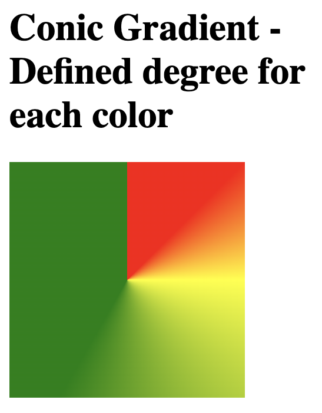

## Linear Gradients

```
<!DOCTYPE html>
<html>
<head>
<style>
#grad1 {
  height: 200px;
  background-color: rgb(86, 61, 246); /* For browsers that do not support gradients */
  background-image: linear-gradient(rgb(86, 61, 246), yellow);
}
</style>
</head>
<body>

<h1>Linear Gradient - Top to Bottom</h1>

<div id="grad1"></div>

</body>
</html>
```


```
<!DOCTYPE html>
<html>
<head>
<style>
#grad1 {
  height: 200px;
  background-color: rgb(86, 61, 246); /* For browsers that do not support gradients */
  background-image: linear-gradient(to right,rgb(86, 61, 246) , yellow);
}
</style>
</head>
<body>

<h1>Linear Gradient - Left to Right</h1>

<div id="grad1"></div>

</body>
</html>
```


```
<!DOCTYPE html>
<html>
<head>
<style>
#grad1 {
  height: 200px;
  background-color: rgb(86, 61, 246); /* For browsers that do not support gradients */
  background-image: linear-gradient(to bottom right, rgb(86, 61, 246), yellow);
}
</style>
</head>
<body>

<h1>Linear Gradient - top left to bottom right</h1>

<div id="grad1"></div>

</body>
</html>
```


```
<!DOCTYPE html>
<html>
<head>
<style>
#grad1 {
  height: 100px;
  background-color: rgb(86, 61, 246); /* For browsers that do not support gradients */
  background-image: linear-gradient(0deg, rgb(86, 61, 246), yellow);
}

#grad2 {
  height: 100px;
  background-color: rgb(86, 61, 246); /* For browsers that do not support gradients */
  background-image: linear-gradient(90deg, rgb(86, 61, 246), yellow);
}

#grad3 {
  height: 100px;
  background-color: rgb(86, 61, 246); /* For browsers that do not support gradients */
  background-image: linear-gradient(180deg, rgb(86, 61, 246), yellow);
}

#grad4 {
  height: 100px;
  background-color: rgb(86, 61, 246); /* For browsers that do not support gradients */
  background-image: linear-gradient(-90deg, rgb(86, 61, 246), yellow);
}
</style>
</head>
<body>

<h1>Linear Gradients - Using Different Angles</h1>

<div id="grad1" style="text-align:center;">0deg</div><br>
<div id="grad2" style="text-align:center;">90deg</div><br>
<div id="grad3" style="text-align:center;">180deg</div><br>
<div id="grad4" style="text-align:center;">-90deg</div>

</body>
</html>
```


```
<!DOCTYPE html>
<html>
<head>
<style>
#grad1 {
  height: 200px;
  background-color: red; /* For browsers that do not support gradients */
  background-image: linear-gradient(red, yellow, green);
}

#grad2 {
  height: 200px;
  background-color: red; /* For browsers that do not support gradients */
  background-image: linear-gradient(red, orange, yellow, green, blue, indigo, violet);
}

#grad3 {
  height: 200px;
  background-color: red; /* For browsers that do not support gradients */
  background-image: linear-gradient(red 10%, green 85%, blue 90%);
}
</style>
</head>
<body>

<h1>Linear Gradients - Multiple Color Stops</h1>

<h2>3 Color Stops (evenly spaced):</h2>
<div id="grad1"></div>

<h2>7 Color Stops (evenly spaced):</h2>
<div id="grad2"></div>

<h2>3 Color Stops (not evenly spaced):</h2>
<div id="grad3"></div>

</body>
</html>
```


```
<!DOCTYPE html>
<html>
<head>
<style>
#grad1 {
  height: 55px;
  background-color: red; /* For browsers that do not support gradients */
  background-image: linear-gradient(to right, red, orange, yellow, green, blue, indigo, violet);
}
</style>
</head>
<body>

<div id="grad1" style="text-align:center;margin:auto;color:#888888;font-size:40px;font-weight:bold">
Rainbow Background
</div>

</body>
</html>
```


```
<!DOCTYPE html>
<html>
<head>
<style>
#grad1 {
  height: 200px;
  background-image: linear-gradient(to right, rgba(255,0,0,0),rgb(86, 61, 246));
}
</style>
</head>
<body>

<div id="grad1"></div>

</body>
</html>
```


```
<!DOCTYPE html>
<html>
<head>
<style>
#grad1 {
  height: 100px;
  background-color: red; /* For browsers that do not support gradients */
  background-image: repeating-linear-gradient(red, yellow 10%, green 20%);
}

#grad2 {
  height: 100px;
  background-color: red; /* For browsers that do not support gradients */
  background-image: repeating-linear-gradient(45deg,red,yellow 7%,green 10%);
}

#grad3 {
  height: 100px;
  background-color: red; /* For browsers that do not support gradients */
  background-image: repeating-linear-gradient(190deg,red,yellow 7%,green 10%);
}

#grad4 {
  height: 100px;
  background-color: red; /* For browsers that do not support gradients */
  background-image: repeating-linear-gradient(90deg,red,yellow 7%,green 10%);
}

#grad5 {
  height: 100px;
  background-color: red; /* For browsers that do not support gradients */
  background-image: repeating-linear-gradient(45deg, red 0px, red 10px, yellow 10px, yellow 20px);
}
</style>
</head>
<body>

<div id="grad1"></div>

<p>A repeating gradient on 45deg axe starting red and finishing green:</p>
<div id="grad2"></div>

<p>A repeating gradient on 190deg axe starting red and finishing green:</p>
<div id="grad3"></div>

<p>A repeating gradient on 90deg axe starting red and finishing green:</p>
<div id="grad4"></div>

<p>A repeating gradient on 45deg axe with solid stripes:</p>
<div id="grad5"></div>

</body>
</html>
```


```
<!DOCTYPE html>
<html>
<head>
<style>
#grad1 {
  height: 150px;
  width: 200px;
  background-color: red; /* For browsers that do not support gradients */
  background-image: radial-gradient(red, yellow, green);
}
</style>
</head>
<body>

<h1>Radial Gradient - Evenly Spaced Color Stops</h1>

<div id="grad1"></div>

</body>
</html>
```


```
<!DOCTYPE html>
<html>
<head>
<style>
#grad1 {
  height: 150px;
  width: 200px;
  background-color: red; /* For browsers that do not support gradients */
  background-image: radial-gradient(red 5%, yellow 15%, green 60%);
}
</style>
</head>
<body>

<h1>Radial Gradient - Differently Spaced Color Stops</h1>

<div id="grad1"></div>

</body>
</html>
```


```
<!DOCTYPE html>
<html>
<head>
<style>
#grad1 {
  height: 150px;
  width: 200px;
  background-color: red; /* For browsers that do not support gradients */
  background-image: radial-gradient(red, yellow, green);
}

#grad2 {
  height: 150px;
  width: 200px;
  background-color: red; /* For browsers that do not support gradients */
  background-image: radial-gradient(circle, red, yellow, green);
}
</style>
</head>
<body>

<h1>Radial Gradient - Shapes</h1>

<h2>Ellipse (this is default):</h2>
<div id="grad1"></div>

<h2><strong>Circle:</strong></h2>
<div id="grad2"></div>

</body>
</html>
```


```
<!DOCTYPE html>
<html>
<head>
<style>
#grad1 {
  height: 120px;
  width: 120px;
  background-color: red; /* For browsers that do not support gradients */
  background-image: radial-gradient(closest-side at 60% 55%, red, yellow, black);
}

#grad2 {
  height: 120px;
  width: 120px;
  background-color: red; /* For browsers that do not support gradients */
  background-image: radial-gradient(farthest-side at 60% 55%, red, yellow, black);
}

#grad3 {
  height: 120px;
  width: 120px;
  background-color: red; /* For browsers that do not support gradients */
  background-image: radial-gradient(closest-corner at 60% 55%, red, yellow, black);
}

#grad4 {
  height: 120px;
  width: 120px;
  background-color: red; /* For browsers that do not support gradients */
  background-image: radial-gradient(farthest-corner at 60% 55%, red, yellow, black);
}
</style>
</head>
<body>

<h2>closest-side:</h2>
<div id="grad1"></div>

<h2>farthest-side:</h2>
<div id="grad2"></div>

<h2>closest-corner:</h2>
<div id="grad3"></div>

<h2>farthest-corner (default):</h2>
<div id="grad4"></div>

</body>
</html>
```


```
<!DOCTYPE html>
<html>
<head>
<style>
#grad1 {
  height: 150px;
  width: 200px;
  background-color: red; /* For browsers that do not support gradients */
  background-image: repeating-radial-gradient(red, yellow 10%, green 15%);
}
</style>
</head>
<body>

<h1>Repeating Radial Gradient</h1>

<div id="grad1"></div>

</body>
</html>
```


```
<!DOCTYPE html>
<html>
<head>
<style>
#grad1 {
  height: 200px;
  width: 200px;
  background-color: red; /* For browsers that do not support gradients */
  background-image: conic-gradient(red, yellow, green);
}
</style>
</head>
<body>

<h1>Conic Gradient - Three Colors</h1>

<div id="grad1"></div>

</body>
</html>
```


```
<!DOCTYPE html>
<html>
<head>
<style>
#grad1 {
  height: 200px;
  width: 200px;
  background-color: red; /* For browsers that do not support gradients */
  background-image: conic-gradient(red 45deg, yellow 90deg, green 210deg);
}
</style>
</head>
<body>

<h1>Conic Gradient - Defined degree for each color</h1>

<div id="grad1"></div>

</body>
</html>
```


```
<!DOCTYPE html>
<html>
<head>
<style>
#grad1 {
  height: 200px;
  width: 200px;
  background-color: red; /* For browsers that do not support gradients */
  background-image: conic-gradient(red, yellow, green, blue, black);
  border-radius: 50%;
}
</style>
</head>
<body>

<h1>Conic Gradient - Pie Chart</h1>

<div id="grad1"></div>

</body>
</html>
```


```
<!DOCTYPE html>
<html>
<head>
<style>
#grad1 {
  height: 200px;
  width: 200px;
  background-color: red; /* For browsers that do not support gradients */
  background-image: conic-gradient(from 90deg, red, yellow, green);
  border-radius: 50%;
}
</style>
</head>
<body>

<h1>Conic Gradient - With a from angle</h1>

<div id="grad1"></div>

</body>
</html>
```


```
<!DOCTYPE html>
<html>
<head>
<style>
#grad1 {
  height: 200px;
  width: 200px;
  background-color: red; /* For browsers that do not support gradients */
  background-image: conic-gradient(at 60% 45%, red, yellow, green);
  border-radius: 50%;
}
</style>
</head>
<body>

<h1>Conic Gradient - With a specified center position</h1>

<div id="grad1"></div>

</body>
</html>
```


```
<!DOCTYPE html>
<html>
<head>
<style>
#grad1 {
  height: 200px;
  width: 200px;
  background-color: red; /* For browsers that do not support gradients */
  background-image: repeating-conic-gradient(red 10%, yellow 20%);
  border-radius: 50%;
}
</style>
</head>
<body>

<h1>Repeating a Conic Gradient</h1>

<div id="grad1"></div>

</body>
</html>
```


