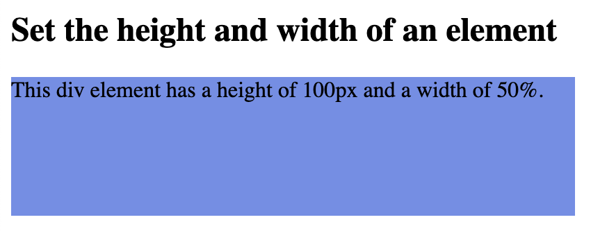
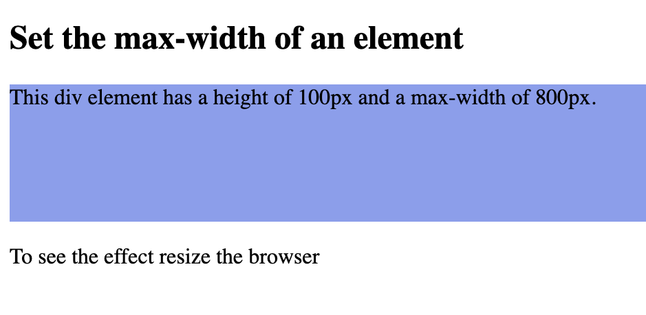

# `height` and `width` values

`height` and `width` properties may have the following values:

- auto - This is default. The browser calculates the height and width
- length - Defines the height/width in px, cm, etc.
- % - Defines the height/width in percent of the containing block
- initial - Sets the height/width to its default value
- inherit - The height/width will be inherited from its parent value


```
<!DOCTYPE html>
<html>
<head>
<style>
div {
  height: 100px;
  width: 50%;
  background-color: rgb(110, 143, 234);
}
</style>
</head>
<body>

<h2>Set the height and width of an element</h2>

<div>This div element has a height of 100px and a width of 50%.</div>

</body>
</html>
```


## The `height` and `width` properties do not include padding, borders, or margins. They set the height/width of the area inside the padding, border, and margin of the element.

## `max-width`

```
<!DOCTYPE html>
<html>
<head>
<style>
div {
  max-width: 800px;
  height: 100px;
  background-color: rgb(135, 159, 240);
}
</style>
</head>
<body>

<h2>Set the max-width of an element</h2>

<div>This div element has a height of 100px and a max-width of 800px.</div>

<p>To see the effect resize the browser </p>

</body>
</html>
```



