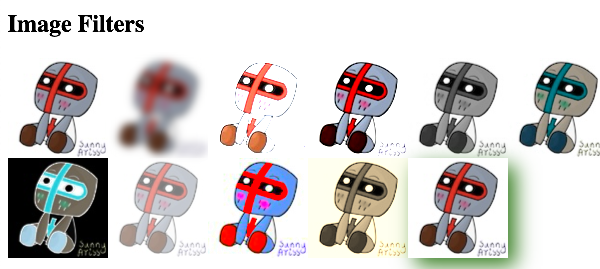
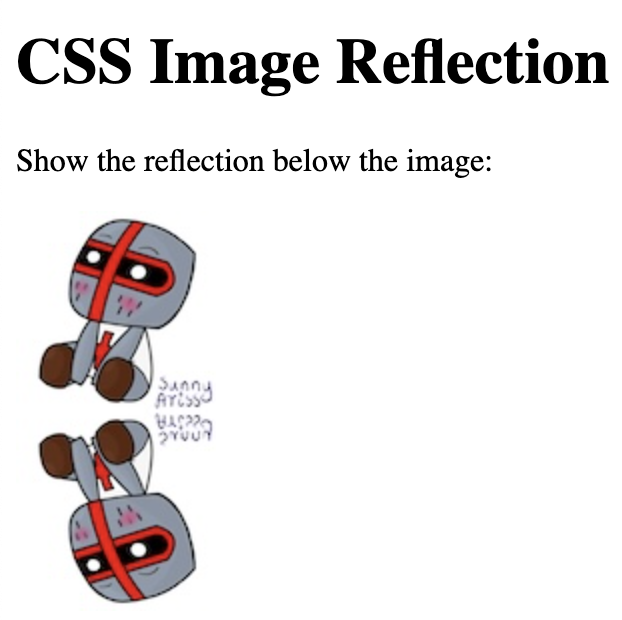
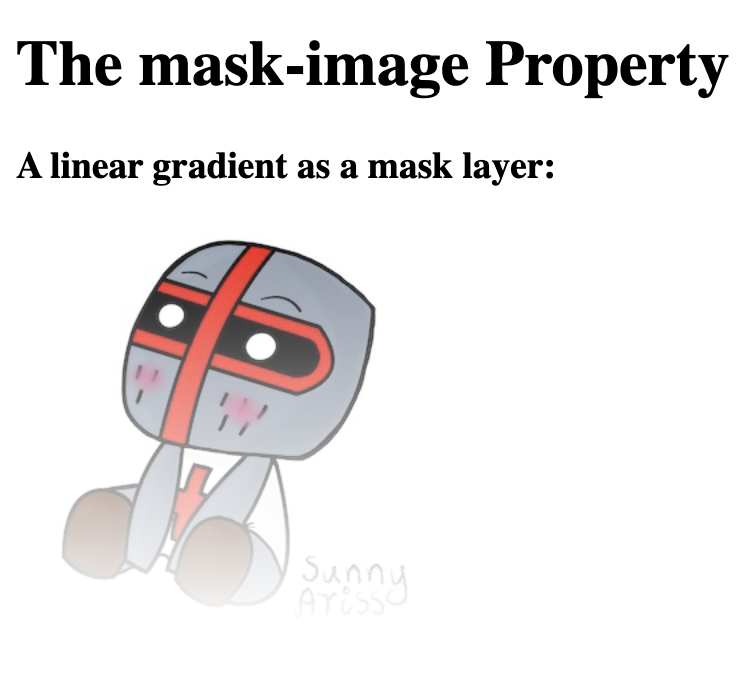
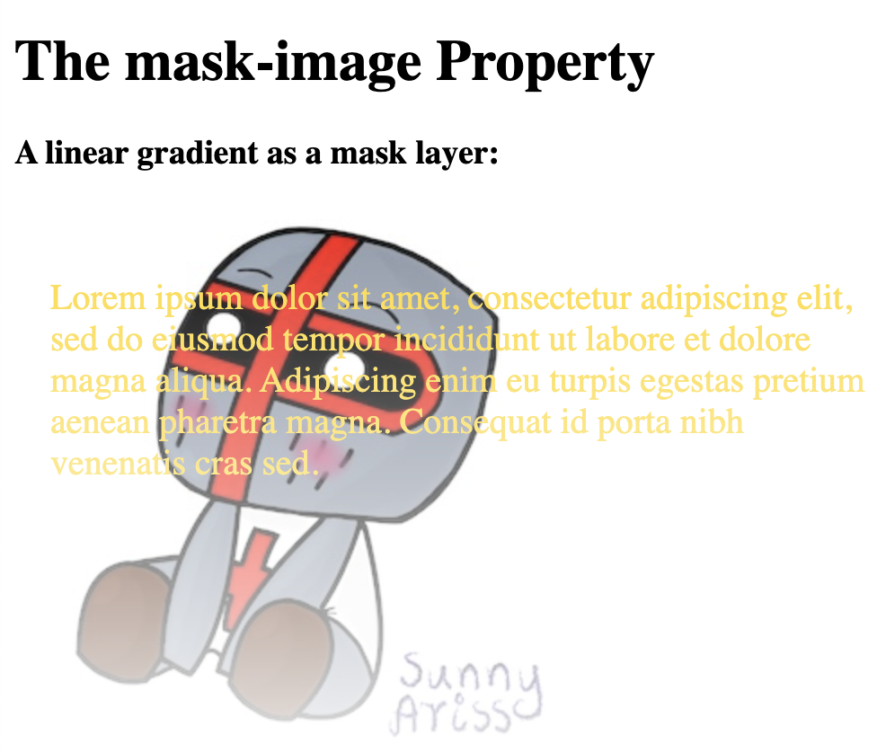
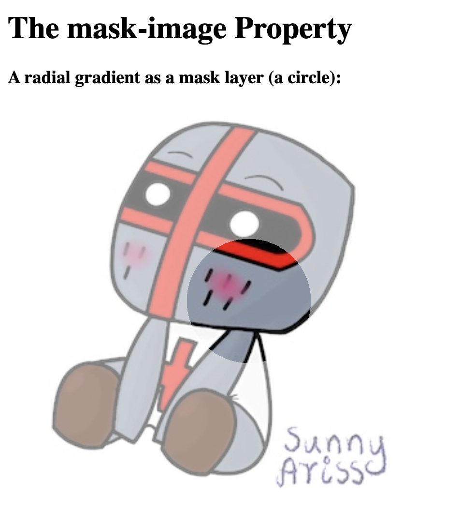

## Rounded Images

```
<!DOCTYPE html>
<html>
<head>
<style>
img {
  border-radius: 8px;
}
</style>
</head>
<body>

<h2>Rounded Image</h2>


</body>
</html>
```

```
img {
  border-radius: 50%;
}
```

## Thumbnail images

```
<!DOCTYPE html>
<html>
<head>
<style>
img {
  border: 1px solid #ddd;
  border-radius: 4px;
  padding: 5px;
  width: 150px;
}
</style>
</head>
<body>

<h2>Thumbnail Image</h2>


</body>
</html>
```
### Image as link

```
<!DOCTYPE html>
<html>
<head>
<style>
img {
  border: 1px solid #ddd;
  border-radius: 4px;
  padding: 5px;
  width: 150px;
}

img:hover {
  box-shadow: 0 0 2px 1px rgba(0, 140, 186, 0.5);
}
</style>
</head>
<body>

<h2>Thumbnail Image as Link</h2>

<a target="_blank" href="paris.jpg">
  
</a>

</body>
</html>
```

## Responsive Image

```
<!DOCTYPE html>
<html>
<head>
<style>
img {
  max-width: 100%;
  height: auto;
}
</style>
</head>
<body>

<h2>Responsive Image</h2>


</body>
</html>
```

## Center an Image
```
<!DOCTYPE html>
<html>
<head>
<style>
img {
  display: block;
  margin-left: auto;
  margin-right: auto;
}
</style>
</head>
<body>

<h2>Center an Image</h2>


</body>
</html>
```

## Responsive Polaroid Images

```
<!DOCTYPE html>
<html>
<head>
<style>
body {margin:25px;}

div.polaroid {
  width: 80%;
  background-color: white;
  box-shadow: 0 4px 8px 0 rgba(0, 0, 0, 0.2), 0 6px 20px 0 rgba(0, 0, 0, 0.19);
  margin-bottom: 25px;
}

div.container {
  text-align: center;
  padding: 10px 20px;
}
</style>
</head>
<body>

<h2>Responsive Polaroid Images / Cards</h2>

<div class="polaroid">
  
  <div class="container">
  <p>Cinque Terre</p>
  </div>
</div>

<div class="polaroid">
  
  <div class="container">
  <p>Northern Lights</p>
  </div>
</div>

</body>
</html>
```

### Image Text

https://www.w3schools.com/css/css3_images.asp


## Image Filters
```
<!DOCTYPE html>
<html>
<head>
<style>
body {
  background-color:white;
}
img {
  width: 33%;
  height: auto;
  float: left; 
  max-width: 100px;
}

.blur {filter: blur(4px);}
.brightness {filter: brightness(250%);}
.contrast {filter: contrast(180%);}
.grayscale {filter: grayscale(100%);}
.huerotate {filter: hue-rotate(180deg);}
.invert {filter: invert(100%);}
.opacity {filter: opacity(50%);}
.saturate {filter: saturate(7);}
.sepia {filter: sepia(100%);}
.shadow {filter: drop-shadow(8px 8px 10px green);}
</style>
</head>
<body>

<h2>Image Filters</h2>


</body>
</html>
```


## Image Modal 

```
<!DOCTYPE html>
<html>
<head>
<style>
#myImg {
  border-radius: 5px;
  cursor: pointer;
  transition: 0.3s;
}

#myImg:hover {opacity: 0.7;}

/* The Modal (background) */
.modal {
  display: none; /* Hidden by default */
  position: fixed; /* Stay in place */
  z-index: 1; /* Sit on top */
  padding-top: 100px; /* Location of the box */
  left: 0;
  top: 0;
  width: 100%; /* Full width */
  height: 100%; /* Full height */
  overflow: auto; /* Enable scroll if needed */
  background-color: rgb(0,0,0); /* Fallback color */
  background-color: rgba(0,0,0,0.9); /* Black w/ opacity */
}

/* Modal Content (image) */
.modal-content {
  margin: auto;
  display: block;
  width: 80%;
  max-width: 700px;
}

/* Caption of Modal Image */
#caption {
  margin: auto;
  display: block;
  width: 80%;
  max-width: 700px;
  text-align: center;
  color: #ccc;
  padding: 10px 0;
  height: 150px;
}

/* Add Animation */
.modal-content, #caption {  
  animation-name: zoom;
  animation-duration: 0.6s;
}

@keyframes zoom {
  from {transform: scale(0.1)} 
  to {transform: scale(1)}
}

/* The Close Button */
.close {
  position: absolute;
  top: 15px;
  right: 35px;
  color: #f1f1f1;
  font-size: 40px;
  font-weight: bold;
  transition: 0.3s;
}

.close:hover,
.close:focus {
  color: #bbb;
  text-decoration: none;
  cursor: pointer;
}

/* 100% Image Width on Smaller Screens */
@media only screen and (max-width: 700px){
  .modal-content {
    width: 100%;
  }
}
</style>
</head>
<body>

<h2>Image Modal</h2>

<p>CSS to create a modal (dialog box) that is hidden by default.</p>
<p>JavaScript to trigger the modal and to display the current image inside the modal when it is clicked on. Also note that we use the value from the image's "alt" attribute as an image caption text inside the modal.</p>


<!-- The Modal -->
<div id="myModal" class="modal">
  <span class="close">&times;</span>
  
  <div id="caption"></div>
</div>

<script>
// Get the modal
var modal = document.getElementById('myModal');

// Get the image and insert it inside the modal - use its "alt" text as a caption
var img = document.getElementById('myImg');
var modalImg = document.getElementById("img01");
var captionText = document.getElementById("caption");
img.onclick = function(){
  modal.style.display = "block";
  modalImg.src = this.src;
  captionText.innerHTML = this.alt;
}

// Get the <span> element that closes the modal
var span = document.getElementsByClassName("close")[0];

// When the user clicks on <span> (x), close the modal
span.onclick = function() { 
  modal.style.display = "none";
}
</script>

</body>
</html>
```
## Image Reflections

property can be: below, above, left , or right.


```
<!DOCTYPE html>
<html>
<head>
<style>
img {
  -webkit-box-reflect: below;
}
</style>
</head>
<body>

<h1>CSS Image Reflection</h1>

<p>Show the reflection below the image:</p>


</body>
</html>
```



## Reflection With Gradient

```
<!DOCTYPE html>
<html>
<head>
<style>
img {
  -webkit-box-reflect: below 0px linear-gradient(to bottom, rgba(0,0,0,0.0), rgba(0,0,0,0.4));
}
</style>
</head>
<body>

<h1>CSS Image Reflection</h1>

<p>Show the reflection with gradient (to make a fade-out effect):</p>


</body>
</html>
```

## `object-fit`

- fill - This is default. The image is resized to fill the given dimension. If necessary, the image will be stretched or squished to fit
- contain - The image keeps its aspect ratio, but is resized to fit within the given dimension
- cover - The image keeps its aspect ratio and fills the given dimension. The image will be clipped to fit
- none - The image is not resized
scale-down - the image is scaled down to the smallest version of none or contain


```
<!DOCTYPE html>
<html>
<head>
<style>
.fill {object-fit: fill;}
.contain {object-fit: contain;}
.cover {object-fit: cover;}
.scale-down {object-fit: scale-down;}
.none {object-fit: none;}
</style>
</head>
<body>

<h1>The object-fit Property</h1>

<h2>No object-fit:</h2>


<h2>object-fit: fill (this is default):</h2>


<h2>object-fit: contain:</h2>


<h2>object-fit: cover:</h2>


<h2>object-fit: scale-down:</h2>


<h2>object-fit: none:</h2>


</body>
</html>
```
## `object-position`

```
img {
  width: 200px;
  height: 300px;
  object-fit: cover;
  object-position: 15% 100%;
}
```
# CSS Masking

```
<!DOCTYPE html>
<html>
<head>
<style>
.mask1 {
  -webkit-mask-image: linear-gradient(black, transparent);
  mask-image: linear-gradient(black, transparent);
}
</style>
</head>
<body>

<h1>The mask-image Property</h1>

<h3>A linear gradient as a mask layer:</h3>
<div class="mask1">

</div>

</body>
</html>
```



```
<!DOCTYPE html>
<html>
<head>
<style>
p {
  font-size: 20px;
  padding: 20px;
  color: gold;
}
.mask1 {
  max-width: 600px;
  height: 350px;
  overflow-y: scroll;
  background: url(doc-files/chibi2.jpg) no-repeat;
  -webkit-mask-image: linear-gradient(black, transparent);
  mask-image: linear-gradient (black, transparent);
}
</style>
</head>
<body>

<h1>The mask-image Property</h1>

<h3>A linear gradient as a mask layer:</h3>

<div class="mask1">
<p>Lorem ipsum dolor sit amet, consectetur adipiscing elit, sed do eiusmod tempor incididunt ut labore et dolore magna aliqua. Adipiscing enim eu turpis egestas pretium aenean pharetra magna. Consequat id porta nibh venenatis cras sed.</p>

</div>

</body>
</html>
```


```
<!DOCTYPE html>
<html>
<head>
<style>
.mask2 {
  -webkit-mask-image: radial-gradient(circle, black 20%, rgba(0, 0, 0, 0.5) 20%);
  mask-image: radial-gradient(circle, black 20%, rgba(0, 0, 0, 0.5) 20%);
}
</style>
</head>
<body>

<h1>The mask-image Property</h1>

<h3>A radial gradient as a mask layer (a circle):</h3>
<div class="mask2">

</div>

</body>
</html>
```


