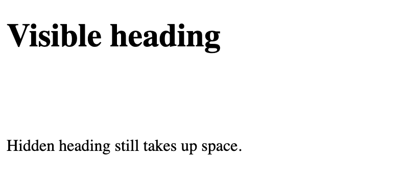

# `display `

`display` property is used to specify how an element is shown on a web page.

Default display value for most elements is block or inline.

## Block-level

Block-level element ALWAYS starts on a new line and takes up the full width available.

Block-level elements:

- `<div>`
- `<h1> - <h6>`
- `<p>`
- `<form>`
- `<header>`
- `<footer>`
- `<section>`

## Inline Elements

Inline element DOES NOT start on a new line and only takes up as much width as necessary.

Examples of inline elements:

- `<span>`
- `<a>`
- ``


```
<!DOCTYPE html>
<html>
<head>
<style>
h1.hidden {
  visibility: hidden;
}
</style>
</head>
<body>

<h1>Visible heading</h1>
<h1 class="hidden">Hidden heading</h1>
<p>Hidden heading still takes up space.</p>

</body>
</html>
```



```
<!DOCTYPE html>
<html>
<head>
<style>
h1.hidden {
  display: none;
}
</style>
</head>
<body>

<h1>Visible heading</h1>
<h1 class="hidden">Hidden heading</h1>
<p>h1 element with display: none; does not take up any space.</p>

</body>
</html>
```


```
<!DOCTYPE html>
<html>
<head>
<style>
li {
  display: inline;
}
</style>
</head>
<body>

<p>Display a list of links as a horizontal menu:</p>

<ul>
  <li><a href="https://github.com/SunnyAris/HTML" target="_blank">HTML</a></li>
  <li><a href="https://github.com/SunnyAris/CSS" target="_blank">CSS</a></li>
  
</body>
</html>
```


```
<!DOCTYPE html>
<html>
<head>
<style>
a {
  display: block;
}
</style>
</head>
<body>

<h1>Display links as block elements</h1>

<a href="https://github.com/SunnyAris/HTML" target="_blank">HTML</a>
<a href="https://github.com/SunnyAris/CSS" target="_blank">CSS</a>

</body>
</html>
```


```
<!DOCTYPE html>
<html>
<head>
<style>
span {
  display: block;
}
</style>
</head>
<body>

<h1>Display span elements as block elements</h1>

<span>A display property with</span> <span>a value of "block" results in</span> <span>a line break between each span elements.</span>

</body>
</html>
```


# width and max-width

Block-level element always takes up the full width available.

Setting the width of a block-level element will prevent it from stretching out. 

```
<!DOCTYPE html>
<html>
<head>
<style>
div.ex1 {
  width: 500px;
  margin: auto;
  border: 3px solid #73AD21;
}

div.ex2 {
  max-width: 500px;
  margin: auto;
  border: 3px solid #73AD21;
}
</style>
</head>
<body>

<h2>CSS Max-width</h2>

<div class="ex1">This div element has width: 500px;</div>
<br>

<div class="ex2">This div element has max-width: 500px;</div>


</body>
</html>
```


# `position`

`position` values:

- static
- relative
- fixed
- absolute
- sticky

Elements are positioned using the top, bottom, left, and right properties.

## static;

position: static; is not positioned in any special way; it is always positioned according to the normal flow of the page

Static positioned elements are not affected by the top, bottom, left, and right properties.

```
<!DOCTYPE html>
<html>
<head>
<style>
div.static {
  position: static;
  border: 3px solid blue;
}
</style>
</head>
<body>

<h2>position: static;</h2>

<div class="static">
div element has position: static;
</div>

</body>
</html>
```


## relative;

Setting the top, right, bottom, and left properties of a relatively-positioned element will cause it to be adjusted away from its normal position.

```
<!DOCTYPE html>
<html>
<head>
<style>
div.relative {
  position: relative;
  left: 30px;
  border: 3px solid blue;
}
</style>
</head>
<body>

<h2>position: relative;</h2>

<div class="relative">
div element has position: relative;
</div>

</body>
</html>
```


## fixed;

fixed; is positioned relative to the viewport, which means it always stays in the same place even if the page is scrolled. The top, right, bottom, and left properties are used to position the element.

A fixed element does not leave a gap in the page where it would normally have been located.


## absolute;

An element with position: absolute; is positioned relative to the nearest positioned ancestor (instead of positioned relative to the viewport, like fixed):

```
<!DOCTYPE html>
<html>
<head>
<style>
div.relative {
  position: relative;
  width: 400px;
  height: 200px;
  border: 3px solid blue;
} 

div.absolute {
  position: absolute;
  top: 80px;
  right: 0;
  width: 200px;
  height: 100px;
  border: 3px solid blue;
}
</style>
</head>
<body>

<h2>position: absolute;</h2>

<div class="relative">div element has position: relative;
  <div class="absolute">div element has position: absolute;</div>
</div>

</body>
</html>
```


## sticky;

```
<!DOCTYPE html>
<html>
<head>
<style>
div.sticky {
  position: -webkit-sticky;
  position: sticky;
  top: 0;
  padding: 5px;
  background-color: lightblue;
  border: 5px solid blue;
}
</style>
</head>
<body>

<p>Try to <b>scroll</b> inside this frame to understand how sticky positioning works.</p>

<div class="sticky">sticky</div>

<div style="padding-bottom:2000px">
  <p>In this example, the sticky element sticks to the top of the page (top: 0), when you reach its scroll position.</p>
  <p>Scroll back up to remove the stickyness.</p>
  <p>Some text to enable scrolling.. Lorem ipsum dolor sit amet, illum definitiones no quo, maluisset concludaturque et eum, altera fabulas ut quo. Atqui causae gloriatur ius te, id agam omnis evertitur eum. Affert laboramus repudiandae nec et. Inciderint efficiantur his ad. Eum no molestiae voluptatibus.</p>
  <p>Some text to enable scrolling.. Lorem ipsum dolor sit amet, illum definitiones no quo, maluisset concludaturque et eum, altera fabulas ut quo. Atqui causae gloriatur ius te, id agam omnis evertitur eum. Affert laboramus repudiandae nec et. Inciderint efficiantur his ad. Eum no molestiae voluptatibus.</p>
</div>

</body>
</html>
```


##  z-index


