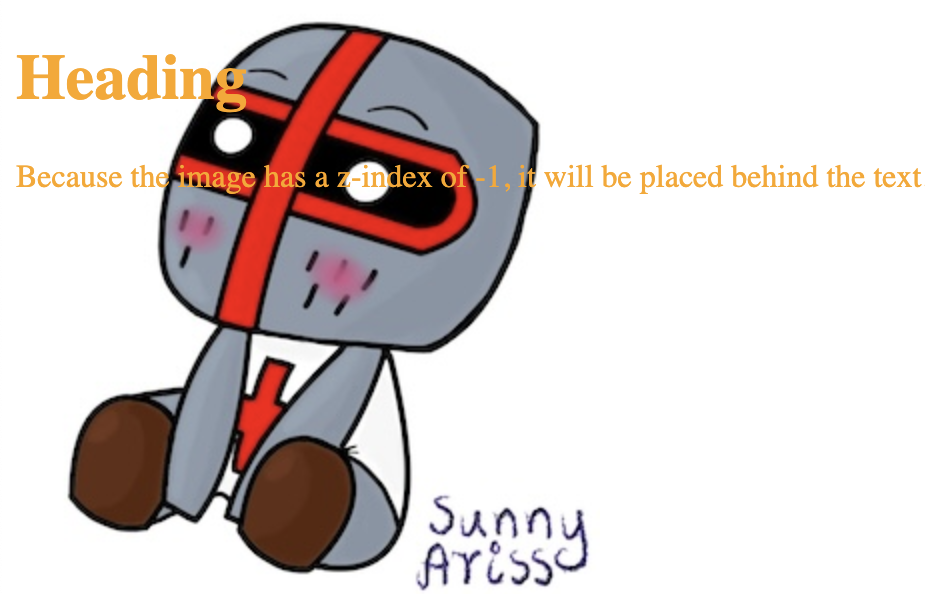

# `display `

`display` property is used to specify how an element is shown on a web page.

Default display value for most elements is block or inline.

## Block-level

Block-level element ALWAYS starts on a new line and takes up the full width available.

Block-level elements:

- `<div>`
- `<h1> - <h6>`
- `<p>`
- `<form>`
- `<header>`
- `<footer>`
- `<section>`

## Inline Elements

Inline element DOES NOT start on a new line and only takes up as much width as necessary.

Examples of inline elements:

- `<span>`
- `<a>`
- ``


```
<!DOCTYPE html>
<html>
<head>
<style>
h1.hidden {
  visibility: hidden;
}
</style>
</head>
<body>

<h1>Visible heading</h1>
<h1 class="hidden">Hidden heading</h1>
<p>Hidden heading still takes up space.</p>

</body>
</html>
```


```
<!DOCTYPE html>
<html>
<head>
<style>
h1.hidden {
  display: none;
}
</style>
</head>
<body>

<h1>Visible heading</h1>
<h1 class="hidden">Hidden heading</h1>
<p>h1 element with display: none; does not take up any space.</p>

</body>
</html>
```


```
<!DOCTYPE html>
<html>
<head>
<style>
li {
  display: inline;
}
</style>
</head>
<body>

<p>Display a list of links as a horizontal menu:</p>

<ul>
  <li><a href="https://github.com/SunnyAris/HTML" target="_blank">HTML</a></li>
  <li><a href="https://github.com/SunnyAris/CSS" target="_blank">CSS</a></li>
  
</body>
</html>
```


```
<!DOCTYPE html>
<html>
<head>
<style>
a {
  display: block;
}
</style>
</head>
<body>

<h1>Display links as block elements</h1>

<a href="https://github.com/SunnyAris/HTML" target="_blank">HTML</a>
<a href="https://github.com/SunnyAris/CSS" target="_blank">CSS</a>

</body>
</html>
```


```
<!DOCTYPE html>
<html>
<head>
<style>
span {
  display: block;
}
</style>
</head>
<body>

<h1>Display span elements as block elements</h1>

<span>A display property with</span> <span>a value of "block" results in</span> <span>a line break between each span elements.</span>

</body>
</html>
```


# width and max-width

Block-level element always takes up the full width available.

Setting the width of a block-level element will prevent it from stretching out. 

```
<!DOCTYPE html>
<html>
<head>
<style>
div.ex1 {
  width: 500px;
  margin: auto;
  border: 3px solid #73AD21;
}

div.ex2 {
  max-width: 500px;
  margin: auto;
  border: 3px solid #73AD21;
}
</style>
</head>
<body>

<h2>CSS Max-width</h2>

<div class="ex1">This div element has width: 500px;</div>
<br>

<div class="ex2">This div element has max-width: 500px;</div>


</body>
</html>
```


# `position`

`position` values:

- static
- relative
- fixed
- absolute
- sticky

Elements are positioned using the top, bottom, left, and right properties.

## static;

position: static; is not positioned in any special way; it is always positioned according to the normal flow of the page

Static positioned elements are not affected by the top, bottom, left, and right properties.

```
<!DOCTYPE html>
<html>
<head>
<style>
div.static {
  position: static;
  border: 3px solid blue;
}
</style>
</head>
<body>

<h2>position: static;</h2>

<div class="static">
div element has position: static;
</div>

</body>
</html>
```


## relative;

Setting the top, right, bottom, and left properties of a relatively-positioned element will cause it to be adjusted away from its normal position.

```
<!DOCTYPE html>
<html>
<head>
<style>
div.relative {
  position: relative;
  left: 30px;
  border: 3px solid blue;
}
</style>
</head>
<body>

<h2>position: relative;</h2>

<div class="relative">
div element has position: relative;
</div>

</body>
</html>
```


## fixed;

fixed; is positioned relative to the viewport, which means it always stays in the same place even if the page is scrolled. The top, right, bottom, and left properties are used to position the element.

A fixed element does not leave a gap in the page where it would normally have been located.


## absolute;

An element with position: absolute; is positioned relative to the nearest positioned ancestor (instead of positioned relative to the viewport, like fixed):

```
<!DOCTYPE html>
<html>
<head>
<style>
div.relative {
  position: relative;
  width: 400px;
  height: 200px;
  border: 3px solid blue;
} 

div.absolute {
  position: absolute;
  top: 80px;
  right: 0;
  width: 200px;
  height: 100px;
  border: 3px solid blue;
}
</style>
</head>
<body>

<h2>position: absolute;</h2>

<div class="relative">div element has position: relative;
  <div class="absolute">div element has position: absolute;</div>
</div>

</body>
</html>
```


## sticky;

```
<!DOCTYPE html>
<html>
<head>
<style>
div.sticky {
  position: -webkit-sticky;
  position: sticky;
  top: 0;
  padding: 5px;
  background-color: lightblue;
  border: 5px solid blue;
}
</style>
</head>
<body>

<p>Try to <b>scroll</b> inside this frame to understand how sticky positioning works.</p>

<div class="sticky">sticky</div>

<div style="padding-bottom:2000px">
  <p>In this example, the sticky element sticks to the top of the page (top: 0), when you reach its scroll position.</p>
  <p>Scroll back up to remove the stickyness.</p>
  <p>Some text to enable scrolling.. Lorem ipsum dolor sit amet, illum definitiones no quo, maluisset concludaturque et eum, altera fabulas ut quo. Atqui causae gloriatur ius te, id agam omnis evertitur eum. Affert laboramus repudiandae nec et. Inciderint efficiantur his ad. Eum no molestiae voluptatibus.</p>
  <p>Some text to enable scrolling.. Lorem ipsum dolor sit amet, illum definitiones no quo, maluisset concludaturque et eum, altera fabulas ut quo. Atqui causae gloriatur ius te, id agam omnis evertitur eum. Affert laboramus repudiandae nec et. Inciderint efficiantur his ad. Eum no molestiae voluptatibus.</p>
</div>

</body>
</html>
```


#  z-index

```
<!DOCTYPE html>
<html>
<head>
<style>
img {
  position: absolute;
  left: 0px;
  top: 0px;
  z-index: -1;
}
</style>
</head>
<body>

<h1 style="color:orange;">Heading</h1>

<p style="color:orange;">Because the image has a z-index of -1, it will be placed behind the text.</p>

</body>
</html>
```



```
<!DOCTYPE html>
<html>
<head>
<style>
.container {
  position: relative;
}

.red-box {
  position: relative;
  border: 2px solid red;
  height: 100px;
  margin: 30px;
}

.orange-box {
  position: absolute;
  background: orange;
  height: 60px;  
  width: 70%;
  left: 50px;
  top: 50px;
}

.yellow-box {
  position: absolute;
  background: yellow;
  width: 35%;
  left: 270px;
  top: -15px;
  height: 100px;
}
</style>
</head>
<body>

<h1>Overlapping elements</h1>

<p>If two positioned elements overlap each other without a z-index specified,
the element defined last in the HTML code will be shown on top:</p>

<div class="container">
  <div class="red-box">red box</div>
  <div class="orange-box">orange box</div>
  <div class="yellow-box">yellow box</div>
</div>

</body>
</html>
```


```
<!DOCTYPE html>
<html>
<head>
<style>
.container {
  position: relative;
}

.red-box {
  position: relative;
  z-index: 1;
  border: 2px solid red;
  height: 100px;
  margin: 30px;
}

.orange-box {
  position: absolute;
  z-index: 3; /* orange box will be above both red and yellow box */
  background: orange;
  height: 60px;  
  width: 70%;
  left: 50px;
  top: 50px;
}

.yellow-box {
  position: absolute;
  z-index: 2; /* yellow box will be above black box */
  background: yellow;
  width: 35%;
  left: 270px;
  top: -15px;
  height: 100px;
}
</style>
</head>
<body>

<h1>Z-index Example</h1>

<p>An element with greater stack order is always above an element with a lower stack order.</p>

<div class="container">
  <div class="red-box">red box (z-index: 1)</div>
  <div class="orange-box">orange box (z-index: 3)</div>
  <div class="yellow-box">yellow box (z-index: 2)</div>
</div>

</body>
</html>
```


# Overflow

Overflow property has the following values:

- visible - Default. The overflow is not clipped. The content renders outside the element's box

- hidden - The overflow is clipped, and the rest of the content will be invisible

- scroll - The overflow is clipped, and a scrollbar is added to see the rest of the content

- auto - Similar to scroll, but it adds scrollbars only when necessary


## overflow: visible

```
<!DOCTYPE html>
<html>
<head>
<style>
div {
  background-color: yellow;
  width: 200px;
  height: 65px;
  border: 1px solid;
  overflow: visible;
}
</style>
</head>
<body>

<h2>Overflow: visible</h2>

<p>By default, the overflow is visible, meaning that it is not clipped and it renders outside the element's box:</p>

<div>To have better control of the layout use overflow. The overflow property specifies what happens if content overflows an element's box.</div>

</body>
</html>
```


## overflow: hidden

```
<!DOCTYPE html>
<html>
<head>
<style>
div {
  background-color: yellow;
  width: 200px;
  height: 65px;
  border: 1px solid black;
  overflow: hidden;
}
</style>
</head>
<body>

<h2>Overflow: hidden</h2>

<p>With the hidden value, the overflow is clipped, and the rest of the content is hidden:</p>


<div>To have better control of the layout use overflow. The overflow property specifies what happens if content overflows an element's box.</div>

</body>
</html>
```


## overflow: scroll

```
<!DOCTYPE html>
<html>
<head>
<style>
#overflowTest {
  background: orange;
  color: white;
  padding: 15px;
  width: 50%;
  height: 100px;
  overflow: scroll;
  border: 5px solid yellow;
}
</style>
</head>
<body>

<h2>CSS Overflow</h2>

<p>The overflow property controls what happens to content that is too big to fit into an area.</p>

<div id="overflowTest">This text is really long and the height of its container is only 100 pixels. Therefore, a scrollbar is added to help the reader to scroll the content. Lorem ipsum dolor sit amet, consectetuer adipiscing elit, sed diam nonummy nibh euismod tincidunt ut laoreet dolore magna aliquam erat volutpat. Ut wisi enim ad minim veniam, quis nostrud exerci tation ullamcorper suscipit lobortis nisl ut aliquip ex ea commodo consequat. Duis autem vel eum iriure dolor in hendrerit in vulputate velit esse molestie consequat, vel illum dolore eu feugiat nulla facilisis at vero eros et accumsan et iusto odio dignissim qui blandit praesent luptatum zzril delenit augue duis dolore te feugait nulla facilisi. Nam liber tempor cum soluta nobis eleifend option congue nihil imperdiet doming id quod mazim placerat facer possim assum. Typi non habent claritatem insitam; est usus legentis in iis qui facit eorum claritatem.</div>

</body>
</html>
```


## overflow: auto


## overflow-x and overflow-y

```
<!DOCTYPE html>
<html>
<head>
<style>
div {
  background-color: yellow;
  width: 200px;
  height: 65px;
  border: 1px solid black;
  overflow-x: hidden;
  overflow-y: scroll;
}
</style>
</head>
<body>

<h2>Overflow-x and overflow-y</h2>


<p>overflow-x specifies what to do with the left/right edges of the content.</p>
<p>overflow-y specifies what to do with the top/bottom edges of the content.</p>

<div>Using the overflow property to have better control of the layout. The overflow property specifies what happens if content overflows an element's box.</div>

</body>
</html>
```


