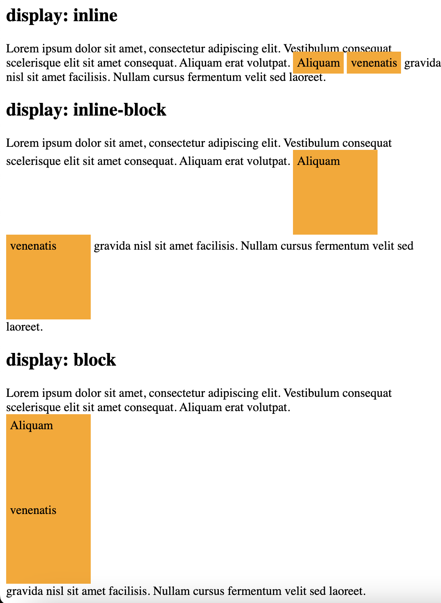
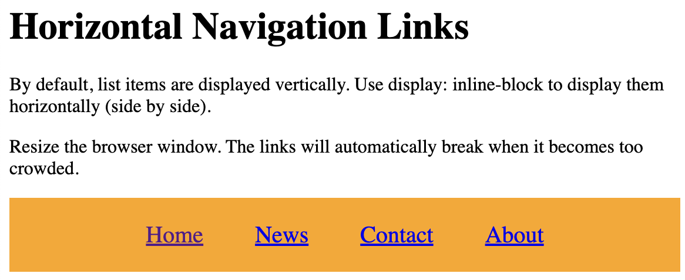

# display: inline-block

```
<!DOCTYPE html>
<html>
<head>
<style>
span.a {
  display: inline; /* the default for span */
  width: 100px;
  height: 100px;
  padding: 5px;
  border: 1px yellow;  
  background-color: orange; 
}

span.b {
  display: inline-block;
  width: 100px;
  height: 100px;
  padding: 5px;
  border: 1px yellow;    
  background-color: orange; 
}

span.c {
  display: block;
  width: 100px;
  height: 100px;
  padding: 5px;
  border: 1px yellow;    
  background-color: orange; 
}
</style>
</head>
<body>

<h1>The display Property</h1>

<h2>display: inline</h2>
<div>Lorem ipsum dolor sit amet, consectetur adipiscing elit. Vestibulum consequat scelerisque elit sit amet consequat. Aliquam erat volutpat. <span class="a">Aliquam</span> <span class="a">venenatis</span> gravida nisl sit amet facilisis. Nullam cursus fermentum velit sed laoreet. </div>

<h2>display: inline-block</h2>
<div>Lorem ipsum dolor sit amet, consectetur adipiscing elit. Vestibulum consequat scelerisque elit sit amet consequat. Aliquam erat volutpat. <span class="b">Aliquam</span> <span class="b">venenatis</span> gravida nisl sit amet facilisis. Nullam cursus fermentum velit sed laoreet. </div>

<h2>display: block</h2>
<div>Lorem ipsum dolor sit amet, consectetur adipiscing elit. Vestibulum consequat scelerisque elit sit amet consequat. Aliquam erat volutpat. <span class="c">Aliquam</span> <span class="c">venenatis</span> gravida nisl sit amet facilisis. Nullam cursus fermentum velit sed laoreet. </div>

</body>
</html>
```


```
<!DOCTYPE html>
<html>
<head>
<style>
.nav {
  background-color: orange; 
  list-style-type: none;
  text-align: center;
  margin: 0;
  padding: 0;
}

.nav li {
  display: inline-block;
  font-size: 20px;
  padding: 20px;
}
</style>
</head>
<body>

<h1>Horizontal Navigation Links</h1>
<p>By default, list items are displayed vertically. Use display: inline-block to display them horizontally (side by side).</p>
<p>Resize the browser window. The links will automatically break when it becomes too crowded.</p>

<ul class="nav">
  <li><a href="#home">Home</a></li>
  <li><a href="#news">News</a></li>
  <li><a href="#contact">Contact</a></li>  
  <li><a href="#about">About</a></li>
</ul>

</body>
</html>
```


