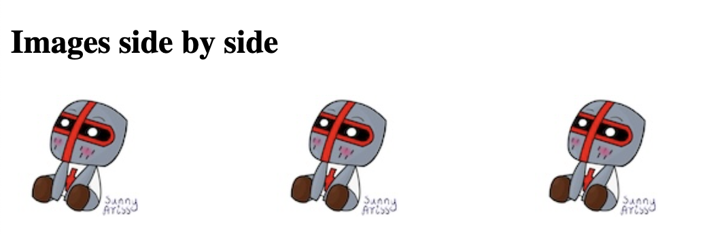

# float, clear

`float` specifies how an element should float

`clear` specifies what elements can float beside the cleared element and on which side

## `float`

float have one of the following values:

- left - floats to the left of its container
- right - floats to the right of its container
- none - does not float (default) 
- inherit - inherits the float value of its parent

```
<!DOCTYPE html>
<html>
<head>
<style>
div {
  float: left;
  padding: 15px; 
}

.div1 {
  background: yellow;
}

.div2 {
  background: orange;
}

.div3 {
  background: red;
}
</style>
</head>
<body>

<h2>Float next to each other</h2>

<p>In this example, the three divs will float next to each other.</p>

<div class="div1">Div 1</div>
<div class="div2">Div 2</div>
<div class="div3">Div 3</div>

</body>
</html>
```


```
<!DOCTYPE html>
<html>
<head>
<style>
img.floatLeft { 
  float: right;
}

img.floatRight {
  float: left;
}
</style>
</head>
<body>

<h2>Float right nad left</h2>

<p>In this example, the image will float to the right and left in the paragraph, and the text in the paragraph will wrap around the image.</p>

<p>

<p>

</body>
</html>
```


```
<!DOCTYPE html>
<html>
<head>
<style>
img.floatRightClear { 
    float: right; 
    clear: right; 
}
</style>
</head>
<body>

<h2>Float right</h2>

<p>In this example, the image will float to the right in the paragraph, and the text in the paragraph will wrap around the image.</p>

<p>

<p>

</body>
</html>
```


## `clear`

`clear` have one of the following values:

- none - not pushed below left or right floated elements. (default)
- left - pushed below left floated elements
- right - pushed below right floated elements
- both - pushed below both left and right floated elements
- inherit - inherits the clear value from its parent

```
<!DOCTYPE html>
<html>
<head>
<style>
.div1 {
  float: left;
  padding: 10px;
  border: 3px solid orange;
}

.div2 {
  padding: 10px;
  border: 3px solid yellow;
}

.div3 {
  float: left;
  padding: 10px;  
  border: 3px solid orange;
}

.div4 {
  padding: 10px;
  border: 3px solid yellow;
  clear: left;
}
</style>
</head>
<body>

<h2>Without clear</h2>
<div class="div1">div1</div>
<div class="div2">div2 is after div1 in the HTML code. div1 floats to the left, the text in div2 flows around div1.</div>
<br><br>

<h2>With clear</h2>
<div class="div3">div3</div>
<div class="div4">div 4, clear: left; moves div4 down below the floating div3. The value "left" clears elements floated to the left.</div>

</body>
</html>
```


```
<!DOCTYPE html>
<html>
<head>
<style>
div {
  border: 3px solid #e23958;
  padding: 5px;
}

.img1 {
  float: right;
}

.img2 {
  float: right;
}

.clearfix::after {
  content: "";
  clear: both;
  display: table;
}
</style>
</head>
<body>

<h2>Without Clearfix</h2>

<p>Image is floated to the right. It is also taller than the element containing it, so it overflows outside of its container:</p>

<div>
  
  Lorem ipsum dolor sit amet, consectetur adipiscing elit. Phasellus imperdiet...
</div>

<h2 style="clear:right">With New Modern Clearfix</h2>
<p>Add the clearfix hack to the containing element, to fix this problem:</p>

<div class="clearfix">
  
  Lorem ipsum dolor sit amet, consectetur adipiscing elit. Phasellus imperdiet...
</div>

</body>
</html>
```


## Float Examples

```
<!DOCTYPE html>
<html>
<head>
<style>
* {
  box-sizing: border-box;
}

.box {
  float: left;
  width: 33.33%;
  padding: 50px;
}

.clearfix::after {
  content: "";
  clear: both;
  display: table;
}
</style>
</head>
<body>

<h2>Grid of Boxes</h2>
<p>Float boxes side by side:</p>

<div class="clearfix">
  <div class="box" style="background-color:red">
  <p>Some text.</p>
  </div>
  <div class="box" style="background-color:orange">
  <p>Some text.</p>
  </div>
  <div class="box" style="background-color:yellow">
  <p>Some text.</p>
  </div>
</div>

</body>
</html>
```


```
<!DOCTYPE html>
<html>
<head>
<style>
* {
  box-sizing: border-box;
}

.img-container {
  float: left;
  width: 33.33%; /* three containers (use 25% for four, and 50% for two, etc) */
  padding: 5px; /* space between the images */
}

.clearfix::after {
  content: "";
  clear: both;
  display: table;
}
</style>
</head>
<body>

<h2>Images side by side</h2>

<div class="clearfix">
  <div class="img-container">
  
  </div>
  <div class="img-container">
  
  </div>
  <div class="img-container">
  
  </div>
</div>

</body>
</html>
```



```
<!DOCTYPE html>
<html>
<head>
<style>
* {
  box-sizing: border-box;
}

.box {
  float: left;
  width: 50%;
  padding: 50px;
  height: 300px;
}

.clearfix::after {
  content: "";
  clear: both;
  display: table;
}
</style>
</head>
<body>

<h2>Equal Height Boxes</h2>
<p>Floating boxes with equal heights:</p>

<div class="clearfix">
  <div class="box" style="background-color:yellow">
  <h2>Box 1</h2>
  <p>Some content, some content, some content</p>
  </div>
  <div class="box" style="background-color:orange">
  <h2>Box 2</h2>
  <p>Some content, some content, some content</p>
  <p>Some content, some content, some content</p>
  <p>Some content, some content, some content</p>
  </div>
</div>

</body>
</html>
```


## Navigation Menu

```
<!DOCTYPE html>
<html>
<head>
<style>
ul {
  list-style-type: none;
  margin: 0;
  padding: 0;
  overflow: hidden;
  background-color: orange;
}

li {
  float: left;
}

li a {
  display: inline-block;
  color: white;
  text-align: center;
  padding: 14px 16px;
  text-decoration: none;
}

li a:hover {
  background-color: gold;
}

.active {
  background-color: red;
}
</style>
</head>
<body>

<ul>
  <li><a href="#home" class="active">Home</a></li>
  <li><a href="#news">News</a></li>
  <li><a href="#contact">Contact</a></li>
  <li><a href="#about">About</a></li>
</ul>

</body>
</html>
```


