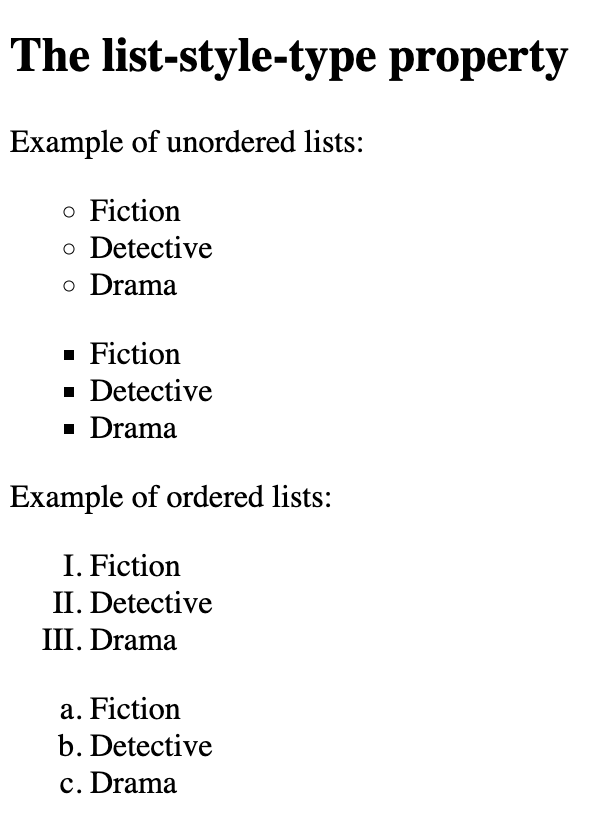
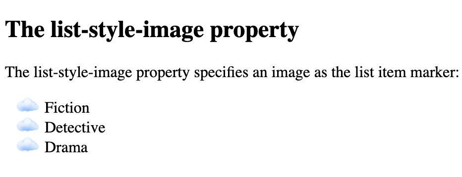
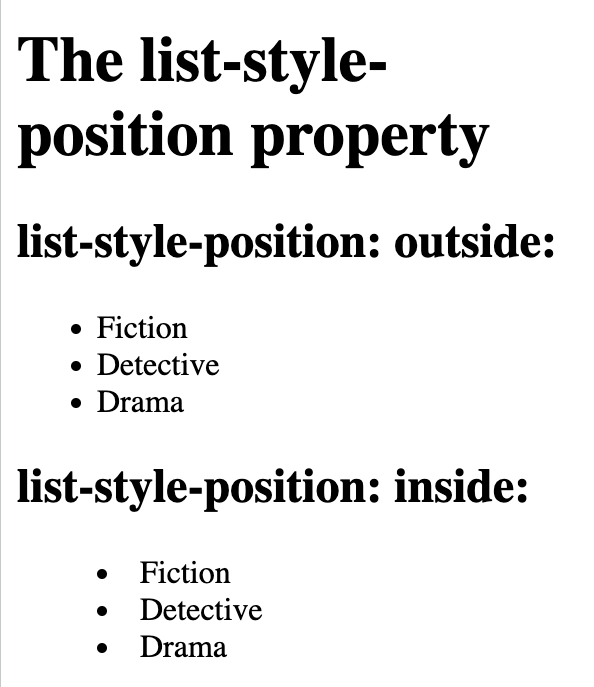
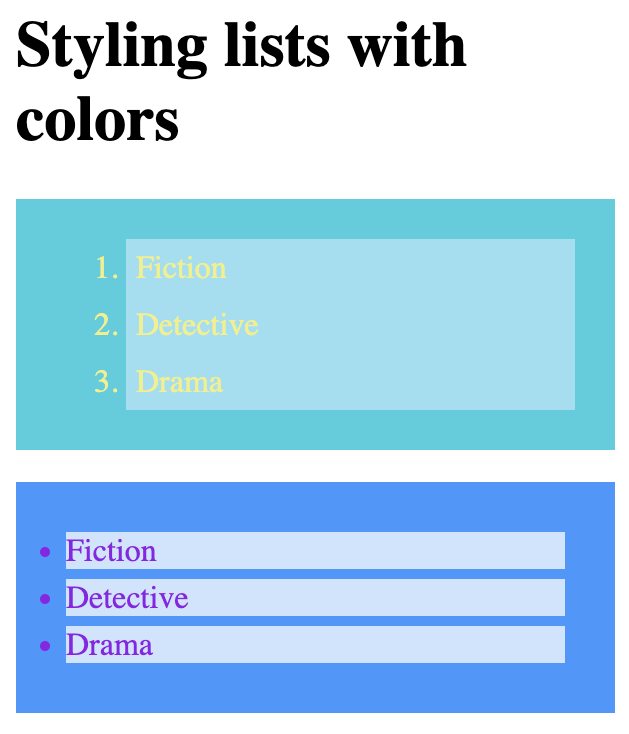
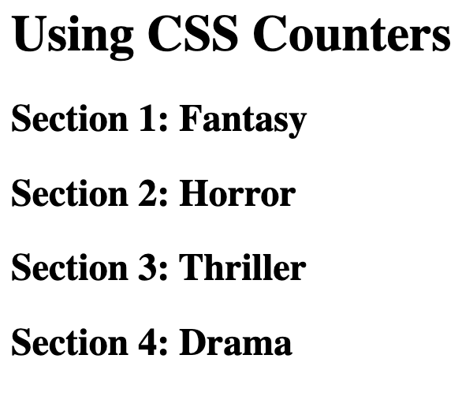
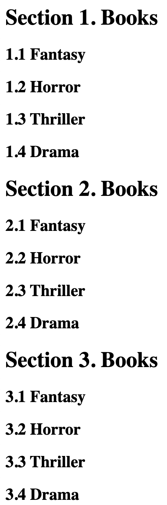
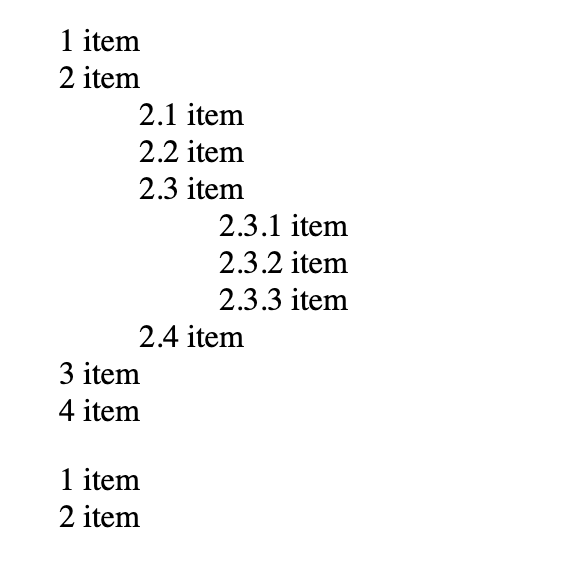

# List style

```
<!DOCTYPE html>
<html>
<head>
<style>
ul.a {
  list-style-type: circle;
}

ul.b {
  list-style-type: square;
}

ol.c {
  list-style-type: upper-roman;
}

ol.d {
  list-style-type: lower-alpha;
}
</style>
</head>
<body>

<h2>The list-style-type property</h2>

<p>Example of unordered lists:</p>
<ul class="a">
  <li>Fiction</li>
  <li>Detective</li>
  <li>Drama</li>
</ul>

<ul class="b">
  <li>Fiction</li>
  <li>Detective</li>
  <li>Drama</li>
</ul>

<p>Example of ordered lists:</p>
<ol class="c">
  <li>Fiction</li>
  <li>Detective</li>
  <li>Drama</li>
</ol>

<ol class="d">
  <li>Fiction</li>
  <li>Detective</li>
  <li>Drama</li>
</ol>

</body>
</html>
```



## `list-style-image`

```
<!DOCTYPE html>
<html>
<head>
<style>
ul {
  list-style-image: url('doc-files/cl2.png');
}
</style>
</head>
<body>

<h2>The list-style-image property</h2>

<p>The list-style-image property specifies an image as the list item marker:</p>

<ul>
  <li>Fiction</li>
  <li>Detective</li>
  <li>Drama</li>
</ul>

</body>
</html>
```


## `list-style-position`

```
<!DOCTYPE html>
<html>
<head>
<style>
ul.a {
  list-style-position: outside;
}

ul.b {
  list-style-position: inside;
}
</style>
</head>
<body>

<h1>The list-style-position property</h1>

<h2>list-style-position: outside:</h2>
<ul class="a">
  <li>Fiction</li>
  <li>Detective</li>
  <li>Drama</li>
</ul>

<h2>list-style-position: inside:</h2>
<ul class="b">
  <li>Fiction</li>
  <li>Detective</li>
  <li>Drama</li>
</ul>

</body>
</html>
```


## Remove default settings

```
<!DOCTYPE html>
<html>
<head>
<style>
ul.demo {
  list-style-type: none;
  margin: 0;
  padding: 0;
}
</style>
</head>
<body>

<p>Default list:</p>
<ul>
  <li>Fiction</li>
  <li>Detective</li>
  <li>Drama</li>
</ul>

<p>Remove bullets, margin and padding from list:</p>
<ul class="demo">
  <li>Fiction</li>
  <li>Detective</li>
  <li>Drama</li>
</ul>

</body>
</html>
```

## Shorthand property

`list-style` property is a shorthand property. It is used to set all the list properties

ul {
  list-style: square inside url("cl2.png");
}

The order of the shorthand property:

- list-style-type 
- list-style-position 
- list-style-image 

## Styling lists with colors

```
<!DOCTYPE html>
<html>
<head>
<style>
ol {
  background: #2ccfde;
  padding: 20px;
}

ul {
  background: #3399ff;
  padding: 20px;
}

ol li {
  background: #95e0f3;
  color: rgb(243, 239, 131);
  padding: 5px;
  margin-left: 35px;
}

ul li {
  background: #cce5ff;
  color: rgb(144, 29, 232);
  margin: 5px;
}
</style>
</head>
<body>

<h1>Styling lists with colors</h1>

<ol>
  <li>Fiction</li>
  <li>Detective</li>
  <li>Drama</li>
</ol>

<ul>
  <li>Fiction</li>
  <li>Detective</li>
  <li>Drama</li>
</ul>

</body>
</html>
```


## Automatic Numbering With Counters

```
<!DOCTYPE html>
<html>
<head>
<style>
body {
  counter-reset: section;
}

h2::before {
  counter-increment: section;
  content: "Section " counter(section) ": ";
}
</style>
</head>
<body>

<h1>Using CSS Counters</h1>

<h2>Fantasy</h2>
<h2>Horror</h2>
<h2>Thriller</h2>
<h2>Drama</h2>

</body>
</html>
```


## Nesting Counters

```
<!DOCTYPE html>
<html>
<head>
<style>
body {
  counter-reset: section;
}

h1 {
  counter-reset: subsection;
}

h1::before {
  counter-increment: section;
  content: "Section " counter(section) ". ";
}

h2::before {
  counter-increment: subsection;
  content: counter(section) "." counter(subsection) " ";
}
</style>
</head>
<body>


<h1>Books</h1>
<h2>Fantasy</h2>
<h2>Horror</h2>
<h2>Thriller</h2>
<h2>Drama</h2>

<h1>Books</h1>
<h2>Fantasy</h2>
<h2>Horror</h2>
<h2>Thriller</h2>
<h2>Drama</h2>

<h1>Books</h1>
<h2>Fantasy</h2>
<h2>Horror</h2>
<h2>Thriller</h2>
<h2>Drama</h2>

</body>
</html>
```



```
<!DOCTYPE html>
<html>
<head>
<style>
ol {
  counter-reset: section;
  list-style-type: none;
}

li::before {
  counter-increment: section;
  content: counters(section,".") " ";
}
</style>
</head>
<body>

<ol>
  <li>item</li>
  <li>item   
  <ol>
    <li>item</li>
    <li>item</li>
    <li>item
    <ol>
      <li>item</li>
      <li>item</li>
      <li>item</li>
    </ol>
    </li>
    <li>item</li>
  </ol>
  </li>
  <li>item</li>
  <li>item</li>
</ol>

<ol>
  <li>item</li>
  <li>item</li>
</ol>

</body>
</html>
```

