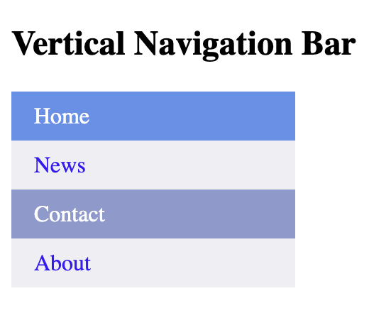

# Navigation Bar

```
<!DOCTYPE html>
<html>
<head>
<style>
ul {
  list-style-type: none;
  margin: 0;
  padding: 0;
}

li a {
  display: block;
  width: 60px;
  background-color: #e6de0c;
}
</style>
</head>
<body>

<ul>
  <li><a href="#home">Home</a></li>
  <li><a href="#news">News</a></li>
  <li><a href="#contact">Contact</a></li>
  <li><a href="#about">About</a></li>
</ul>

<p>Whole link area is clickable, not just the text.</p>

</body>
</html>
```


```
<!DOCTYPE html>
<html>
<head>
<style>
ul {
  list-style-type: none;
  margin: 0;
  padding: 0;
  width: 200px;
  background-color: #efeef3;
}

li a {
  display: block;
  color: #3719f7;
  padding: 8px 16px;
  text-decoration: none;
}

li a:hover {
  background-color: #5f91ed;
  color: white;
}
</style>
</head>
<body>

<h2>Vertical Navigation Bar</h2>

<ul>
  <li><a href="#home">Home</a></li>
  <li><a href="#news">News</a></li>
  <li><a href="#contact">Contact</a></li>
  <li><a href="#about">About</a></li>
</ul>

</body>
</html>
```


# Active/Current Navigation Link

```
<!DOCTYPE html>
<html>
<head>
<style>
ul {
  list-style-type: none;
  margin: 0;
  padding: 0;
  width: 200px;
  background-color: #efeef3;
}

li a {
  display: block;
  color: #3719f7;
  padding: 8px 16px;
  text-decoration: none;
}

li a.active {
  background-color: #5f91ed;
  color: white;
}

li a:hover:not(.active) {
  background-color: #8e9ace;
  color: white;
}

</style>
</head>
<body>

<h2>Vertical Navigation Bar</h2>

<ul>
  <li><a class="active" href="#home">Home</a></li>
  <li><a href="#news">News</a></li>
  <li><a href="#contact">Contact</a></li>
  <li><a href="#about">About</a></li>
</ul>

</body>
</html>
```


# Center Links & Add Borders

```
<!DOCTYPE html>
<html>
<head>
<style>
ul {
  list-style-type: none;
  margin: 0;
  padding: 0;
  width: 200px;
  background-color: #efeef3;
  border: 1px solid #3d08ed;
}

li a {
  display: block;
  color: #3719f7;
  padding: 8px 16px;
  text-decoration: none;
}

li {
  text-align: center;
  border-bottom: 1px solid #3d08ed;
}

li:last-child {
  border-bottom: none;
}

li a.active {
  background-color: #5f91ed;
  color: white;
}

li a:hover:not(.active) {
  background-color: #8e9ace;
  color: white;
}

</style>
</head>
<body>

<h2>Vertical Navigation Bar</h2>

<ul>
  <li><a class="active" href="#home">Home</a></li>
  <li><a href="#news">News</a></li>
  <li><a href="#contact">Contact</a></li>
  <li><a href="#about">About</a></li>
</ul>

</body>
</html>
```


# Full-height Fixed Vertical Navbar

```
<!DOCTYPE html>
<html>
<head>
<style>
body {
  margin: 0;
  background-color: #b9caff;
}
h2 {
    color: rgb(14, 14, 169);
    margin-left: 20px;
  }

ul {
  list-style-type: none;
  margin: 0;
  padding: 0;
  width: 25%;
  background-color: #b9caff;
  position: fixed;
  height: 100%;
  overflow: auto;
}

li a {
  display: block;
  color: #380fec;
  padding: 8px 16px;
  text-decoration: none;
}

li a.active {
  background-color: #3350f3;
  color: white;
}

li a:hover:not(.active) {
  background-color: #8991ee;
  color: white;
}
</style>
</head>
<body>

<ul>
  <li><a class="active" href="#home">Home</a></li>
  <li><a href="#news">News</a></li>
  <li><a href="#contact">Contact</a></li>
  <li><a href="#about">About</a></li>
</ul>

<div style="margin-left:25%;padding:1px 16px;height:1000px;">
  <h2>Lorem ipsum dolor sit amet, consectetur adipiscing elit, sed do eiusmod tempor incididunt ut labore et dolore magna aliqua. Adipiscing enim eu turpis egestas pretium aenean pharetra magna. Consequat id porta nibh venenatis cras sed. Purus in massa tempor nec. Sed libero enim sed faucibus. Habitant morbi tristique senectus et netus et malesuada fames ac. Felis eget nunc lobortis mattis aliquam faucibus purus. Tellus cras adipiscing enim eu turpis. Sollicitudin nibh sit amet commodo. Cras semper auctor neque vitae.

    Elementum curabitur vitae nunc sed velit dignissim sodales ut eu. Etiam erat velit scelerisque in. Porttitor lacus luctus accumsan tortor posuere. Integer malesuada nunc vel risus commodo viverra maecenas accumsan lacus. Maecenas volutpat blandit aliquam etiam. Bibendum ut tristique et egestas quis ipsum suspendisse ultrices. Neque volutpat ac tincidunt vitae semper. Felis imperdiet proin fermentum leo vel orci porta non. Platea dictumst quisque sagittis purus sit amet volutpat consequat mauris. Est velit egestas dui id ornare arcu odio ut. Gravida arcu ac tortor dignissim convallis aenean et tortor at. Urna id volutpat lacus laoreet non curabitur. Nisl tincidunt eget nullam non nisi est sit amet. Tristique magna sit amet purus. Pulvinar proin gravida hendrerit lectus a. Eu sem integer vitae justo eget magna fermentum. Scelerisque mauris pellentesque pulvinar pellentesque habitant morbi tristique senectus. Massa tempor nec feugiat nisl pretium fusce id velit ut. Facilisis mauris sit amet massa vitae tortor.</h2>
 
</div>

</body>
</html>
```


# Horizontal Navigation Bar

```
<!DOCTYPE html>
<html>
<head>
<style>
ul {
  list-style-type: none;
  margin: 0;
  padding: 0;
  overflow: hidden;
  background-color: #dddddd;
}

li {
  float: left;
}

li a {
  display: block;
  padding: 8px;
}
</style>
</head>
<body>

<ul>
  <li><a href="#home">Home</a></li>
  <li><a href="#news">News</a></li>
  <li><a href="#contact">Contact</a></li>
  <li><a href="#about">About</a></li>
</ul>

</body>
</html>
```


```
<!DOCTYPE html>
<html>
<head>
<style>
ul {
  list-style-type: none;
  margin: 0;
  padding: 0;
  overflow: hidden;
}

li {
  float: left;
}

li a {
  display: block;
  padding: 8px;
  background-color: #dddddd;
}
</style>
</head>
<body>

<ul>
  <li><a href="#home">Home</a></li>
  <li><a href="#news">News</a></li>
  <li><a href="#contact">Contact</a></li>
  <li><a href="#about">About</a></li>
</ul>

</body>
</html>
```


```

<!DOCTYPE html>
<html>
<head>
<style>
ul {
  list-style-type: none;
  margin: 0;
  padding: 0;
  overflow: hidden;
  background-color: #232559;
}

li {
  float: left;
}

li a {
  display: block;
  color: white;
  text-align: center;
  padding: 14px 16px;
  text-decoration: none;
}

li a:hover {
  background-color: #9e86ec;
}
</style>
</head>
<body>

<ul>
  <li><a class="active" href="#home">Home</a></li>
  <li><a href="#news">News</a></li>
  <li><a href="#contact">Contact</a></li>
  <li><a href="#about">About</a></li>
</ul>

</body>
</html>
```


```
<!DOCTYPE html>
<html>
<head>
<style>
ul {
  list-style-type: none;
  margin: 0;
  padding: 0;
  overflow: hidden;
  background-color: #9369e2;
}

li {
  float: left;
}

li a {
  display: block;
  color: white;
  text-align: center;
  padding: 14px 16px;
  text-decoration: none;
}

li a:hover:not(.active) {
  background-color: #4071e3;
}

.active {
  background-color: #0704aa;
}
</style>
</head>
<body>

<ul>
  <li><a class="active" href="#home">Home</a></li>
  <li><a href="#news">News</a></li>
  <li><a href="#contact">Contact</a></li>
  <li><a href="#about">About</a></li>
</ul>

</body>
</html>
```


```
<!DOCTYPE html>
<html>
<head>
<style>
ul {
  list-style-type: none;
  margin: 0;
  padding: 0;
  overflow: hidden;
  background-color: #326bdc;
}

li {
  float: left;
  border-right:1px solid #bbb;
}

li:last-child {
  border-right: none;
}

li a {
  display: block;
  color: white;
  text-align: center;
  padding: 14px 16px;
  text-decoration: none;
}

li a:hover:not(.active) {
  background-color: #7595ec;
}

.active {
  background-color: #5840ef;
}
</style>
</head>
<body>

<ul>
  <li><a class="active" href="#home">Home</a></li>
  <li><a href="#news">News</a></li>
  <li><a href="#contact">Contact</a></li>
  <li style="float:right"><a href="#about">About</a></li>
</ul>

</body>
</html>
```


```
<!DOCTYPE html>
<html>
<head>
<style>
body {margin:0;}

ul {
  list-style-type: none;
  margin: 0;
  padding: 0;
  overflow: hidden;
  background-color: #0e346d;
  position: fixed;
  top: 0;
  width: 100%;
}

li {
  float: left;
}

li a {
  display: block;
  color: white;
  text-align: center;
  padding: 14px 16px;
  text-decoration: none;
}

li a:hover:not(.active) {
  background-color: #5296e4;
}

.active {
  background-color: #3f5bf5;
}
</style>
</head>
<body>

<ul>
  <li><a class="active" href="#home">Home</a></li>
  <li><a href="#news">News</a></li>
  <li><a href="#contact">Contact</a></li>
  <li><a href="#about">About</a></li>
</ul>

<div style="padding:20px;margin-top:30px;background-color:#4f9aea;height:2000px;">
  <h1>Lorem ipsum dolor sit amet, consectetur adipiscing elit, sed do eiusmod tempor incididunt ut labore et dolore magna aliqua. Adipiscing enim eu turpis egestas pretium aenean pharetra magna. Consequat id porta nibh venenatis cras sed. Purus in massa tempor nec. Sed libero enim sed faucibus. Habitant morbi tristique senectus et netus et malesuada fames ac. Felis eget nunc lobortis mattis aliquam faucibus purus. Tellus cras adipiscing enim eu turpis. Sollicitudin nibh sit amet commodo. Cras semper auctor neque vitae.

    Elementum curabitur vitae nunc sed velit dignissim sodales ut eu. Etiam erat velit scelerisque in. Porttitor lacus luctus accumsan tortor posuere. Integer malesuada nunc vel risus commodo viverra maecenas accumsan lacus. Maecenas volutpat blandit aliquam etiam. Bibendum ut tristique et egestas quis ipsum suspendisse ultrices. Neque volutpat ac tincidunt vitae semper. Felis imperdiet proin fermentum leo vel orci porta non. Platea dictumst quisque sagittis purus sit amet volutpat consequat mauris. Est velit egestas dui id ornare arcu odio ut. Gravida arcu ac tortor dignissim convallis aenean et tortor at. Urna id volutpat lacus laoreet non curabitur. Nisl tincidunt eget nullam non nisi est sit amet. Tristique magna sit amet purus. Pulvinar proin gravida hendrerit lectus a. Eu sem integer vitae justo eget magna fermentum. Scelerisque mauris pellentesque pulvinar pellentesque habitant morbi tristique senectus. Massa tempor nec feugiat nisl pretium fusce id velit ut. Facilisis mauris sit amet massa vitae tortor.</h1>
  
</div>

</body>
</html>
```


```
<!DOCTYPE html>
<html>
<head>
<style>
body {margin:0;}

ul {
  list-style-type: none;
  margin: 0;
  padding: 0;
  overflow: hidden;
  background-color: #0e346d;
  position: fixed;
  bottom: 0;
  width: 100%;
}

li {
  float: left;
}

li a {
  display: block;
  color: white;
  text-align: center;
  padding: 14px 16px;
  text-decoration: none;
}

li a:hover:not(.active) {
  background-color: #5296e4;
}

.active {
  background-color: #3f5bf5;
}
</style>
</head>
<body>

<ul>
  <li><a class="active" href="#home">Home</a></li>
  <li><a href="#news">News</a></li>
  <li><a href="#contact">Contact</a></li>
  <li><a href="#about">About</a></li>
</ul>

<div style="padding:20px;background-color:#4f9aea;height:2000px;">
  <h1>Lorem ipsum dolor sit amet, consectetur adipiscing elit, sed do eiusmod tempor incididunt ut labore et dolore magna aliqua. Adipiscing enim eu turpis egestas pretium aenean pharetra magna. Consequat id porta nibh venenatis cras sed. Purus in massa tempor nec. Sed libero enim sed faucibus. Habitant morbi tristique senectus et netus et malesuada fames ac. Felis eget nunc lobortis mattis aliquam faucibus purus. Tellus cras adipiscing enim eu turpis. Sollicitudin nibh sit amet commodo. Cras semper auctor neque vitae.

    Elementum curabitur vitae nunc sed velit dignissim sodales ut eu. Etiam erat velit scelerisque in. Porttitor lacus luctus accumsan tortor posuere. Integer malesuada nunc vel risus commodo viverra maecenas accumsan lacus. Maecenas volutpat blandit aliquam etiam. Bibendum ut tristique et egestas quis ipsum suspendisse ultrices. Neque volutpat ac tincidunt vitae semper. Felis imperdiet proin fermentum leo vel orci porta non. Platea dictumst quisque sagittis purus sit amet volutpat consequat mauris. Est velit egestas dui id ornare arcu odio ut. Gravida arcu ac tortor dignissim convallis aenean et tortor at. Urna id volutpat lacus laoreet non curabitur. Nisl tincidunt eget nullam non nisi est sit amet. Tristique magna sit amet purus. Pulvinar proin gravida hendrerit lectus a. Eu sem integer vitae justo eget magna fermentum. Scelerisque mauris pellentesque pulvinar pellentesque habitant morbi tristique senectus. Massa tempor nec feugiat nisl pretium fusce id velit ut. Facilisis mauris sit amet massa vitae tortor.</h1>
  
</div>

</body>
</html>
```


```
<!DOCTYPE html>
<html>
<head>
<style>
body {
  background-color:white;
}
ul {
  list-style-type: none;
  margin: 0;
  padding: 0;
  overflow: hidden;
  background-color: #279cf6;
}

li {
  float: left;
}

li a, .dropbtn {
  display: inline-block;
  color: white;
  text-align: center;
  padding: 14px 16px;
  text-decoration: none;
}

li a:hover, .dropdown:hover .dropbtn {
  background-color: rgb(65, 137, 245);
}

li.dropdown {
  display: inline-block;
}

.dropdown-content {
  display: none;
  position: absolute;
  background-color: #f9f9f9;
  min-width: 160px;
  box-shadow: 0px 8px 16px 0px rgba(127, 163, 246, 0.988);
  z-index: 1;
}

.dropdown-content a {
  color: rgb(62, 52, 241);
  padding: 12px 16px;
  text-decoration: none;
  display: block;
  text-align: left;
}

.dropdown-content a:hover {background-color: #f1f1f1;}

.dropdown:hover .dropdown-content {
  display: block;
}
</style>
</head>
<body>

<ul>
  <li><a href="#home">Home</a></li>
  <li><a href="#news">News</a></li>
  <li class="dropdown">
    <a href="javascript:void(0)" class="dropbtn">Dropdown</a>
    <div class="dropdown-content">
      <a href="#">Link 1</a>
      <a href="#">Link 2</a>
      <a href="#">Link 3</a>
    </div>
  </li>
</ul>

<h3>Dropdown Menu inside a Navigation Bar</h3>


</body>
</html>
```


```
<!DOCTYPE html>
<html>
<head>
<style>
.dropbtn {
  background-color: #2955e9;
  color: white;
  padding: 16px;
  font-size: 16px;
  border: none;
  cursor: pointer;
}

.dropdown {
  position: relative;
  display: inline-block;
}

.dropdown-content {
  display: none;
  position: absolute;
  right: 0;
  background-color: #f9f9f9;
  min-width: 160px;
  box-shadow: 0px 8px 16px 0px rgba(0,0,0,0.2);
  z-index: 1;
}

.dropdown-content a {
  color: black;
  padding: 12px 16px;
  text-decoration: none;
  display: block;
}

.dropdown-content a:hover {background-color: #f1f1f1;}

.dropdown:hover .dropdown-content {
  display: block;
}

.dropdown:hover .dropbtn {
  background-color: #5ea4f0;
}
</style>
</head>
<body>

<h2>Aligned Dropdown Content</h2>

<div class="dropdown" style="float:left;">
  <button class="dropbtn">Left</button>
  <div class="dropdown-content" style="left:0;">
  <a href="#">Link 1</a>
  <a href="#">Link 2</a>
  <a href="#">Link 3</a>
  </div>
</div>

<div class="dropdown" style="float:right;">
  <button class="dropbtn">Right</button>
  <div class="dropdown-content">
  <a href="#">Link 1</a>
  <a href="#">Link 2</a>
  <a href="#">Link 3</a>
  </div>
</div>

</body>
</html>
```


```
<!DOCTYPE html>
<html>
<head>
<style>
.dropdown {
  position: relative;
  display: inline-block;
}

.dropdown-content {
  display: none;
  position: absolute;
  background-color: #9fc6f9;
  min-width: 160px;
  box-shadow: 0px 8px 16px 0px rgb(12, 26, 129);
  padding: 12px 16px;
  z-index: 1;
}

.dropdown:hover .dropdown-content {
  display: block;
}
</style>
</head>
<body>

<h2>Hoverable Dropdown</h2>

<div class="dropdown">
  <span>Move mouse over the text. </span>
  <div class="dropdown-content">
  <p>Hello World!</p>
  </div>
</div>

</body>
</html>
```


```
<!DOCTYPE html>
<html>
<head>
<style>
.dropdown {
  position: relative;
  display: inline-block;
}

.dropdown-content {
  display: none;
  position: absolute;
  background-color: #6795ec;
  min-width: 160px;
  box-shadow: 0px 8px 16px 0px rgb(58, 85, 238);
  z-index: 1;
}

.dropdown:hover .dropdown-content {
  display: block;
}

.desc {
  padding: 15px;
  text-align: center;
}
</style>
</head>
<body>

<h2>Dropdown Image</h2>
<p>Move the mouse over the image below to open the dropdown content.</p>

<div class="dropdown">
  
  <div class="dropdown-content">
  
  <div class="desc">Beautiful Cherry Tree</div>
  </div>
</div>

</body>
</html>
```


lake surface PNG Designed By 588ku from https://pngtree.com/freepng/sky-day-white-clouds-cherry_4112230.html?sol=downref&id=bef
