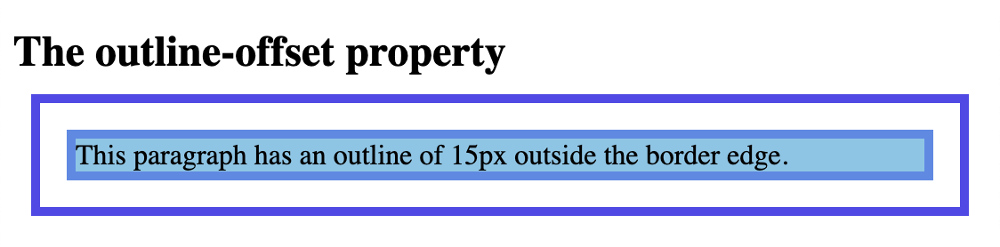

# Outline

An outline is a line drawn outside the element's border.

CSS has the following outline properties:

- outline-style
- outline-color
- outline-width
- outline-offset
- outline


The outline is drawn outside the element's border, and may overlap other content.


The outline is NOT a part of the element's dimensions; the element's total width and height is not affected by the width of the outline.

## `outline-style`


```
<!DOCTYPE html>
<html>
<head>
<style>
p {outline-color:cornflowerblue; outline-width: 4px;}

p.dotted {outline-style: dotted;}
p.dashed {outline-style: dashed;}
p.solid {outline-style: solid;}
p.double {outline-style: double;}
p.groove {outline-style: groove;}
p.ridge {outline-style: ridge;}
p.inset {outline-style: inset;}
p.outset {outline-style: outset;}
</style>
</head>
<body>

<h2>The outline-style property</h2>

<p class="dotted">A dotted outline</p>
<p class="dashed">A dashed outline</p>
<p class="solid">A solid outline</p>
<p class="double">A double outline</p>
<p class="groove">A groove outline. The effect depends on the outline-color value.</p>
<p class="ridge">A ridge outline. The effect depends on the outline-color value.</p>
<p class="inset">An inset outline. The effect depends on the outline-color value.</p>
<p class="outset">An outset outline. The effect depends on the outline-color value.</p>

</body>
</html>
```


## `outline-width`

- thin (typically 1px)
- medium (typically 3px)
- thick (typically 5px)
- specific size (in px, pt, cm, em, etc)

```
<!DOCTYPE html>
<html>
<head>
<style>
p.ex1 {
  border: 5px solid black;
  outline-style: solid;
  outline-color: cornflowerblue;
  outline-width: thin;
}

p.ex2 {
  border: 5px solid black;
  outline-style: solid;
  outline-color: cornflowerblue;
  outline-width: medium;
}

p.ex3 {
  border: 5px solid black;
  outline-style: solid;
  outline-color: cornflowerblue;
  outline-width: thick;
}

p.ex4 {
  border: 5px solid black;
  outline-style: solid;
  outline-color: cornflowerblue;
  outline-width: 6px;
}
</style>
</head>
<body>

<h2>The outline-width property</h2>

<p class="ex1">A thin outline.</p>
<p class="ex2">A medium outline.</p>
<p class="ex3">A thick outline.</p>
<p class="ex4">A 6px thick outline.</p>

</body>
</html>
```


## Shorthand property

```
<!DOCTYPE html>
<html>
<head>
<style>
p.ex1 {outline: dashed;}
p.ex2 {outline: dotted blue;}
p.ex3 {outline: 5px solid grey;}
p.ex4 {outline: thick ridge red;}
</style>
</head>
<body>

<h2>The outline Property</h2>

<p class="ex1">A dashed outline.</p>
<p class="ex2">A dotted blue outline.</p>
<p class="ex3">A 5px solid grey outline.</p>
<p class="ex4">A thick ridge red outline.</p>

</body>
</html>
```


## `outline-offset`

The space between an element and its outline is transparent

```
<!DOCTYPE html>
<html>
<head>
<style>
p {
  margin: 30px;
  background:rgb(126, 199, 231);
  border: 5px solid rgb(83, 138, 233);
  outline: 5px solid rgb(81, 73, 236);
  outline-offset: 15px;
}
</style>
</head>
<body>

<h2>The outline-offset property</h2>

<p>This paragraph has an outline of 15px outside the border edge.</p>

</body>
</html>
```




