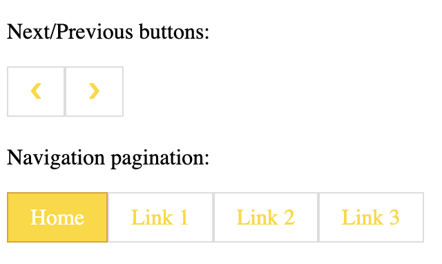

## Active and Hoverable Pagination

```
<!DOCTYPE html>
<html>
<head>
<style>
.pagination {
  display: inline-block;
}

.pagination a {
  color: black;
  float: left;
  padding: 8px 16px;
  text-decoration: none;
}

.pagination a.active {
  background-color: gold;
  color: white;
}

.pagination a:hover:not(.active) {background-color: #ddd;}
</style>
</head>
<body>

<h2>Active and Hoverable Pagination</h2>

<div class="pagination">
  <a href="#">&laquo;</a>
  <a href="#">1</a>
  <a class="active" href="#">2</a>
  <a href="#">3</a>
  <a href="#">4</a>
 <a href="#">&raquo;</a>
</div>

</body>
</html>
```


## Rounded Active and Hoverable Buttons

```
.pagination a {
  color: black;
  float: left;
  padding: 8px 16px;
  text-decoration: none;
}

.pagination a.active {
  background-color: gold;
  color: white;
  border-radius: 5px;
}

.pagination a:hover:not(.active) {
  background-color: #ddd;
  border-radius: 5px;
}
```
## Transition Effect on Hover

```
<!DOCTYPE html>
<html>
<head>
<style>
.pagination {
  display: inline-block;
}

.pagination a {
  color: black;
  float: left;
  padding: 8px 16px;
  text-decoration: none;
  transition: background-color .3s;
}

.pagination a.active {
  background-color: gold;
  color: white;
}

.pagination a:hover:not(.active) {background-color: #ddd;}
</style>
</head>
<body>

<h2>Transition Effect on Hover</h2>

<div class="pagination">
  <a href="#">&laquo;</a>
  <a href="#">1</a>
  <a href="#" class="active">2</a>
  <a href="#">3</a>
  <a href="#">&raquo;</a>
</div>

</body>
</html>

```

## Bordered Pagination

```
.pagination a {
  border: 1px solid gold; 
}
```

## Rounded Borders

```
.pagination a:first-child {
  border-top-left-radius: 5px;
  border-bottom-left-radius: 5px;
}

.pagination a:last-child {
  border-top-right-radius: 5px;
  border-bottom-right-radius: 5px;
}
```

## Space Between Links

```
.pagination a {
  margin: 0 4px; }
```

## Size

```
.pagination a {
  font-size: 13px;
}
```

## Centered

```
.center {
  text-align: center;
}
```

```
<!DOCTYPE html>
<html>
<head>
<style>
body {
  background-color:white;
}
.pagination {
  display: inline-block;
}

.pagination a {
  color: gold;
  float: left;
  padding: 8px 16px;
  text-decoration: none;
  transition: background-color .3s;
  border: 1px solid #ddd;
}

.pagination a.active {
  background-color: gold;
  color: white;
  border: 1px solid goldenrod;
}

.pagination a:hover:not(.active) {background-color: #ddd;}
</style>
</head>
<body>

<p>Next/Previous buttons:</p>
<div class="pagination">
  <a href="#">❮</a>
  <a href="#">❯</a>
</div>

<p>Navigation pagination:</p>
<div class="pagination">
  <a href="#" class="active">Home</a>
  <a href="#">Link 1</a>
  <a href="#">Link 2</a>
  <a href="#">Link 3</a>
</div>

</body>
</html>
```



