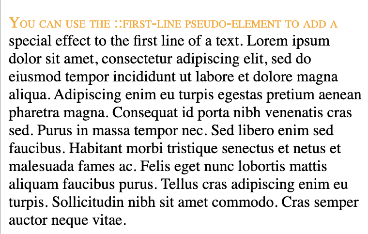
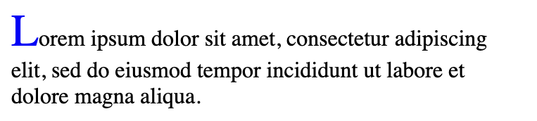
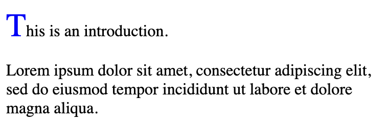
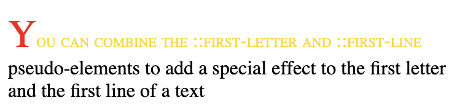
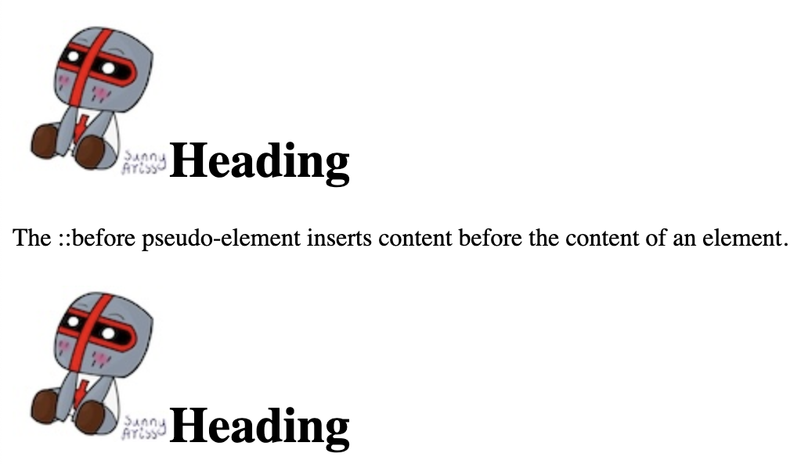
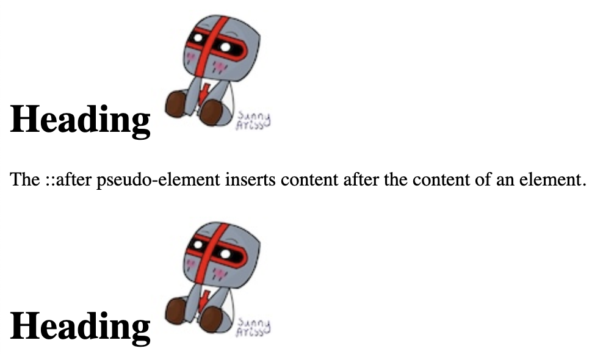
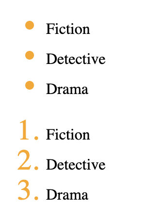
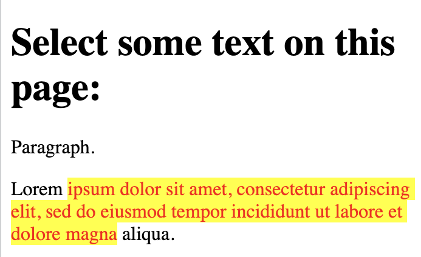
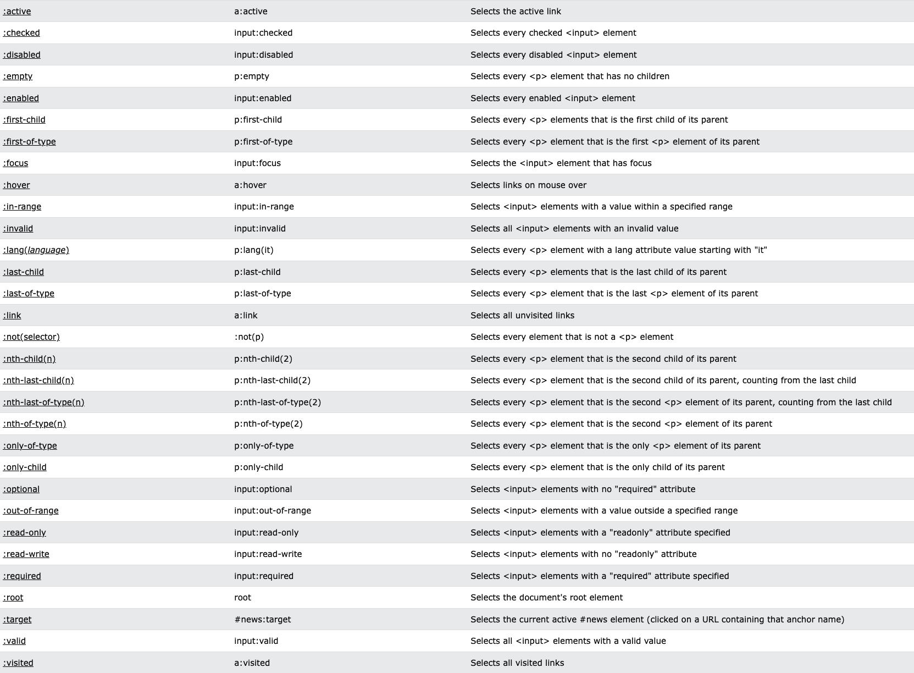

# Pseudo-elements

Pseudo-element is used to:

- style the first letter, or line, of an element
- insert content before, or after, the content of an element

pseudo-element can only be applied to block-level elements

## `::first-line`

- font properties
- color properties
- background properties
- word-spacing
- letter-spacing
- text-decoration
- vertical-align
- text-transform
- line-height
- clear


```
<!DOCTYPE html>
<html>
<head>
<style>
p::first-line {
  color: orange;
  font-variant: small-caps;
}
</style>
</head>
<body>

<p>You can use the ::first-line pseudo-element to add a special effect to the first line of a text. Lorem ipsum dolor sit amet, consectetur adipiscing elit, sed do eiusmod tempor incididunt ut labore et dolore magna aliqua. Adipiscing enim eu turpis egestas pretium aenean pharetra magna. Consequat id porta nibh venenatis cras sed. Purus in massa tempor nec. Sed libero enim sed faucibus. Habitant morbi tristique senectus et netus et malesuada fames ac. Felis eget nunc lobortis mattis aliquam faucibus purus. Tellus cras adipiscing enim eu turpis. Sollicitudin nibh sit amet commodo. Cras semper auctor neque vitae.</p>

</body>
</html>
```


## `::first-letter`

- font properties
- color properties 
- background properties
- margin properties
- padding properties
- border properties
- text-decoration
- vertical-align (only if "float" is "none")
- text-transform
- line-height
- float
- clear

```
<!DOCTYPE html>
<html>
<head>
<style>
p::first-letter {
  color: blue;
  font-size: xx-large;
}
</style>
</head>
<body>

<p>Lorem ipsum dolor sit amet, consectetur adipiscing elit, sed do eiusmod tempor incididunt ut labore et dolore magna aliqua.</p>

</body>
</html>
```



## HTML Classes

```
<!DOCTYPE html>
<html>
<head>
<style>
p.intro::first-letter {
  color: blue;
  font-size: 200%;
}  
</style>
</head>
<body>

<p class="intro">This is an introduction.</p>
<p>Lorem ipsum dolor sit amet, consectetur adipiscing elit, sed do eiusmod tempor incididunt ut labore et dolore magna aliqua.</p>

</body>
</html>
```


## Multiple pseudo-elements

```
<!DOCTYPE html>
<html>
<head>
<style>
p::first-letter {
  color: red;
  font-size: xx-large;
}

p::first-line {
  color: gold;
  font-variant: small-caps;
}
</style>
</head>
<body>

<p>You can combine the ::first-letter and ::first-line pseudo-elements to add a special effect to the first letter and the first line of a text</p>

</body>
</html>
```


## `::before` Pseudo-element

```
<!DOCTYPE html>
<html>
<head>
<style>
h1::before {
  content: url(doc-files/chibi.jpg);
}
</style>
</head>
<body>

<h1>Heading</h1>
<p>The ::before pseudo-element inserts content before the content of an element.</p>

<h1>Heading</h1>

</body>
</html>
```


## `::after` pseudo-element

```
<!DOCTYPE html>
<html>
<head>
<style>
h1::after {
  content: url(doc-files/chibi.jpg);
}
</style>
</head>
<body>

<h1>Heading</h1>
<p>The ::after pseudo-element inserts content after the content of an element.</p>

<h1>Heading</h1>

</body>
</html>
```



## `::marker` Pseudo-element

```
<!DOCTYPE html>
<html>
<head>
<style>
::marker { 
  color: orange;
  font-size: 30px;
}
</style>
</head>
<body>

<ul>
  <li>Fiction</li>
  <li>Detective</li>
  <li>Drama</li>
</ul>

<ol>
  <li>Fiction</li>
  <li>Detective</li>
  <li>Drama</li>
</ol>

</body>
</html>
```



## `::selection` pseudo-element

```
<!DOCTYPE html>
<html>
<head>
<style>
::selection {
  color: red;
  background: yellow;
}
</style>
</head>
<body>

<h1>Select some text on this page:</h1>

<p>Paragraph.</p>
<div>Lorem ipsum dolor sit amet, consectetur adipiscing elit, sed do eiusmod tempor incididunt ut labore et dolore magna aliqua.</div>

</body>
</html>
```




