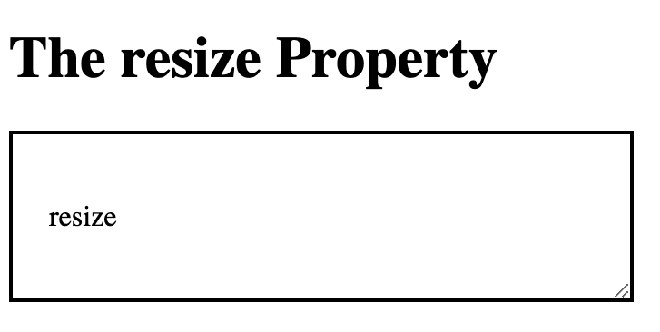

# Resize

## horizontal

```
<!DOCTYPE html>
<html>
<head>
<style> 
div {
  border: 2px solid;
  padding: 20px; 
  width: 300px;
  resize: horizontal;
  overflow: auto;
}
</style>
</head>
<body>

<h1>The resize Property</h1>

<div>
  <p>resize<p/>
</div>

</body>
</html>

```


## vertical
```
<!DOCTYPE html>
<html>
<head>
<style> 
div {
  border: 2px solid;
  padding: 20px; 
  width: 300px;
  resize: vertical;
  overflow: auto;
}
</style>
</head>
<body>

<h1>The resize Property</h1>

<div>
  <p>resize</p>
</div>

</body>
</html>
```

## Resize both the height and width 

```
<!DOCTYPE html>
<html>
<head>
<style> 
div {
  border: 2px solid;
  padding: 20px; 
  width: 300px;
  resize: both;
  overflow: auto;
}
</style>
</head>
<body>

<h1>The resize Property</h1>

<div>
  <p>resize</p>
  
</div>

</body>
</html>
```

