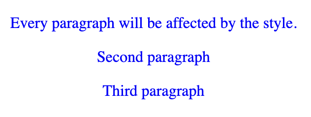
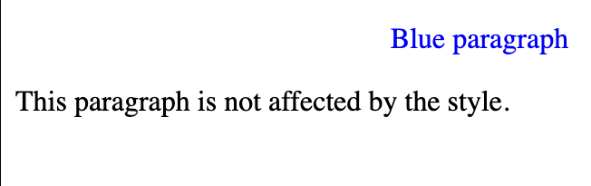
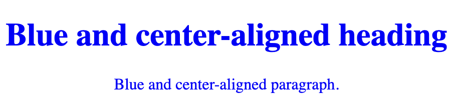
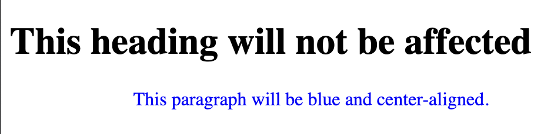
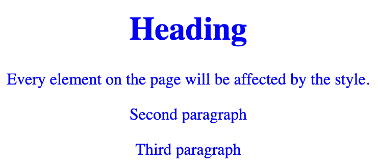
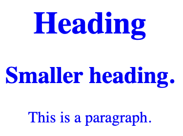

# CSS selectors

Five categories CSS selectors:

- Simple selectors (select elements based on name, id, class)

- Combinator selectors (select elements based on a specific relationship between them)

- Pseudo-class selectors (select elements based on a certain state)

- Pseudo-elements selectors (select and style a part of an element)

- Attribute selectors (select elements based on an attribute or attribute value)

`#id`	(#firstname)	
Selects the element with `id="firstname"`

`.class`	(.intro)	
Selects all elements with `class="intro"`

`element.class`	(p.intro)	Selects only `<p>` elements with `class="intro"`

`*`	
Selects all elements

`element`	(p)	
Selects all `<p>` elements

`element,element,..`	(div, p)	Selects all `<div>` elements and all `<p>` elements


## CSS element selector
```
<!DOCTYPE html>
<html>
<head>
<style>
p {
  text-align: center;
  color: blue;
} 
</style>
</head>
<body>

<p>Every paragraph will be affected by the style.</p>
<p id="para1">Second paragraph</p>
<p>Third paragraph </p>

</body>
</html>
```



## CSS id selector

The `id selector` uses the `id` attribute of an HTML element to select a specific element.

The `id` of an element is unique within a page, so the `id` selector is used to select one unique element.

To select an element with a specific `id`, write a hash `#` character, followed by the `id` of the element.

```
<!DOCTYPE html>
<html>
<head>
<style>
#para1 {
  text-align: center;
  color: blue;
}
</style>
</head>
<body>

<p id="para1">Blue paragraph</p>
<p>This paragraph is not affected by the style.</p>

</body>
</html>
```


## CSS class selector

The class selector selects HTML elements with a specific class attribute.

To select elements with a specific class, write a period (.) character, followed by the class name.

```
<!DOCTYPE html>
<html>
<head>
<style>
.center {
  text-align: center;
  color: blue;
}
</style>
</head>
<body>

<h1 class="center">Blue and center-aligned heading</h1>
<p class="center">Blue and center-aligned paragraph.</p> 

</body>
</html>
```


```
<!DOCTYPE html>
<html>
<head>
<style>
p.center {
  text-align: center;
  color: blue;
}
</style>
</head>
<body>

<h1 class="center">This heading will not be affected</h1>
<p class="center">This paragraph will be blue and center-aligned.</p> 

</body>
</html>
```



## CSS Universal Selector

The universal selector (*) selects all HTML elements on the page.

```
<!DOCTYPE html>
<html>
<head>
<style>
* {
  text-align: center;
  color: blue;
}
</style>
</head>
<body>

<h1>Heading</h1>

<p>Every element on the page will be affected by the style.</p>
<p id="para1">Second paragraph</p>
<p>Third paragraph </p>

</body>
</html>
```


## CSS grouping selector

The grouping selector selects all the HTML elements with the same style definitions.

Look at the following CSS code (the h1, h2, and p elements have the same style definitions):

```
<!DOCTYPE html>
<html>
<head>
<style>
h1, h2, p {
  text-align: center;
  color: blue;
}
</style>
</head>
<body>

<h1>Heading</h1>
<h2>Smaller heading.</h2>
<p>This is a paragraph.</p>

</body>
</html>
```


