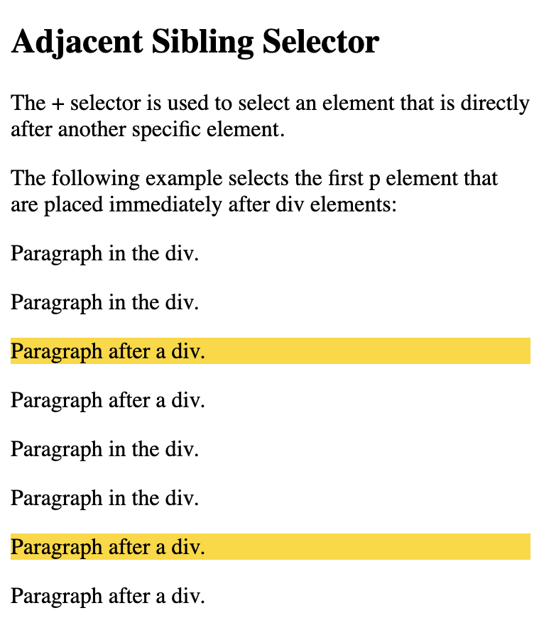
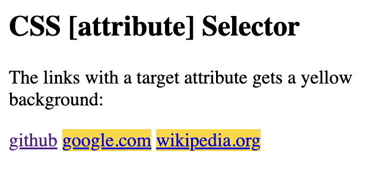
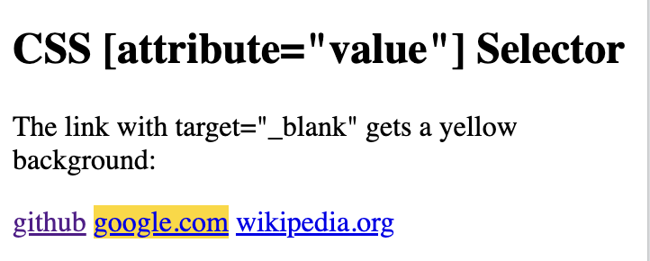
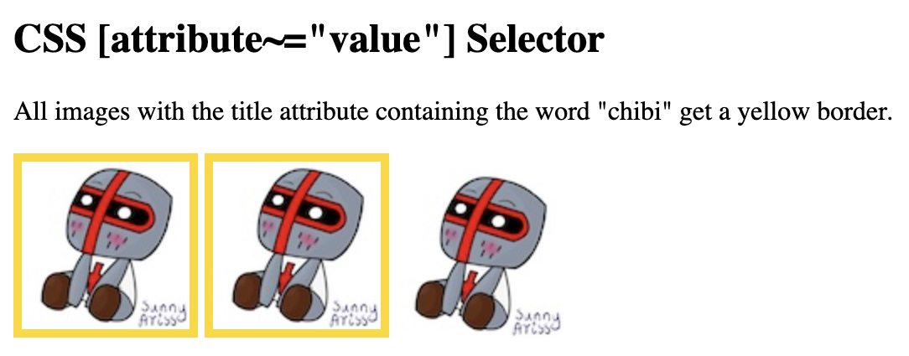
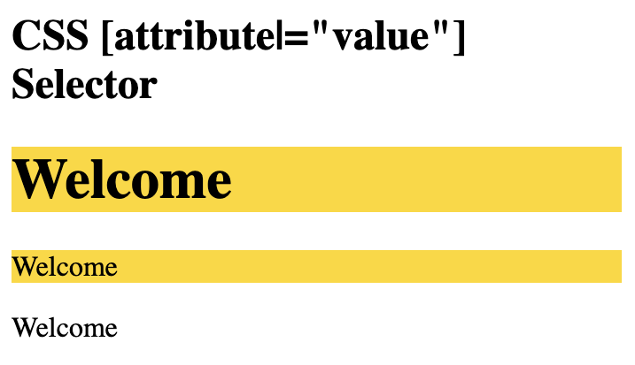
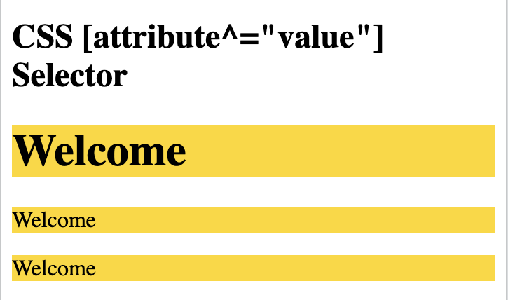
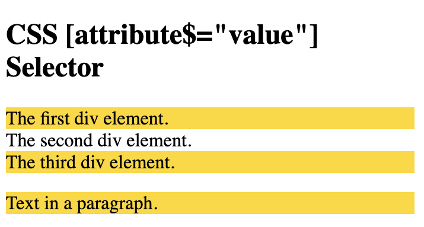
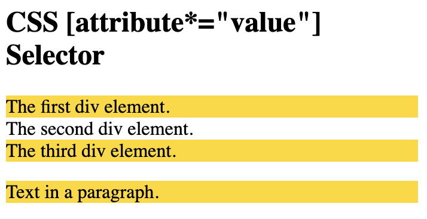

# CSS selectors

Five categories CSS selectors:

- Simple selectors (select elements based on name, id, class)

- Combinator selectors (select elements based on a specific relationship between them)

- Pseudo-class selectors (select elements based on a certain state)

- Pseudo-elements selectors (select and style a part of an element)

- Attribute selectors (select elements based on an attribute or attribute value)

`#id`	(#firstname)	
Selects the element with `id="firstname"`

`.class`	(.intro)	
Selects all elements with `class="intro"`

`element.class`	(p.intro)	Selects only `<p>` elements with `class="intro"`

`*`	
Selects all elements

`element`	(p)	
Selects all `<p>` elements

`element,element,..`	(div, p)	Selects all `<div>` elements and all `<p>` elements


## CSS element selector
```
<!DOCTYPE html>
<html>
<head>
<style>
p {
  text-align: center;
  color: blue;
} 
</style>
</head>
<body>

<p>Every paragraph will be affected by the style.</p>
<p id="para1">Second paragraph</p>
<p>Third paragraph </p>

</body>
</html>
```


## CSS id selector

The `id selector` uses the `id` attribute of an HTML element to select a specific element.

The `id` of an element is unique within a page, so the `id` selector is used to select one unique element.

To select an element with a specific `id`, write a hash `#` character, followed by the `id` of the element.

```
<!DOCTYPE html>
<html>
<head>
<style>
#para1 {
  text-align: center;
  color: blue;
}
</style>
</head>
<body>

<p id="para1">Blue paragraph</p>
<p>This paragraph is not affected by the style.</p>

</body>
</html>
```


## CSS class selector

The class selector selects HTML elements with a specific class attribute.

To select elements with a specific class, write a period (.) character, followed by the class name.

```
<!DOCTYPE html>
<html>
<head>
<style>
.center {
  text-align: center;
  color: blue;
}
</style>
</head>
<body>

<h1 class="center">Blue and center-aligned heading</h1>
<p class="center">Blue and center-aligned paragraph.</p> 

</body>
</html>
```


```
<!DOCTYPE html>
<html>
<head>
<style>
p.center {
  text-align: center;
  color: blue;
}
</style>
</head>
<body>

<h1 class="center">This heading will not be affected</h1>
<p class="center">This paragraph will be blue and center-aligned.</p> 

</body>
</html>
```


## CSS Universal Selector

The universal selector (*) selects all HTML elements on the page.

```
<!DOCTYPE html>
<html>
<head>
<style>
* {
  text-align: center;
  color: blue;
}
</style>
</head>
<body>

<h1>Heading</h1>

<p>Every element on the page will be affected by the style.</p>
<p id="para1">Second paragraph</p>
<p>Third paragraph </p>

</body>
</html>
```


## CSS grouping selector

The grouping selector selects all the HTML elements with the same style definitions.

Look at the following CSS code (the h1, h2, and p elements have the same style definitions):

```
<!DOCTYPE html>
<html>
<head>
<style>
h1, h2, p {
  text-align: center;
  color: blue;
}
</style>
</head>
<body>

<h1>Heading</h1>
<h2>Smaller heading.</h2>
<p>This is a paragraph.</p>

</body>
</html>
```


# Combinators

There are four different combinators in CSS:

- descendant selector (space)
- child selector (>)
- adjacent sibling selector (+)
- general sibling selector (~)

## Descendant Selector

```
<!DOCTYPE html>
<html>
<head>
<style>
div p {
  background-color: gold;
}
</style>
</head>
<body>

<h2>Descendant selector</h2>

<p>The descendant selector matches all elements that are descendants of a specified element.</p>

<div>
  <p>Paragraph in the div.</p>
  <p>Paragraph in the div.</p>
  <section><p>Paragraph in the div.</p></section>
</div>

<p>Paragraph not in a div.</p>
<p>Paragraph not in a div.</p>

</body>
</html>
```


## Child Selector

```
<!DOCTYPE html>
<html>
<head>
<style>
div > p {
  background-color: gold;
}
</style>
</head>
<body>

<h2>Child Selector</h2>

<p>The child selector (>) selects all elements that are the children of a specified element.</p>

<div>
  <p>Paragraph in the div.</p>
  <p>Paragraph in the div.</p>
  <section>
    <!-- not Child but Descendant -->
    <p>Paragraph in the div (inside a section element).</p>
  </section>
  <p>Paragraph in the div.</p>
</div>

<p>Paragraph not in a div.</p>
<p>Paragraph not in a div.</p>

</body>
</html>
```


## Sibling Selector (+)

```
<!DOCTYPE html>
<html>
<head>
<style>
div + p {
  background-color: gold;
}
</style>
</head>
<body>

<h2>Adjacent Sibling Selector</h2>

<p>The + selector is used to select an element that is directly after another specific element.</p>
<p>The following example selects the first p element that are placed immediately after div elements:</p>

<div>
  <p>Paragraph in the div.</p>
  <p>Paragraph in the div.</p>
</div>

<p>Paragraph after a div.</p>
<p>Paragraph after a div.</p>

<div>
  <p>Paragraph in the div.</p>
  <p>Paragraph in the div.</p>
</div>

<p>Paragraph after a div.</p>
<p>Paragraph after a div.</p>

</body>
</html>
```


## General Sibling Selector

```
<!DOCTYPE html>
<html>
<head>
<style>
div ~ p {
  background-color: gold;
}
</style>
</head>
<body>

<h2>General Sibling Selector</h2>

<p>The general sibling selector (~) selects all elements that are next siblings of a specified element.</p>

<p>Paragraph</p>

<div>
  <p>Paragraph</p>
</div>

<p>Paragraph</p>

<code>Code.</code>

<p>Paragraph</p>

</body>
</html>
```


## Match the first `<i>` element in all `<p>` elements

```
<!DOCTYPE html>
<html>
<head>
<style>
p i:first-child {
  color: blue;
} 
</style>
</head>
<body>

<p>A <i>strong</i> paragraph. 
A <i>strong</i> paragraph.</p>
<p>A <i>strong</i> paragraph. A <i>strong</i> paragraph.</p>

</body>
</html>
```


## Match all `<i>` elements in all first child `<p>` elements

```
<!DOCTYPE html>
<html>
<head>
<style>
p:first-child i {
  color: blue;
} 
</style>
</head>
<body>

<p>A <i>strong</i> paragraph. 
A <i>strong</i> paragraph.</p>
<p>A <i>strong</i> paragraph. A <i>strong</i> paragraph.</p>

<div>
<p>A <i>strong</i> paragraph. 
A <i>strong</i> paragraph.</p>
<p>A <i>strong</i> paragraph. A <i>strong</i> paragraph.</p>
</div>

</body>
</html>
```


##  :lang pseudo-class

```
<!DOCTYPE html>
<html>
<head>
<style>
q:lang(no) {
  quotes: "~" "~";
}
</style>
</head>
<body>

<p>Some text <q lang="no">A quote in a paragraph</q> Some text.</p>
<p>:lang defines the quotation marks for q elements with lang="no":</p>

</body>
</html>
```


## [attribute] Selectors

```
<!DOCTYPE html>
<html>
<head>
<style>
a[target] {
  background-color: gold;
}
</style>
</head>
<body>

<h2>CSS [attribute] Selector</h2>
<p>The links with a target attribute gets a yellow background:</p>

<a href="https://github.com/SunnyAris">github</a>
<a href="http://www.google.com" target="_blank">google.com</a>
<a href="http://www.wikipedia.org" target="_top">wikipedia.org</a>

</body>
</html>
```


## [attribute="value"] Selector

```
<!DOCTYPE html>
<html>
<head>
<style>
a[target="_blank"] {
  background-color: gold;
}
</style>
</head>
<body>

<h2>CSS [attribute="value"] Selector</h2>
<p>The link with target="_blank" gets a yellow background:</p>

<a href="https://github.com/SunnyAris">github</a>
<a href="http://www.google.com" target="_blank">google.com</a>
<a href="http://www.wikipedia.org" target="_top">wikipedia.org</a>


</body>
</html>
```



##  [attribute~="value"] Selector

Selector is used to select elements with an attribute value containing a specified word.

```
<!DOCTYPE html>
<html>
<head>
<style>
[title~="chibi"] {
  border: 5px solid gold;
}
</style>
</head>
<body>

<h2>CSS [attribute~="value"] Selector</h2>
<p>All images with the title attribute containing the word "chibi" get a yellow border.</p>


</body>
</html>
```



## [attribute|="value"] Selector

Selector is used to select elements with the specified attribute, whose value can be exactly the specified value,

```
<!DOCTYPE html>
<html>
<head>
<style>
[class|="top"] {
  background: gold;
}
</style>
</head>
<body>

<h2>CSS [attribute|="value"] Selector</h2>

<h1 class="top-header">Welcome</h1>
<p class="top-text">Welcome</p>
<p class="topcontent">Welcome</p>

</body>
</html>
```


## [attribute^="value"] Selector

```
<!DOCTYPE html>
<html>
<head>
<style>
[class^="top"] {
  background: gold;
}
</style>
</head>
<body>

<h2>CSS [attribute^="value"] Selector</h2>

<h1 class="top-header">Welcome</h1>
<p class="top-text">Welcome</p>
<p class="topcontent">Welcome</p>

</body>
</html>
```


## [attribute$="value"] Selector

`[attribute$="value"]`selects all elements with a class attribute value that ends with "test"

```
<!DOCTYPE html>
<html>
<head>
<style> 
[class$="test"] {
  background: gold;
}
</style>
</head>
<body>

<h2>CSS [attribute$="value"] Selector</h2>

<div class="first_test">The first div element.</div>
<div class="second">The second div element.</div>
<div class="my-test">The third div element.</div>
<p class="mytest">Text in a paragraph.</p>

</body>
</html>
```



## [attribute*="value"] Selector

`[attribute*="value"]`selects all elements with a class attribute value that contains "te"

```
<!DOCTYPE html>
<html>
<head>
<style> 
[class*="te"] {
  background: gold;
}
</style>
</head>
<body>

<h2>CSS [attribute*="value"] Selector</h2>

<div class="first_test">The first div element.</div>
<div class="second">The second div element.</div>
<div class="my-test">The third div element.</div>
<p class="mytest">Text in a paragraph.</p>

</body>
</html>
```


