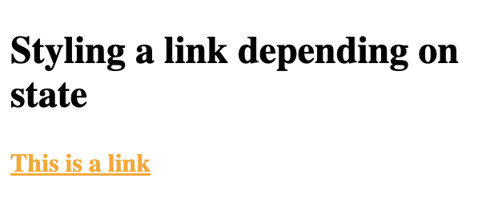
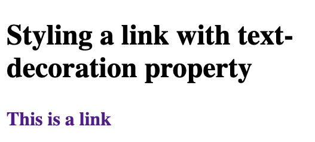
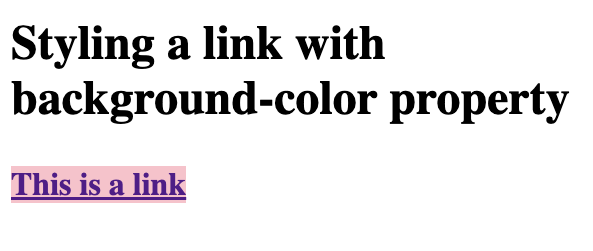
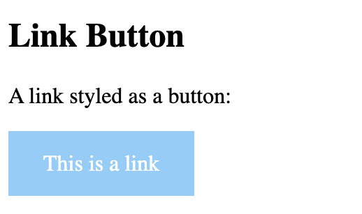
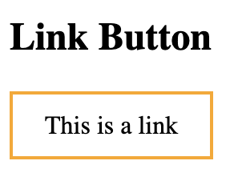
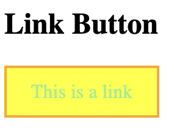

# Styled links

- a:link - a normal, unvisited link
- a:visited - a link the user has visited
- a:hover - a link when the user mouses over it
- a:active - a link the moment it is clicked

Rules:
- a:hover MUST come after a:link and a:visited
- a:active MUST come after a:hover

## Styling a link depending on state

```
<!DOCTYPE html>
<html>
<head>
<style>
/* unvisited link */
a:link {
  color: red;
}

/* visited link */
a:visited {
  color: orange;
}

/* mouse over link */
a:hover {
  color: green;
}

/* selected link */
a:active {
  color: pink;
}
</style>
</head>
<body>

<h2>Styling a link depending on state</h2>

<p><b><a href="default.asp" target="_blank">This is a link</a></b></p>

</body>
</html>
```



## `text-decoration` property is mostly used to remove underlines from links

```
<!DOCTYPE html>
<html>
<head>
<style>
a:link {
  text-decoration: none;
}

a:visited {
  text-decoration: none;
}

a:hover {
  text-decoration: underline;
}

a:active {
  text-decoration: underline;
}
</style>
</head>
<body>

<h2>Styling a link with text-decoration property</h2>

<p><b><a href="default.asp" target="_blank">This is a link</a></b></p>

</body>
</html>
```



## Styling a link with `background-color` property


```
<!DOCTYPE html>
<html>
<head>
<style>
a:link {
  background-color: yellow;
}

a:visited {
  background-color: pink;
}

a:hover {
  background-color: lightgreen;
}

a:active {
  background-color: hotpink;
} 
</style>
</head>
<body>

<h2>Styling a link with background-color property</h2>

<p><b><a href="default.asp" target="_blank">This is a link</a></b></p>

</body>
</html>
```



## More styling links

```
<!DOCTYPE html>
<html>
<head>
<style>
a.one:link {color:#ff0000;}
a.one:visited {color:#0000ff;}
a.one:hover {color:#ffcc00;}

a.two:link {color:#ff0000;}
a.two:visited {color:#0000ff;}
a.two:hover {font-size:150%;}

a.three:link {color:#ff0000;}
a.three:visited {color:#0000ff;}
a.three:hover {background:#66ff66;}

a.four:link {color:#ff0000;}
a.four:visited {color:#0000ff;}
a.four:hover {font-family:monospace;}

a.five:link {color:#ff0000;text-decoration:none;}
a.five:visited {color:#0000ff;text-decoration:none;}
a.five:hover {text-decoration:underline;}
</style>
</head>
<body>

<h2>Styling Links</h2>

<p><b><a class="one" href="default.asp" target="_blank">This link changes color</a></b></p>
<p><b><a class="two" href="default.asp" target="_blank">This link changes font-size</a></b></p>
<p><b><a class="three" href="default.asp" target="_blank">This link changes background-color</a></b></p>
<p><b><a class="four" href="default.asp" target="_blank">This link changes font-family</a></b></p>
<p><b><a class="five" href="default.asp" target="_blank">This link changes text-decoration</a></b></p>

</body>
</html>
```

## Link Button

```
<!DOCTYPE html>
<html>
<head>
<style>
a:link, a:visited {
  background-color: #87CEFA;
  color: white;
  padding: 14px 25px;
  text-align: center;
  text-decoration: none;
  display: inline-block;
}

a:hover, a:active {
  background-color: blue;
}
</style>
</head>
<body>

<h2>Link Button</h2>

<p>A link styled as a button:</p>
<a href="default.asp" target="_blank">This is a link</a>

</body>
</html>

```



```
<!DOCTYPE html>
<html>
<head>
<style>
a:link, a:visited {
  background-color: white;
  color: black;
  border: 2px solid orange;
  padding: 10px 20px;
  text-align: center;
  text-decoration: none;
  display: inline-block;
}

a:hover, a:active {
  background-color: yellow;
  color: lightgreen;
}
</style>
</head>
<body>

<h2>Link Button</h2>

<a href="default.asp" target="_blank">This is a link</a>

</body>
</html>
```





## Cursor 

```
<!DOCTYPE html>
<html>
<head>
<style>
.alias {cursor: alias;}
.all-scroll {cursor: all-scroll;}
.auto {cursor: auto;}
.cell {cursor: cell;}
.col-resize {cursor: col-resize;}
.context-menu {cursor: context-menu;}
.copy {cursor: copy;}
.crosshair {cursor: crosshair;}
.default {cursor: default;}
.e-resize {cursor: e-resize;}
.ew-resize {cursor: ew-resize;}
.grab {cursor: -webkit-grab; cursor: grab;}
.grabbing {cursor: -webkit-grabbing; cursor: grabbing;}
.help {cursor: help;}
.move {cursor: move;}
.n-resize {cursor: n-resize;}
.ne-resize {cursor: ne-resize;}
.nesw-resize {cursor: nesw-resize;}
.ns-resize {cursor: ns-resize;}
.nw-resize {cursor: nw-resize;}
.nwse-resize {cursor: nwse-resize;}
.no-drop {cursor: no-drop;}
.none {cursor: none;}
.not-allowed {cursor: not-allowed;}
.pointer {cursor: pointer;}
.progress {cursor: progress;}
.row-resize {cursor: row-resize;}
.s-resize {cursor: s-resize;}
.se-resize {cursor: se-resize;}
.sw-resize {cursor: sw-resize;}
.text {cursor: text;}
.url {cursor: url(myBall.cur),auto;}
.w-resize {cursor: w-resize;}
.wait {cursor: wait;}
.zoom-in {cursor: zoom-in;}
.zoom-out {cursor: zoom-out;}
</style>
</head>
<body>

<h1>The cursor Property</h1>
<p>Mouse over the words to change the mouse cursor.</p>

<p class="alias">alias</p>
<p class="all-scroll">all-scroll</p>
<p class="auto">auto</p>
<p class="cell">cell</p>
<p class="col-resize">col-resize</p>
<p class="context-menu">context-menu</p>
<p class="copy">copy</p>
<p class="crosshair">crosshair</p>
<p class="default">default</p>
<p class="e-resize">e-resize</p>
<p class="ew-resize">ew-resize</p>
<p class="grab">grab</p>
<p class="grabbing">grabbing</p>
<p class="help">help</p>
<p class="move">move</p>
<p class="n-resize">n-resize</p>
<p class="ne-resize">ne-resize</p>
<p class="nesw-resize">nesw-resize</p>
<p class="ns-resize">ns-resize</p>
<p class="nw-resize">nw-resize</p>
<p class="nwse-resize">nwse-resize</p>
<p class="no-drop">no-drop</p>
<p class="none">none</p>
<p class="not-allowed">not-allowed</p>
<p class="pointer">pointer</p>
<p class="progress">progress</p>
<p class="row-resize">row-resize</p>
<p class="s-resize">s-resize</p>
<p class="se-resize">se-resize</p>
<p class="sw-resize">sw-resize</p>
<p class="text">text</p>
<p class="url">url</p>
<p class="w-resize">w-resize</p>
<p class="wait">wait</p>
<p class="zoom-in">zoom-in</p>
<p class="zoom-out">zoom-out</p>

</body>
</html>
```

