# Borders

```
<!DOCTYPE html>
<html>
<head>
<style>
table, th, td {
  border: 1px solid;
}
</style>
</head>
<body>

<h2>Add a border to a table:</h2>

<table>
  <tr>
    <th>Genre</th>
    <th>Author</th>
    <th>Title</th>
  </tr>
  <tr>
    <td>Horror</td>
    <td>Stephen King</td>
    <td>The Shining</td>
  </tr>
  <tr>
    <td>Science Fiction </td>
    <td>Frank Herbert</td>
    <td>Dune</td>
  </tr>
  <tr>
    <td>Detective</td>
    <td>Arthur Conan Doyle</td>
    <td>Sherlock Holmes</td>
  </tr>
</table>

</body>
</html>
```
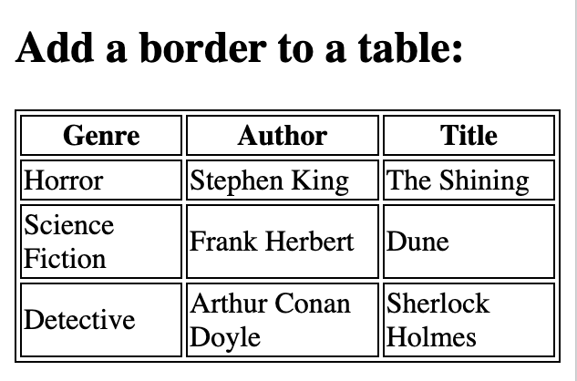

## Full-Width table

```
<!DOCTYPE html>
<html>
<head>
<style>
table, th, td {
  border: 1px solid;
}

table {
  width: 100%;
}
</style>
</head>
<body>

<h2>Full-width Table</h2>

<table>
  <tr>
    <th>Firstname</th>
    <th>Lastname</th>
  </tr>
  <tr>
    <td>Stephen</td>
    <td>King</td>
  </tr>
  <tr>
    <td>Frank</td>
    <td>Herbert</td>
  </tr>
</table>

</body>
</html>
```

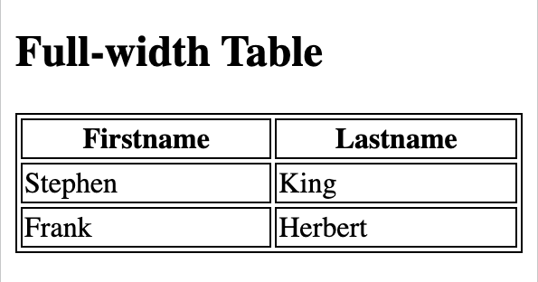

## `border-collapse`

```
<!DOCTYPE html>
<html>
<head>
<style>
table, td, th {
  border: 1px solid;
}

table {
  width: 100%;
  border-collapse: collapse;
}
</style>
</head>
<body>

<h2>Let the table borders collapse</h2>

<table>
  <tr>
    <th>Firstname</th>
    <th>Lastname</th>
  </tr>
  <tr>
    <td>Stephen</td>
    <td>King</td>
  </tr>
  <tr>
    <td>Frank</td>
    <td>Herbert</td>
  </tr>
</table>

</body>
</html>
```
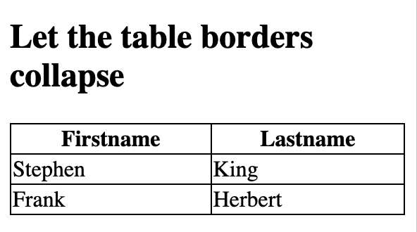


```
<!DOCTYPE html>
<html>
<head>
<style>
table {
  width: 100%;
  border: 1px solid;
}
</style>
</head>
<body>

<h2>Single Border Around The Table</h2>

<table>
  <tr>
    <th>Firstname</th>
    <th>Lastname</th>
  </tr>
  <tr>
    <td>Stephen</td>
    <td>King</td>
  </tr>
  <tr>
    <td>Frank</td>
    <td>Herbert</td>
  </tr>
</table>

</body>
</html>
```
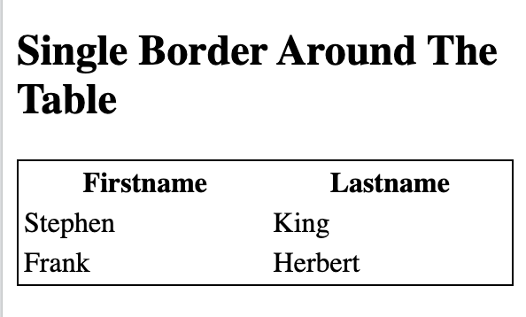

## Width and height

```
<!DOCTYPE html>
<html>
<head>
<style>
table, td, th {
  border: 1px solid black;
}

table {
  border-collapse: collapse;
  width: 100%;
}

th {
  height: 70px;
}
</style>
</head>
<body>

<h2>The width and height properties</h2>

<table>
  <tr>
    <th>Genre</th>
    <th>Author</th>
    <th>Title</th>
  </tr>
  <tr>
    <td>Horror</td>
    <td>Stephen King</td>
    <td>The Shining</td>
  </tr>
  <tr>
    <td>Science Fiction </td>
    <td>Frank Herbert</td>
    <td>Dune</td>
  </tr>
  <tr>
    <td>Detective</td>
    <td>Arthur Conan Doyle</td>
    <td>Sherlock Holmes</td>
  </tr>
</table>

</body>
</html>
```


```
<!DOCTYPE html>
<html>
<head>
<style>
table, td, th {
  border: 1px solid black;
}

table {
  border-collapse: collapse;
  width: 50%;
}
</style>
</head>
<body>

<h2>A table that only span half the page</h2>

<p>Width of the table to 50%:</p>

<table>
  <tr>
    <th>Genre</th>
    <th>Author</th>
    <th>Title</th>
  </tr>
  <tr>
    <td>Horror</td>
    <td>Stephen King</td>
    <td>The Shining</td>
  </tr>
  <tr>
    <td>Science Fiction </td>
    <td>Frank Herbert</td>
    <td>Dune</td>
  </tr>
  <tr>
    <td>Detective</td>
    <td>Arthur Conan Doyle</td>
    <td>Sherlock Holmes</td>
  </tr>
</table>

</body>
</html>
```

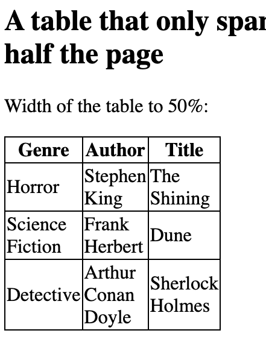

## Table alignment

`text-align` property sets the horizontal alignment left, right, or center

```
<!DOCTYPE html>
<html>
<head>
<style>
table, td, th {
  border: 5px solid black;
}

table {
  border-collapse: collapse;
  width: 100%;
}

td {
  text-align: center;
}
</style>
</head>
<body>

<h2>The text-align property</h2>

<table>
  <tr>
    <th>Genre</th>
    <th>Author</th>
    <th>Title</th>
  </tr>
  <tr>
    <td>Horror</td>
    <td>Stephen King</td>
    <td>The Shining</td>
  </tr>
  <tr>
    <td>Science Fiction </td>
    <td>Frank Herbert</td>
    <td>Dune</td>
  </tr>
  <tr>
    <td>Detective</td>
    <td>Arthur Conan Doyle</td>
    <td>Sherlock Holmes</td>
  </tr>
</table>

</body>
</html>
```
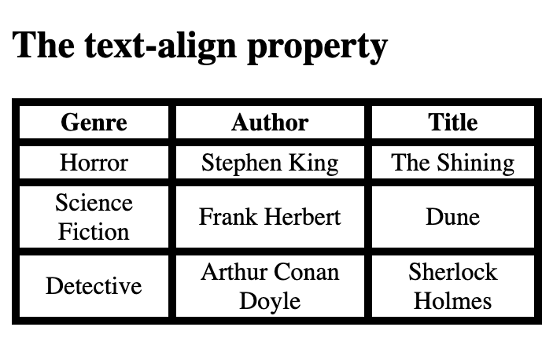


`vertical-align` property sets the vertical alignment top, bottom, or middle

```
<!DOCTYPE html>
<html>
<head>
<style>
table, td, th {
  border: 5px solid black;
}

table {
  border-collapse: collapse;
  width: 100%;
}

td {
  height: 50px;
  vertical-align: bottom;
}
</style>
</head>
<body>

<h2>The vertical-align property</h2>


<table>
  <tr>
    <th>Genre</th>
    <th>Author</th>
    <th>Title</th>
  </tr>
  <tr>
    <td>Horror</td>
    <td>Stephen King</td>
    <td>The Shining</td>
  </tr>
  <tr>
    <td>Science Fiction </td>
    <td>Frank Herbert</td>
    <td>Dune</td>
  </tr>
  <tr>
    <td>Detective</td>
    <td>Arthur Conan Doyle</td>
    <td>Sherlock Holmes</td>
  </tr>
</table>

</body>
</html>
```
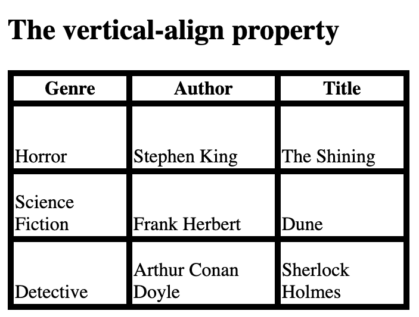

## Table padding

```
<!DOCTYPE html>
<html>
<head>
<style>
table, td, th {  
  border: 5px solid #ddd;
  text-align: left;
}

table {
  border-collapse: collapse;
  width: 100%;
}

th, td {
  padding: 15px;
}
</style>
</head>
<body>

<h2>The padding property</h2>

<p>This property adds space between the border and the content in a table.</p>

<table>
   <tr>
    <th>Genre</th>
    <th>Author</th>
    <th>Title</th>
  </tr>
  <tr>
    <td>Horror</td>
    <td>Stephen King</td>
    <td>The Shining</td>
  </tr>
  <tr>
    <td>Science Fiction </td>
    <td>Frank Herbert</td>
    <td>Dune</td>
  </tr>
  <tr>
    <td>Detective</td>
    <td>Arthur Conan Doyle</td>
    <td>Sherlock Holmes</td>
  </tr>
</table>

</body>
</html>
```
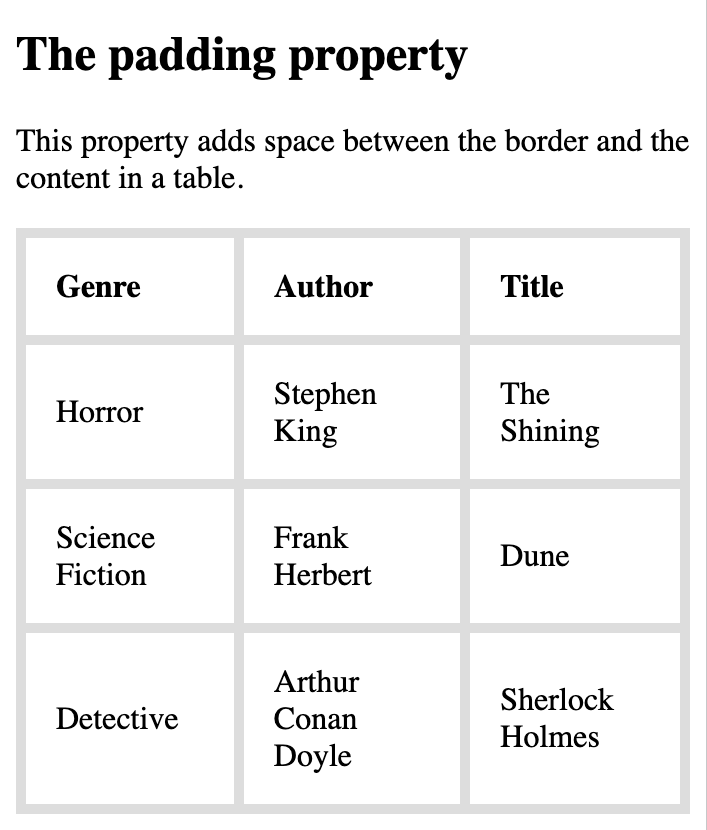

## `border-bottom`

```
<!DOCTYPE html>
<html>
<head>
<style>
table {
  border-collapse: collapse;
  width: 100%;
}

th, td {
  padding: 8px;
  text-align: left;
  border-bottom: 1px solid #ddd;
}
</style>
</head>
<body>

<h2>Bordered bottom</h2>

<table>
  <tr>
    <th>Genre</th>
    <th>Author</th>
    <th>Title</th>
  </tr>
  <tr>
    <td>Horror</td>
    <td>Stephen King</td>
    <td>The Shining</td>
  </tr>
  <tr>
    <td>Science Fiction </td>
    <td>Frank Herbert</td>
    <td>Dune</td>
  </tr>
  <tr>
    <td>Detective</td>
    <td>Arthur Conan Doyle</td>
    <td>Sherlock Holmes</td>
  </tr>
</table>

</body>
</html>
```

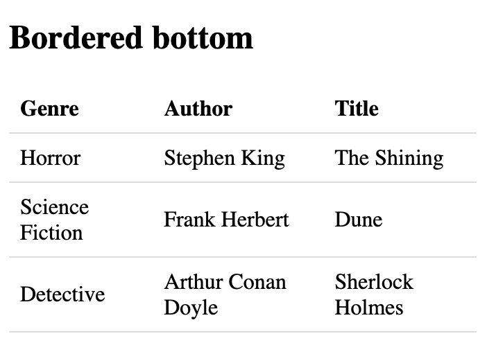


## `:hover` selector to highlight table rows 

```
<!DOCTYPE html>
<html>
<head>
<style>
table {
  border-collapse: collapse;
  width: 100%;
}

th, td {
  padding: 8px;
  text-align: left;
  border-bottom: 1px solid #ddd;
}

tr:hover {background-color: cornflowerblue;}
</style>
</head>
<body>

<h2>Hoverable table</h2>

<table>
 <tr>
    <th>Genre</th>
    <th>Author</th>
    <th>Title</th>
  </tr>
  <tr>
    <td>Horror</td>
    <td>Stephen King</td>
    <td>The Shining</td>
  </tr>
  <tr>
    <td>Science Fiction </td>
    <td>Frank Herbert</td>
    <td>Dune</td>
  </tr>
  <tr>
    <td>Detective</td>
    <td>Arthur Conan Doyle</td>
    <td>Sherlock Holmes</td>
  </tr> 
    
</table>

</body>
</html>
```
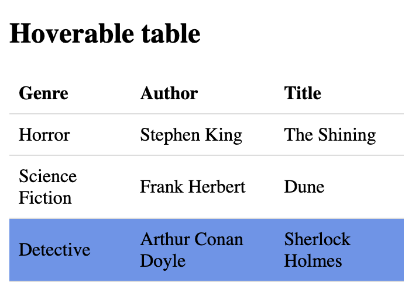

## zebra-striped table

```
<!DOCTYPE html>
<html>
<head>
<style>
table {
  border-collapse: collapse;
  width: 100%;
}

th, td {
  text-align: left;
  padding: 8px;
}

tr:nth-child(even) {background-color: #87CEFA;}
</style>
</head>
<body>

<h2>Striped Table</h2>


<table>
  <tr>
    <th>Genre</th>
    <th>Author</th>
    <th>Title</th>
  </tr>
  <tr>
    <td>Horror</td>
    <td>Stephen King</td>
    <td>The Shining</td>
  </tr>
  <tr>
    <td>Science Fiction </td>
    <td>Frank Herbert</td>
    <td>Dune</td>
  </tr>
  <tr>
    <td>Detective</td>
    <td>Arthur Conan Doyle</td>
    <td>Sherlock Holmes</td>
  </tr> 
</table>

</body>
</html>
```

## Colored Table Header

```
<!DOCTYPE html>
<html>
<head>
<style>
table {
  border-collapse: collapse;
  width: 100%;
}

th, td {
  text-align: left;
  padding: 8px;
}

tr:nth-child(even){background-color: #87CEFA}

th {
  background-color: #6495ED;
  color: white;
}
</style>
</head>
<body>

<h2>Colored Table Header</h2>

<table>
  <tr>
    <th>Genre</th>
    <th>Author</th>
    <th>Title</th>
  </tr>
  <tr>
    <td>Horror</td>
    <td>Stephen King</td>
    <td>The Shining</td>
  </tr>
  <tr>
    <td>Science Fiction </td>
    <td>Frank Herbert</td>
    <td>Dune</td>
  </tr>
  <tr>
    <td>Detective</td>
    <td>Arthur Conan Doyle</td>
    <td>Sherlock Holmes</td>
  </tr> 
</table>

</body>
</html>
```
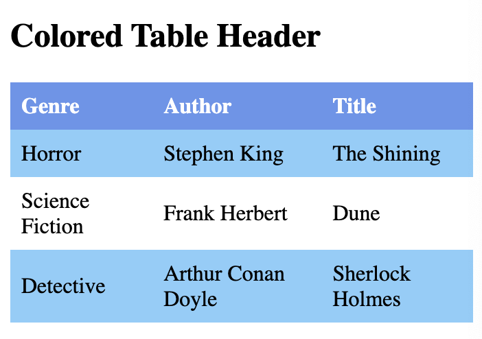

## Responsive table

```
<!DOCTYPE html>
<html>
<head>
<style>
table {
  border-collapse: collapse;
  width: 100%;
}

th, td {
  text-align: left;
  padding: 8px;
}

tr:nth-child(even) {background-color: #87CEFA;}
</style>
</head>
<body>

<h2>Responsive Table</h2>
<p>A responsive table will display a horizontal scroll bar if the screen is too 
small to display the full content. 

<div style="overflow-x: auto;">
  <table>
    <tr>
      <th>First Name</th>
      <th>Last Name</th>
      <th>Points</th>
      <th>Points</th>
      <th>Points</th>
      <th>Points</th>
      <th>Points</th>
      <th>Points</th>
      <th>Points</th>
      <th>Points</th>
      <th>Points</th>
      <th>Points</th>
    </tr>
    <tr>
      <td>Stephen</td>
      <td>King</td>
      <td>50</td>
      <td>50</td>
      <td>50</td>
      <td>50</td>
      <td>50</td>
      <td>50</td>
      <td>50</td>
      <td>50</td>
      <td>50</td>
      <td>50</td>
    </tr>
    <tr>
      <td>Frank</td>
      <td>Herbert</td>
      <td>94</td>
      <td>94</td>
      <td>94</td>
      <td>94</td>
      <td>94</td>
      <td>94</td>
      <td>94</td>
      <td>94</td>
      <td>94</td>
      <td>94</td>
    </tr>
    
  </table>
</div>

</body>
</html>
```
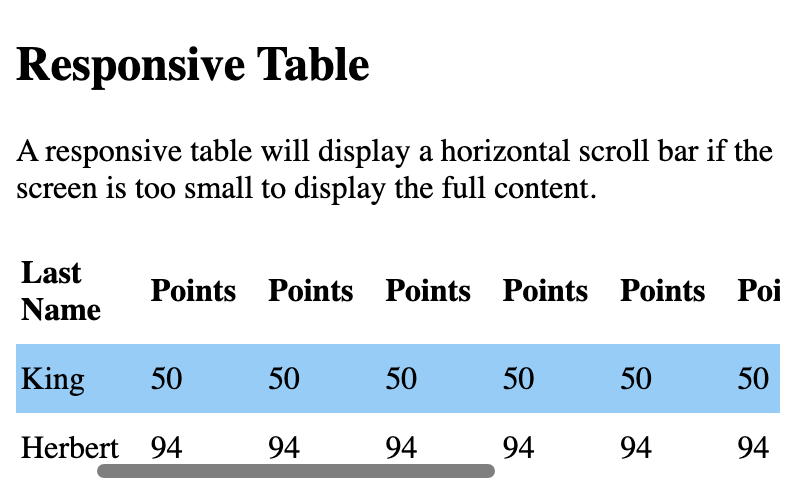
