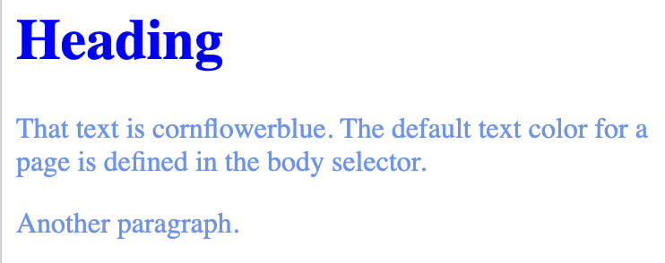
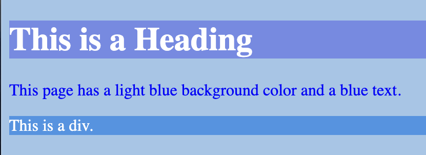
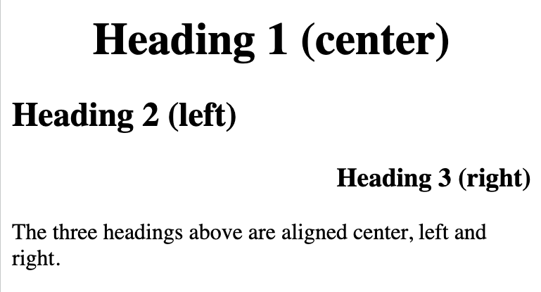

# `Tekst`

## `color`
```
<!DOCTYPE html>
<html>
<head>
<style>
body {
  color: cornflowerblue;
}

h1 {
  color: blue;
}
</style>
</head>
<body>

<h1>Heading</h1>
<p>That text is cornflowerblue. The default text color for a page is defined in the body selector.</p>
<p>Another paragraph.</p>

</body>
</html>
```


## `background-color`

```
<!DOCTYPE html>
<html>
<head>
<style>
body {
  background-color: rgb(160, 198, 232);
  color: blue;
}

h1 {
  background-color: rgb(114, 139, 231);
  color: white;
}

div {
  background-color: rgb(63, 149, 229);
  color: white;
}
</style>
</head>
<body>

<h1>This is a Heading</h1>
<p>This page has a light blue background color and a blue text.</p>
<div>This is a div.</div>

</body>
</html>
```



## `text-align`

```
<!DOCTYPE html>
<html>
<head>
<style>
h1 {
  text-align: center;
}

h2 {
  text-align: left;
}

h3 {
  text-align: right;
}
</style>
</head>
<body>

<h1>Heading 1 (center)</h1>
<h2>Heading 2 (left)</h2>
<h3>Heading 3 (right)</h3>

<p>The three headings above are aligned center, left and right.</p>

</body>
</html>
```



