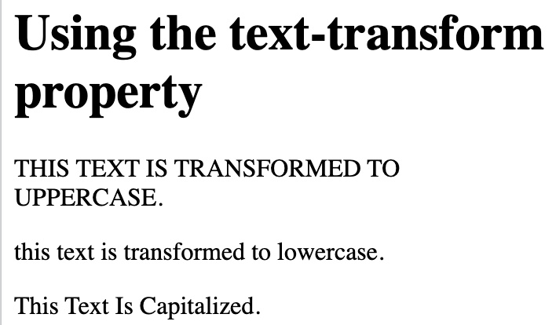
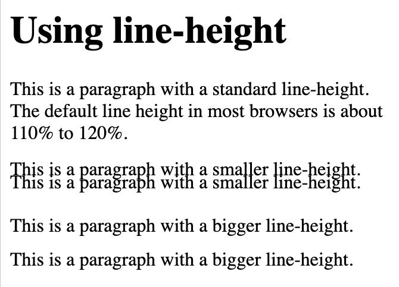

# `Tekst`

## `color`
```
<!DOCTYPE html>
<html>
<head>
<style>
body {
  color: cornflowerblue;
}

h1 {
  color: blue;
}
</style>
</head>
<body>

<h1>Heading</h1>
<p>That text is cornflowerblue. The default text color for a page is defined in the body selector.</p>
<p>Another paragraph.</p>

</body>
</html>
```


## `background-color`

```
<!DOCTYPE html>
<html>
<head>
<style>
body {
  background-color: rgb(160, 198, 232);
  color: blue;
}

h1 {
  background-color: rgb(114, 139, 231);
  color: white;
}

div {
  background-color: rgb(63, 149, 229);
  color: white;
}
</style>
</head>
<body>

<h1>This is a Heading</h1>
<p>This page has a light blue background color and a blue text.</p>
<div>This is a div.</div>

</body>
</html>
```


## Text Overflow

```
<!DOCTYPE html>
<html>
<head>
<style> 
p.test1 {
  white-space: nowrap; 
  width: 200px; 
  border: 1px solid #000000;
  overflow: hidden;
  text-overflow: clip;
}

p.test2 {
  white-space: nowrap; 
  width: 200px; 
  border: 1px solid #000000;
  overflow: hidden;
  text-overflow: ellipsis;
}
</style>
</head>
<body>

<h1>The text-overflow Property</h1>
<p>Text that will not fit in the box.</p>

<h2>text-overflow: clip:</h2>
<p class="test1">This is some long text that will not fit in the box</p>

<h2>text-overflow: ellipsis:</h2>
<p class="test2">This is some long text that will not fit in the box</p>

</body>
</html>
```


```
<!DOCTYPE html>
<html>
<head>
<style> 
div.test {
  white-space: nowrap; 
  width: 200px; 
  overflow: hidden; 
  border: 1px solid #000000;
}

div.test:hover {
  overflow: visible;
}
</style>
</head>
<body>

<div class="test" style="text-overflow:ellipsis;">This is some long text that will not fit in the box</div>
<br>
<div class="test" style="text-overflow:clip;">This is some long text that will not fit in the box</div>

</body>
</html>
```


## `word-wrap`

```
<!DOCTYPE html>
<html>
<head>
<style> 
p.test {
  width: 11em; 
  border: 1px solid #000000;
  word-wrap: break-word;
}
</style>
</head>
<body>

<h1>word-wrap</h1>

<p class="test">This paragraph contains a very long word: thisisaveryveryveryveryveryverylongword. The long word will break and wrap to the next line.</p>

</body>
</html>
```


## `word-break`

```
<!DOCTYPE html>
<html>
<head>
<style> 
p.test1 {
  width: 140px; 
  border: 1px solid #000000;
  word-break: keep-all;
}

p.test2 {
  width: 140px; 
  border: 1px solid #000000;
  word-break: break-all;
}
</style>
</head>
<body>

<h1>word-break</h1>

<p class="test1">This paragraph contains some text. This line will-break-at-hyphens.</p>

<p class="test2">This paragraph contains some text. The lines will break at any character.</p>

</body>
</html>
```


```
<!DOCTYPE html>
<html>
<head>
<style> 
p.test1 {
  writing-mode: horizontal-tb; 
}

span.test2 {
  writing-mode: vertical-rl; 
}

p.test2 {
  writing-mode: vertical-rl; 
}
</style>
</head>
<body>
<h1>writing-mode</h1>

<p class="test1">Some text with default writing-mode.</p>

<p>Some text with a span element with a <span class="test2">vertical-rl</span> writing-mode.</p>

<p class="test2">Some text with writing-mode: vertical-rl.</p>

</body>
</html>
```


## `text-align`

```
<!DOCTYPE html>
<html>
<head>
<style>
h1 {
  text-align: center;
}

h2 {
  text-align: left;
}

h3 {
  text-align: right;
}
</style>
</head>
<body>

<h1>Heading 1 (center)</h1>
<h2>Heading 2 (left)</h2>
<h3>Heading 3 (right)</h3>

<p>The three headings above are aligned center, left and right.</p>

</body>
</html>
```


```
<!DOCTYPE html>
<html>
<head>
<style>
div {
  border: 1px solid black;
  padding: 10px;
  width: 200px;
  height: 200px;
  text-align: justify;
}
</style>
</head>
<body>

<h1>Example text-align: justify</h1>

<p>The text-align: justify; value stretches the lines so that each line has equal width (like in newspapers and magazines).</p>

<div>
Kyoto is the capital city of Kyoto Prefecture in Japan. Located in the Kansai region on the island of Honshu, Kyoto forms a part of the Keihanshin metropolitan area along with Osaka and Kobe. As of 2020, the city had a population of 1.46 million, making it the ninth most populous city in Japan.
</div>

</body>
</html>
```


## `text-align-last`

```
<!DOCTYPE html>
<html>
<head>
<style>
p.a {
  text-align-last: right;
}

p.b {
  text-align-last: center;
}

p.c {
  text-align-last: justify;
}
</style>
</head>
<body>

<h1>The text-align-last Property</h1>

<h2>text-align-last: right:</h2>
<p class="a">Lorem ipsum dolor sit amet, consectetur adipiscing elit. Etiam semper diam at erat pulvinar, at pulvinar felis blandit. Vestibulum volutpat tellus diam, consequat gravida libero rhoncus ut.</p>

<h2>text-align-last: center:</h2>
<p class="b">Lorem ipsum dolor sit amet, consectetur adipiscing elit. Etiam semper diam at erat pulvinar, at pulvinar felis blandit. Vestibulum volutpat tellus diam, consequat gravida libero rhoncus ut.</p>

<h2>text-align-last: justify:</h2>
<p class="c">Lorem ipsum dolor sit amet, consectetur adipiscing elit. Etiam semper diam at erat pulvinar, at pulvinar felis blandit. Vestibulum volutpat tellus diam, consequat gravida libero rhoncus ut.</p>

</body>
</html>
```


## `direction and unicode-bidi`

The unicode-bidi property is used together with the direction property to set or return whether the text should be overridden to support multiple languages in the same document.

```
<!DOCTYPE html>
<html>
<head>
<style>
p.ex1 {
  direction: rtl;
  unicode-bidi: bidi-override;
}
</style>
</head>
<body>

<p>This is the default text direction.</p>

<p class="ex1">This is right-to-left text direction.</p>

</body>
</html>
```


## `vertical-align`

```
<!DOCTYPE html>
<html>
<head>
<style>
img.a {
  vertical-align: baseline;
}

img.b {
  vertical-align: text-top;
}

img.c {
  vertical-align: text-bottom;
}

img.d {
  vertical-align: sub;
}

img.e {
  vertical-align: super;
}
</style>
</head>
<body>

<h1>The vertical-align property</h1>

<h2>vertical-align: baseline (default):</h2>
<p>An  image with a default alignment.</p> 

<h2>vertical-align: text-top:</h2>
<p>An  image with a text-top alignment.</p> 

<h2>vertical-align: text-bottom:</h2>
<p>An  image with a text-bottom alignment.</p>

<h2>vertical-align: sub:</h2>
<p>An  image with a sub alignment.</p> 

<h2>vertical-align: sup:</h2>
<p>An  image with a super alignment.</p>

</body>
</html>
```


# Text Decoration

- text-decoration-line
- text-decoration-color
- text-decoration-style
- text-decoration-thickness
- text-decoration

## `text-decoration-line`

```
<!DOCTYPE html>
<html>
<head>
<style>
h1 {
  text-decoration: overline;
}

h2 {
  text-decoration: line-through;
}

h3 {
  text-decoration: underline;
}

p.ex {
  text-decoration: overline underline;
}
</style>
</head>
<body>

<h1>Overline text decoration</h1>
<h2>Line-through text decoration</h2>
<h3>Underline text decoration</h3>
<p class="ex">Overline and underline text decoration.</p>

<p><strong>Important:</strong> It is not recommended to underline text that is not a link, as this often confuses 
the reader.</p>

</body>
</html>
```


## `text-decoration-color`

```
<!DOCTYPE html>
<html>
<head>
<style>
h1 {
  text-decoration-line: overline;
  text-decoration-color: rgb(25, 221, 87);
}

h2 {
  text-decoration-line: line-through;
  text-decoration-color: rgb(196, 230, 27);
}

h3 {
  text-decoration-line: underline;
  text-decoration-color: rgb(253, 166, 84);  
}

p {
  text-decoration-line: overline underline;
  text-decoration-color: rgb(25, 231, 200);  
}
</style>
</head>
<body>

<h1>Overline text decoration</h1>
<h2>Line-through text decoration</h2>
<h3>Underline text decoration</h3>
<p>Overline and underline text decoration.</p>

</body>
</html>
```


## `text-decoration-style`

```
<!DOCTYPE html>
<html>
<head>
<style>
h1 {
  text-decoration-line: underline;
  text-decoration-style: solid; /* this is default */
}

h2 {
  text-decoration-line: underline;
  text-decoration-style: double;
}

h3 {
  text-decoration-line: underline;
  text-decoration-style: dotted;  
}

p.ex1 {
  text-decoration-line: underline;
  text-decoration-style: dashed;  
}

p.ex2 {
  text-decoration-line: underline;
  text-decoration-style: wavy;  
}

p.ex3 {
  text-decoration-line: underline;
  text-decoration-color: rgb(53, 230, 95);  
  text-decoration-style: wavy;  
}
</style>
</head>
<body>

<h1>Heading 1</h1>
<h2>Heading 2</h2>
<h3>Heading 3</h3>
<p class="ex1">A paragraph.</p>
<p class="ex2">Another paragraph.</p>
<p class="ex3">Another paragraph.</p>

</body>
</html>
```


## `text-decoration-thickness`

```
<!DOCTYPE html>
<html>
<head>
<style>
h1 {
  text-decoration-line: underline;
  text-decoration-thickness: auto;  /* this is default */
}

h2 {
  text-decoration-line: underline;
  text-decoration-thickness: 5px;
}

h3 {
  text-decoration-line: underline;
  text-decoration-thickness: 25%;
}

p {
  text-decoration-line: underline;
  text-decoration-color: blue;  
  text-decoration-style: double;
  text-decoration-thickness: 4px;  
}
</style>
</head>
<body>

<h1>Heading 1</h1>
<h2>Heading 2</h2>
<h3>Heading 3</h3>
<p>A paragraph.</p>

</body>
</html>
```


## Shorthand Property

text-decoration-line (required)

text-decoration-color (optional)

text-decoration-style (optional)

text-decoration-thickness (optional)


```
<!DOCTYPE html>
<html>
<head>
<style>
h1 {
  text-decoration: underline;
}

h2 {
  text-decoration: underline red;
}

h3 {
  text-decoration: underline red double;
}

p {
  text-decoration: underline red double 5px;
}
```

## `text-decoration: none;` is used to remove the underline from links

## `text-transform`

text-transform property is used to specify uppercase and lowercase letters in a text

```
<!DOCTYPE html>
<html>
<head>
<style>
p.uppercase {
  text-transform: uppercase;
}

p.lowercase {
  text-transform: lowercase;
}

p.capitalize {
  text-transform: capitalize;
}
</style>
</head>
<body>

<h1>Using the text-transform property</h1>

<p class="uppercase">This text is transformed to uppercase.</p>
<p class="lowercase">This text is transformed to lowercase.</p>
<p class="capitalize">This text is capitalized.</p>

</body>
</html>
```


## Text Spacing

text-indent

letter-spacing

line-height

word-spacing

white-space

## `text-indent`

```
<!DOCTYPE html>
<html>
<head>
<style>
p {
  text-indent: 50px;
}
</style>
</head>
<body>

<h1>Using text-indent</h1>

<p>Tokyo is the capital and the most populous prefecture of Japan.Tokyo's metropolitan area is the most populous in the world, with an estimated 37.468 million residents as of 2018 although this number has been gradually decreasing since then, the prefecture itself has a population of 14.09 million people while the prefecture's central 23 special wards have a population of 9.73 million. Located at the head of Tokyo Bay, the prefecture forms part of the Kantō region on the central coast of Honshu, Japan's largest island. Tokyo serves as Japan's economic center and is the seat of both the Japanese government and the Emperor of Japan</p>

</body>
</html>

```


## `letter-spacing`

```
<!DOCTYPE html>
<html>
<head>
<style>
h2 {
  letter-spacing: 5px;
}

h3 {
  letter-spacing: -2px;
}
</style>
</head>
<body>

<h1>Using letter-spacing</h1>

<h2>This is heading 1</h2>
<h3>This is heading 2</h3>

</body>
</html>
```


## `line-height`

```
<!DOCTYPE html>
<html>
<head>
<style>
p.small {
  line-height: 0.7;
}

p.big {
  line-height: 1.8;
}
</style>
</head>
<body>

<h1>Using line-height</h1>

<p>
This is a paragraph with a standard line-height.<br>
The default line height in most browsers is about 110% to 120%.<br>
</p>

<p class="small">
This is a paragraph with a smaller line-height.<br>
This is a paragraph with a smaller line-height.<br>
</p>

<p class="big">
This is a paragraph with a bigger line-height.<br>
This is a paragraph with a bigger line-height.<br>
</p>

</body>
</html>
```



## `word-spacing`

```
<!DOCTYPE html>
<html>
<head>
<style>
p.one {
  word-spacing: 10px;
}

p.two {
  word-spacing: -2px;
}
</style>
</head>
<body>

<h1>Using word-spacing</h1>

<p>This is a paragraph with normal word spacing.</p>

<p class="one">This is a paragraph with larger word spacing.</p>

<p class="two">This is a paragraph with smaller word spacing.</p>

</body>
</html>
```


## `white-space`

```
<!DOCTYPE html>
<html>
<head>
<style>
p {
  white-space: nowrap;
}
</style>
</head>
<body>

<h1>Using white-space</h1>

<p>
This is some text that will not wrap.
This is some text that will not wrap.
This is some text that will not wrap.
This is some text that will not wrap.
This is some text that will not wrap.
This is some text that will not wrap.
This is some text that will not wrap.
This is some text that will not wrap.
This is some text that will not wrap.
</p>


</body>
</html>
```


# Text Shadow

```
<!DOCTYPE html>
<html>
<head>
<style>
h1 {
  text-shadow: 2px 2px;
}
</style>
</head>
<body>

<h1>Text-shadow effect!</h1>

</body>
</html>
```


```
<!DOCTYPE html>
<html>
<head>
<style>
h1 {
  text-shadow: 2px 2px red;
}
</style>
</head>
<body>

<h1>Text-shadow effect!</h1>

</body>
</html>
```


```
<!DOCTYPE html>
<html>
<head>
<style>
h1 {
  text-shadow: 2px 2px 5px red;
}
</style>
</head>
<body>

<h1>Text-shadow effect!</h1>

</body>
</html>

```


```
<!DOCTYPE html>
<html>
<head>
<style>
h1 {
  color: white;
  text-shadow: 1px 1px 2px black, 0 0 25px blue, 0 0 5px darkblue;
}
</style>
</head>
<body>

<h1>Text-shadow effect!</h1>

</body>
</html>

```


```
<!DOCTYPE html>
<html>
<head>
<style>
h1 {
  text-shadow: 0 0 3px #FF0000, 0 0 5px #0000FF;
}
</style>
</head>
<body>

<h1>Text-shadow with red and blue neon glow!</h1>

</body>
</html>

```


```
<!DOCTYPE html>
<html>
<head>
<style>
h1 {
  text-shadow: 0 0 3px #FF0000;
}
</style>
</head>
<body>

<h1>Text-shadow with red neon glow!</h1>

</body>
</html>
```


```
<!DOCTYPE html>
<html>
<head>
<style>
h1 {
  color: white;
  text-shadow: 2px 2px 4px #000000;
}
</style>
</head>
<body>

<h1>Text-shadow effect!</h1>

</body>
</html>
```


# Icons 

```
<!DOCTYPE html>
<html>
<head>
<title>Font Awesome Icons</title>
<meta name="viewport" content="width=device-width, initial-scale=1">
<script src="https://kit.fontawesome.com/a076d05399.js" crossorigin="anonymous"></script>
<!--Get your own code at fontawesome.com-->
</head>
<body>

<h1>Font Awesome icon library</h1>

<p>Some Font Awesome icons:</p>
<i class="fas fa-cloud"></i>
<i class="fas fa-heart"></i>
<i class="fas fa-car"></i>
<i class="fas fa-file"></i>
<i class="fas fa-bars"></i>

<p>Styled Font Awesome icons (size and color):</p>
<i class="fas fa-cloud" style="font-size:24px;"></i>
<i class="fas fa-cloud" style="font-size:36px;"></i>
<i class="fas fa-cloud" style="font-size:48px;color:red;"></i>
<i class="fas fa-cloud" style="font-size:60px;color:lightblue;"></i>

</body>
</html>
```


```
<!DOCTYPE html>
<html>
<head>
<title>Google Icons</title>
<meta name="viewport" content="width=device-width, initial-scale=1">
<link rel="stylesheet" href="https://fonts.googleapis.com/icon?family=Material+Icons">
</head>
<body>

<h1>Google icon library</h1>

<p>Some Google icons:</p>
<i class="material-icons">cloud</i>
<i class="material-icons">favorite</i>
<i class="material-icons">attachment</i>
<i class="material-icons">computer</i>
<i class="material-icons">traffic</i>
<br><br>

<p>Styled Google icons (size and color):</p>
<i class="material-icons" style="font-size:24px;">cloud</i>
<i class="material-icons" style="font-size:36px;">cloud</i>
<i class="material-icons" style="font-size:48px;color:red;">cloud</i>
<i class="material-icons" style="font-size:60px;color:lightblue;">cloud</i>

</body>
</html>
```

