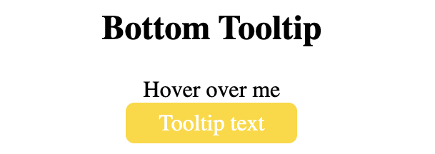

# Tooltip

## basic

```
<!DOCTYPE html>
<html>
<style>
.tooltip {
  position: relative;
  display: inline-block;
  border-bottom: 1px dotted black;
}

.tooltip .tooltiptext {
  visibility: hidden;
  width: 120px;
  background-color: gold;
  color: #fff;
  text-align: center;
  border-radius: 6px;
  padding: 5px 0;

  /* Position the tooltip */
  position: absolute;
  z-index: 1;
}

.tooltip:hover .tooltiptext {
  visibility: visible;
}
</style>
<body style="text-align:center;">

<h2>Basic Tooltip</h2>

<div class="tooltip">Hover over me
  <span class="tooltiptext">Tooltip text</span>
</div>


</body>
</html>
```


## Right tooltip

```
<!DOCTYPE html>
<html>
<style>
.tooltip {
  position: relative;
  display: inline-block;
  border-bottom: 1px dotted black;
}

.tooltip .tooltiptext {
  visibility: hidden;
  width: 120px;
  background-color: gold;
  color: #fff;
  text-align: center;
  border-radius: 6px;
  padding: 5px 0;
  
  /* Position the tooltip */
  position: absolute;
  z-index: 1;
  top: -5px;
  left: 105%;
}

.tooltip:hover .tooltiptext {
  visibility: visible;
}
</style>
<body style="text-align:center;">

<h2>Right Tooltip</h2>

<div class="tooltip">Hover over me
  <span class="tooltiptext">Tooltip text</span>
</div>

</body>
</html>
```


## Left tooltip

```
<!DOCTYPE html>
<html>
<style>
.tooltip {
  position: relative;
  display: inline-block;
  border-bottom: 1px dotted black;
}

.tooltip .tooltiptext {
  visibility: hidden;
  width: 120px;
  background-color: gold;
  color: #fff;
  text-align: center;
  border-radius: 6px;
  padding: 5px 0;
  
  /* Position the tooltip */
  position: absolute;
  z-index: 1;
  top: -5px;
  right: 105%;
}

.tooltip:hover .tooltiptext {
  visibility: visible;
}
</style>
<body style="text-align:center;">

<h2>Left Tooltip</h2>

<div class="tooltip">Hover over me
  <span class="tooltiptext">Tooltip text</span>
</div>

</body>
</html>
```


## Top tooltip

```
<!DOCTYPE html>
<html>
<style>
.tooltip {
  position: relative;
  display: inline-block;
  border-bottom: 1px dotted black;
}

.tooltip .tooltiptext {
  visibility: hidden;
  width: 120px;
  background-color: gold;
  color: #fff;
  text-align: center;
  border-radius: 6px;
  padding: 5px 0;
  
  /* Position the tooltip */
  position: absolute;
  z-index: 1;
  bottom: 100%;
  left: 50%;
  margin-left: -60px;
}

.tooltip:hover .tooltiptext {
  visibility: visible;
}
</style>
<body style="text-align:center;">

<h2>Top Tooltip</h2>

<div class="tooltip">Hover over me
  <span class="tooltiptext">Tooltip text</span>
</div>

</body>
</html>
```


## Bottom tooltip

```
<!DOCTYPE html>
<html>
<style>
.tooltip {
  position: relative;
  display: inline-block;
  border-bottom: 1px dotted black;
}

.tooltip .tooltiptext {
  visibility: hidden;
  width: 120px;
  background-color: gold;
  color: #fff;
  text-align: center;
  border-radius: 6px;
  padding: 5px 0;
  
  position: absolute;
  z-index: 1;
  top: 100%;
  left: 50%;
  margin-left: -60px;
}

.tooltip:hover .tooltiptext {
  visibility: visible;
}
</style>
<body style="text-align:center;">

<h2>Bottom Tooltip</h2>

<div class="tooltip">Hover over me
  <span class="tooltiptext">Tooltip text</span>
</div>

</body>
</html>
```


## Tooltio arrows

```
<!DOCTYPE html>
<html>
<style>
.tooltip {
  position: relative;
  display: inline-block;
  border-bottom: 1px dotted black;
}

.tooltip .tooltiptext {
  visibility: hidden;
  width: 120px;
  background-color: gold;
  color: #fff;
  text-align: center;
  border-radius: 6px;
  padding: 5px 0;
  position: absolute;
  z-index: 1;
  bottom: 150%;
  left: 50%;
  margin-left: -60px;
}

.tooltip .tooltiptext::after {
  content: "";
  position: absolute;
  top: 100%;
  left: 50%;
  margin-left: -5px;
  border-width: 5px;
  border-style: solid;
  border-color: gold transparent transparent transparent;
}

.tooltip:hover .tooltiptext {
  visibility: visible;
}
</style>
<body style="text-align:center;">

<h2>Top Tooltip w/ Bottom Arrow</h2>

<div class="tooltip">Hover over me
  <span class="tooltiptext">Tooltip text</span>
</div>

</body>
</html>
```


## Bottom tooltip

```
<!DOCTYPE html>
<html>
<style>
.tooltip {
  position: relative;
  display: inline-block;
  border-bottom: 1px dotted black;
}

.tooltip .tooltiptext {
  visibility: hidden;
  width: 120px;
  background-color: gold;
  color: #fff;
  text-align: center;
  border-radius: 6px;
  padding: 5px 0;
  position: absolute;
  z-index: 1;
  top: 150%;
  left: 50%;
  margin-left: -60px;
}

.tooltip .tooltiptext::after {
  content: "";
  position: absolute;
  bottom: 100%;
  left: 50%;
  margin-left: -5px;
  border-width: 5px;
  border-style: solid;
  border-color: transparent transparent gold transparent;
}

.tooltip:hover .tooltiptext {
  visibility: visible;
}
</style>
<body style="text-align:center;">

<h2>Bottom Tooltip w/ Top Arrow</h2>

<div class="tooltip">Hover over me
  <span class="tooltiptext">Tooltip text</span>
</div>

</body>
</html>
```


## Right tooltip

```
<!DOCTYPE html>
<html>
<style>
.tooltip {
  position: relative;
  display: inline-block;
  border-bottom: 1px dotted black;
}

.tooltip .tooltiptext {
  visibility: hidden;
  width: 120px;
  background-color: gold;
  color: #fff;
  text-align: center;
  border-radius: 6px;
  padding: 5px 0;
  position: absolute;
  z-index: 1;
  top: -5px;
  left: 110%;
}

.tooltip .tooltiptext::after {
  content: "";
  position: absolute;
  top: 50%;
  right: 100%;
  margin-top: -5px;
  border-width: 5px;
  border-style: solid;
  border-color: transparent gold transparent transparent;
}
.tooltip:hover .tooltiptext {
  visibility: visible;
}
</style>
<body style="text-align:center;">

<h2>Right Tooltip w/ Left Arrow</h2>

<div class="tooltip">Hover over me
  <span class="tooltiptext">Tooltip text</span>
</div>

</body>
</html>
```


## Left tooltip

```
<!DOCTYPE html>
<html>
<style>
.tooltip {
  position: relative;
  display: inline-block;
  border-bottom: 1px dotted black;
}

.tooltip .tooltiptext {
  visibility: hidden;
  width: 120px;
  background-color: gold;
  color: #fff;
  text-align: center;
  border-radius: 6px;
  padding: 5px 0;
  position: absolute;
  z-index: 1;
  top: -5px;
  right: 110%;
}

.tooltip .tooltiptext::after {
  content: "";
  position: absolute;
  top: 50%;
  left: 100%;
  margin-top: -5px;
  border-width: 5px;
  border-style: solid;
  border-color: transparent transparent transparent gold;
}
.tooltip:hover .tooltiptext {
  visibility: visible;
}
</style>
<body style="text-align:center;">

<h2>Left Tooltip w/ Right Arrow</h2>

<div class="tooltip">Hover over me
  <span class="tooltiptext">Tooltip text</span>
</div>

</body>
</html>
```


## Fade In Tooltips

```
<!DOCTYPE html>
<html>
<style>
.tooltip {
  position: relative;
  display: inline-block;
  border-bottom: 1px dotted black;
}

.tooltip .tooltiptext {
  visibility: hidden;
  width: 120px;
  background-color: gold;
  color: #fff;
  text-align: center;
  border-radius: 6px;
  padding: 5px 0;
  position: absolute;
  z-index: 1;
  bottom: 100%;
  left: 50%;
  margin-left: -60px;
  
  /* Fade in tooltip - takes 2 second to go from 0% to 100% opac: */
  opacity: 0;
  transition: opacity 2s;
}

.tooltip:hover .tooltiptext {
  visibility: visible;
  opacity: 1;
}
</style>
<body style="text-align:center;">

<h2>Fade In Tooltip on Hover</h2>

<div class="tooltip">Hover over me
  <span class="tooltiptext">Tooltip text</span>
</div>

</body>
</html>
```


