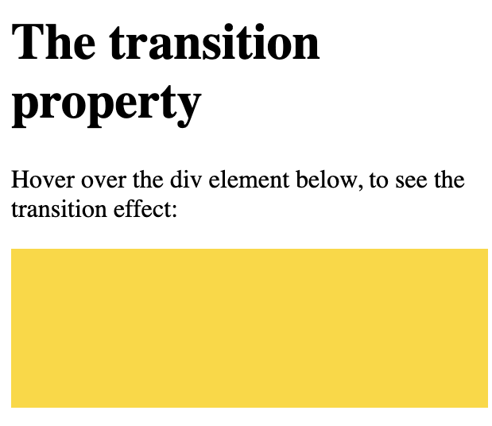
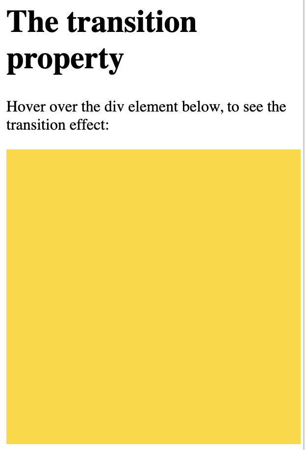

## transition

```
<!DOCTYPE html>
<html>
<head>
<style> 
div {
  width: 100px;
  height: 100px;
  background: gold;
  transition: width 2s;
}

div:hover {
  width: 300px;
}
</style>
</head>
<body>

<h1>The transition property</h1>

<p>Hover over the div element below, to see the transition effect:</p>
<div></div>

</body>
</html>
```


```
<!DOCTYPE html>
<html>
<head>
<style> 
div {
  width: 100px;
  height: 100px;
  background: gold;
  transition: width 2s, height 4s;
}

div:hover {
  width: 300px;
  height: 300px;
}
</style>
</head>
<body>

<h1>The transition property</h1>

<p>Hover over the div element below, to see the transition effect:</p>

<div></div>

</body>
</html>
```


## `transition-timing-function` property

```
<!DOCTYPE html>
<html>
<head>
<style> 
div {
  width: 100px;
  height: 100px;
  background: gold;
  transition: width 2s;
}

#div1 {transition-timing-function: linear;}
#div2 {transition-timing-function: ease;}
#div3 {transition-timing-function: ease-in;}
#div4 {transition-timing-function: ease-out;}
#div5 {transition-timing-function: ease-in-out;}

div:hover {
  width: 300px;
}
</style>
</head>
<body>

<div id="div1">linear</div><br>
<div id="div2">ease</div><br>
<div id="div3">ease-in</div><br>
<div id="div4">ease-out</div><br>
<div id="div5">ease-in-out</div><br>

</body>
</html>
```

## `transition-delay` property

```
<!DOCTYPE html>
<html>
<head>
<style> 
div {
  width: 100px;
  height: 100px;
  background: red;
  transition: width 3s;
  transition-delay: 1s;
}

div:hover {
  width: 300px;
}
</style>
</head>
<body>

<h1>The transition-delay property</h1>

<div></div>

<p>The transition effect has a 1 second delay before starting.</p>

</body>
</html>
```

## Transition + Transform

```
<!DOCTYPE html>
<html>
<head>
<style> 
div {
  width: 100px;
  height: 100px;
  background: gold;
  transition: width 2s, height 2s, transform 2s;
}

div:hover {
  width: 300px;
  height: 300px;
  transform: rotate(180deg);
}
</style>
</head>
<body>

<h1>Transition + Transform</h1>

<div></div>

</body>
</html>
```


