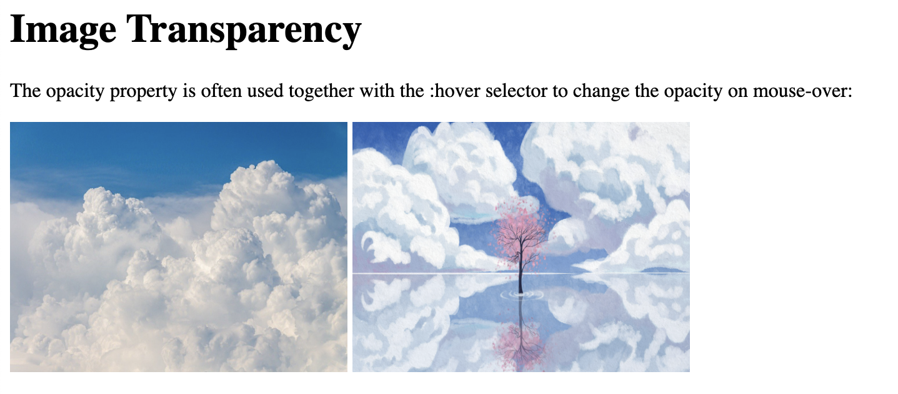
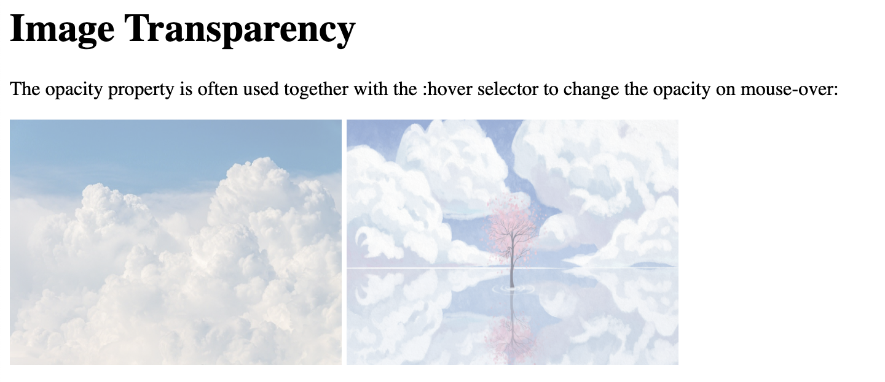
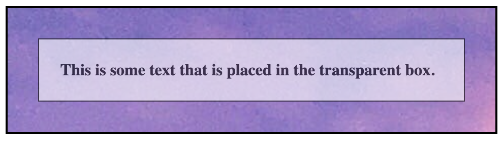

# Image Transparency


```
<!DOCTYPE html>
<html>
<head>
<style>
img:hover {
  opacity: 0.5;
}
</style>
</head>
<body>

<h1>Image Transparency</h1>
<p>The opacity property is often used together with the :hover selector to change the opacity on mouse-over:</p>


</body>
</html>
```

lake surface PNG Designed By 588ku from https://pngtree.com/freepng/sky-day-white-clouds-cherry_4112230.html?sol=downref&id=bef




```
<!DOCTYPE html>
<html>
<head>
<style>
img {
  opacity: 0.5;
}

img:hover {
  opacity: 1.0;
}
</style>
</head>
<body>

<h1>Image Transparency</h1>
<p>The opacity property is often used together with the :hover selector to change the opacity on mouse-over:</p>


</body>
</html>
```




```
<!DOCTYPE html>
<html>
<head>
<style>
div.background {
  background: url(doc-files/pexels-ithalu-dominguez-907485.jpg) repeat;
  border: 2px solid black;
}

div.transbox {
  margin: 30px;
  background-color: #ffffff;
  border: 1px solid black;
  opacity: 0.6;
}

div.transbox p {
  margin: 5%;
  font-weight: bold;
  color: #000000;
}
</style>
</head>
<body>

<div class="background">
  <div class="transbox">
    <p>This is some text that is placed in the transparent box.</p>
  </div>
</div>

</body>
</html>
```



